# ClickHouse 调研

## 一 调研背景

1. 实时业务需求一种**更通用**,**足够快速**,**基于sql**的存储和计算方案

   实时计算 目前的方案 Kafka -> Flink -> HBase+Phoenix 二级索引

   Phoenix的sql功能有限,且受制于底层HBase存储的限制,之后增加需求并不能完美依靠此方案实现

2. 需要能够**整合多种数据存储**的数据中台查询引擎和能够整合**跨引擎任务**的方案

##  二 ClickHouse  介绍

ClickHouse 是由号称“俄罗斯 Google ”的 Yandex开源的一个列式的OLAP的分布式非Hadoop系的DBMS,源码是C++。

主流引擎TPC-DS测试性能比较 :  

- 所有组件都采用分布式搭建于三台物理机,centos7,cpu4核,64g,2T,并配置每台服务器上查询最大使用内存20g，cpu 8线

- Hadoop(2.7)、Hive(2.1)、HAWQ(3.1.2.0)、Presto(0.211)、Impala(2.6.0)、sparksql(2.2.0)、clickhouse(18.1.0-1.el7)、greenplum(5.7.0)

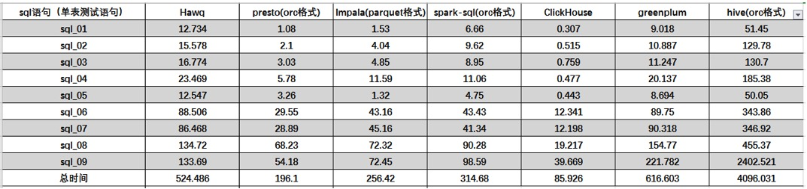

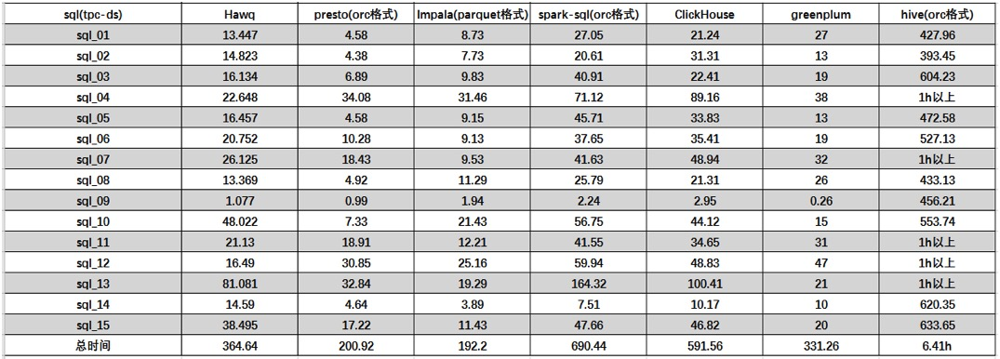

在单表测试方面clickhouse体现出了比其余组件的优势，性能比其他组件要好一大截，而presto相比于hawq和impala以及sparksql在单大表聚合操作方面的表现也相对优秀。(....核少,CH比较吃亏)

## 三  MergeTree引擎和索引原理

### 如何能查询快

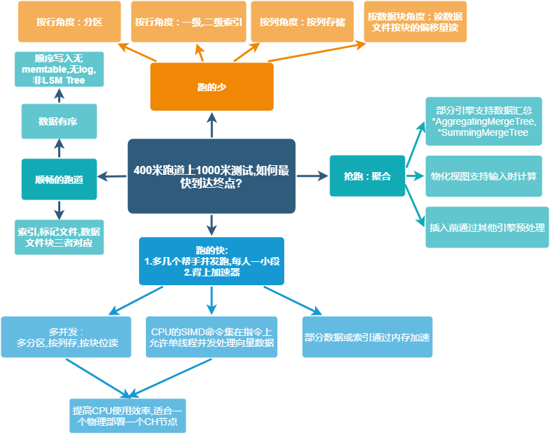

### 由果推因,自己实现CH数据存储和查询

(实现方案多种多样,我只向CH已有的结构推帮助大家理解)

1. 分区<-如何实现<-hive是通过分区字段的目录来实现分区隔离  => 按分区键生成不同目录

2. 列式存储<-如何实现<-HBase的列式存储是按列族存储,一个列族一个目录 => 最简单的形式,一个列一个文件

3. 文件读取按块的位置读<-如何实现<-列文件存储按块存(默认lz4压缩,64k-1M),且需要有块头尾偏移量记录

   初步数据目录结构

   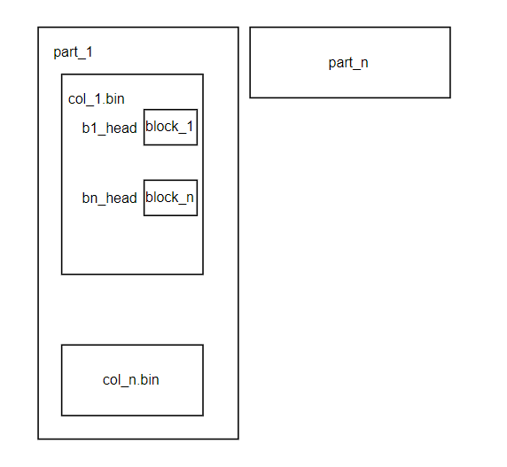

4. 查询过程中,必然要用索引进行剪枝<-如何实现<-数据量大可以用稀疏索引,跳着存(类似hbase的每个region的startrow 和 endrow也是一个索引区间,不过CH粒度更细由 index_granularity),=>主键索引,二级索引每个索引一个文件

5. 索引文件得和查询内容有关=>索引文件存索引字段组合的value值

6. 查询过程中,通过索引文件得能找到要查哪个块,什么偏移量<-如何实现<-细节:按行插入偏移量常变而索引(多行一个索引)不常变,所以偏移量和索引应是两个不同文件,即 查询通过内存中的索引找到哪个块,然后通过标记文件的基于LRU的标记信息(块编号,压缩文件中的偏移量,解压缩块中的偏移量)找到具体要查的文件的偏移位置=>标记文件和文件内容确定了

7. 二级索引又叫跳数索引,目录和一级索引类似,有额外的索引和标记文件

   为了索引而增加文件后的目录结构

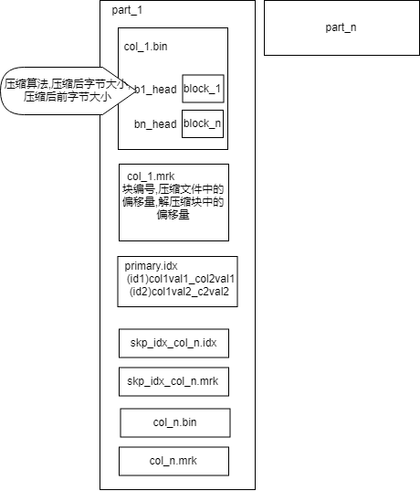

8. 分区细节 : 

   - 非lsm tree,只是按批排序后写入,没有memtable和log<=每个目录只是 以 "分区名\_头批次_尾批次 _合并次数"命名的一个批次的目录,后续由异步merge合并,合并完成批次扩充,合并次数+1
   - 在8之上的细节 : 分区可以用单字段,也可以用多字段组合,也可以表达式,需要记录分区的取值范围,来保证同个分区多个目录合并前可根据分区字段的值提高查询性能<=存储此目录的分区字段值的minmax索引
   - 如果使用了分区,就会有个文件存储分区表达式算出的值

9. 校验和文件,计数文件,列信息文件

   最终结构

   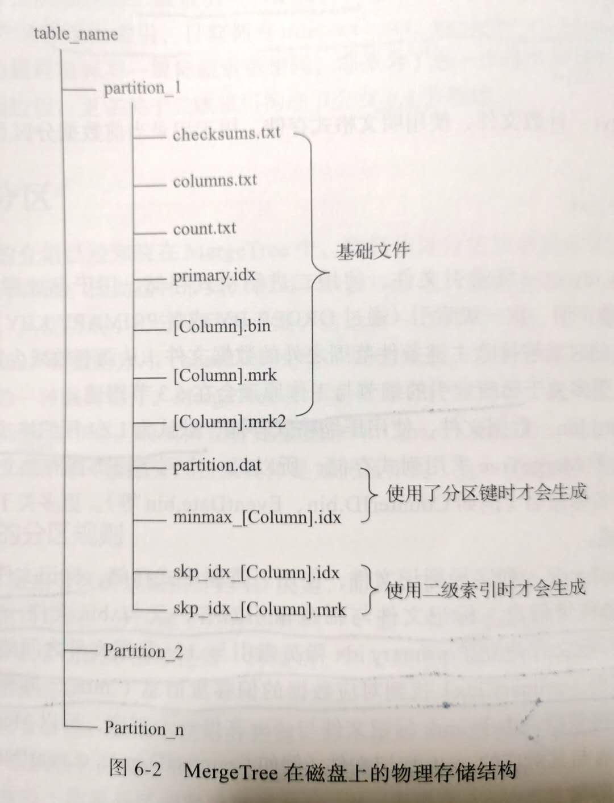

### 二级索引种类和作用

索引粒度由  index_granularity * granularity(声明二级索引时设定)

1. minmax : 记录了一小段数内的最小和最大值,类似分区索引不过粒度更细

2. set(maxrows) : 记录了声明字段或表达式的取值(唯一值)

3. ngrambf_v1(n,size_of_bloom_filter_in_bytes,number_of_hash_functions,random_seed) : 数据短语的布隆过滤器,只支持String和FixedString. n 切割出token的单位长度

4. tokenbf_v1(size_of_bloom_filter_in_bytes,number_of_hash_functions,random_seed) : 会自动按照非字符的,数字的字符串分隔token 

5. bloom_filter([false_positive]) : 指定字段的布隆过滤器,支持 `Int*`, `UInt*`, `Float*`, `Enum`, `Date`, `DateTime`, `String`, `FixedString`, `Array`, `LowCardinality`, `Nullable`. false_positive 是容错率默认0.025

   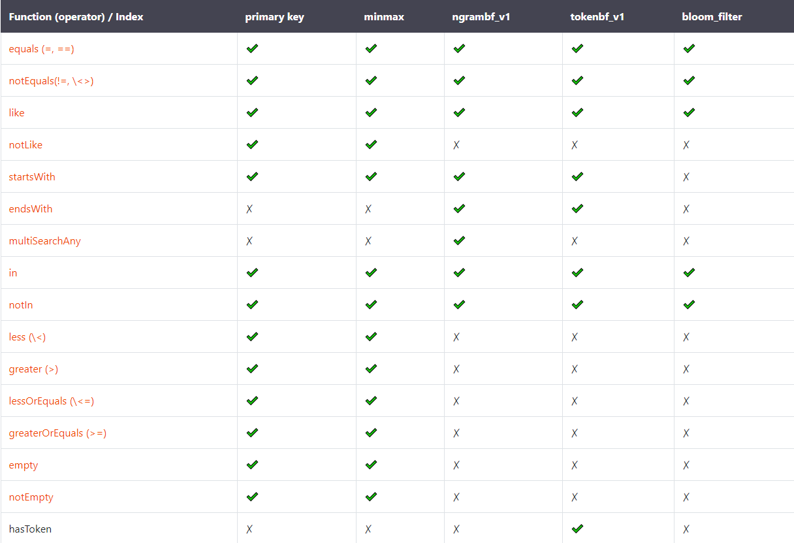

### 剪枝过程

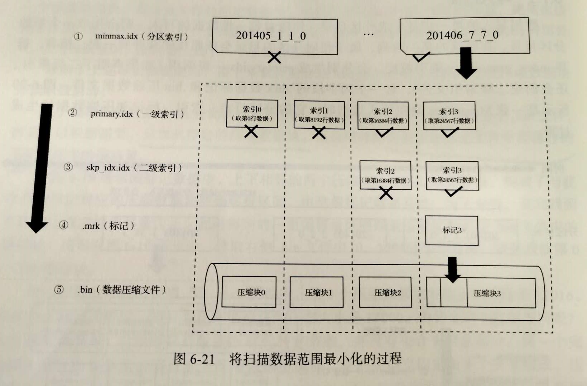

### 主键剪枝细节

- 主键索引递归裁剪源码细节

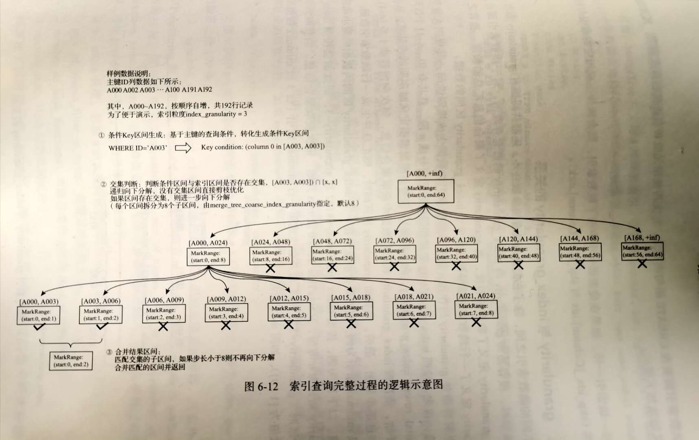

```
       //TODO 主键索引递归逻辑
	  /** There will always be disjoint suspicious segments on the stack, the leftmost one at the top (back).
        * At each step, take the left segment and check if it fits.
        * If fits, split it into smaller ones and put them on the stack. If not, discard it.
        * If the segment is already of one mark length, add it to response and discard it.
        */
        std::vector<MarkRange> ranges_stack = { {0, marks_count} };

        size_t steps = 0;
        while (!ranges_stack.empty())
        {
            MarkRange range = ranges_stack.back();
            ranges_stack.pop_back();

            steps++;

            if (!may_be_true_in_range(range))
                continue;

            if (range.end == range.begin + 1)
            {
                /// We saw a useful gap between neighboring marks. Either add it to the last range, or start a new range.
                if (res.empty() || range.begin - res.back().end > min_marks_for_seek)
                    res.push_back(range);
                else
                    res.back().end = range.end;
            }
            else
            {
                /// Break the segment and put the result on the stack from right to left.
                //settings.merge_tree_coarse_index_granularity 默认为8
                size_t step = (range.end - range.begin - 1) / settings.merge_tree_coarse_index_granularity + 1;
                size_t end;

                for (end = range.end; end > range.begin + step; end -= step)
                    ranges_stack.emplace_back(end - step, end);

                ranges_stack.emplace_back(range.begin, end);
            }
        }

        LOG_TRACE(log, "Used generic exclusion search over index for part {} with {} steps", part->name, steps);
```

- 查询过程中主键作用

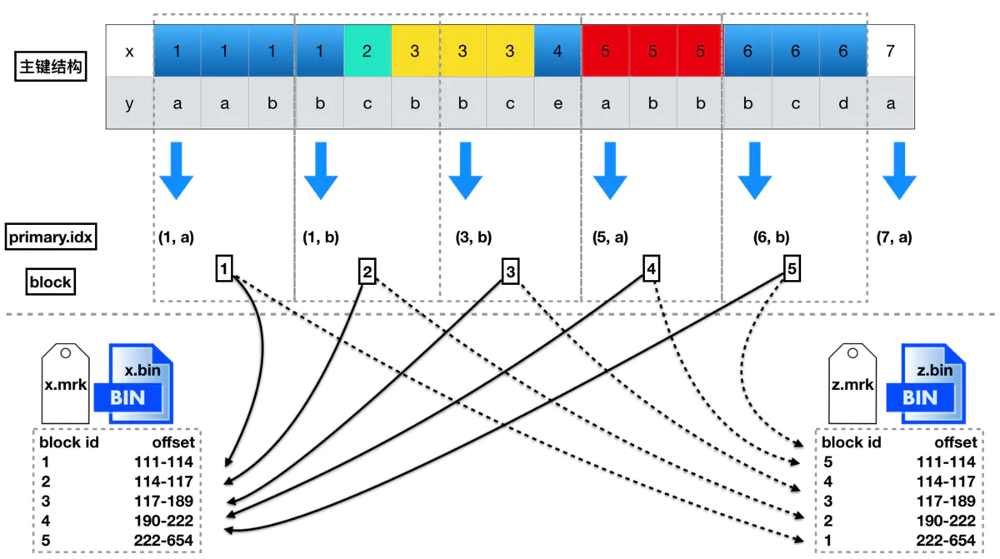

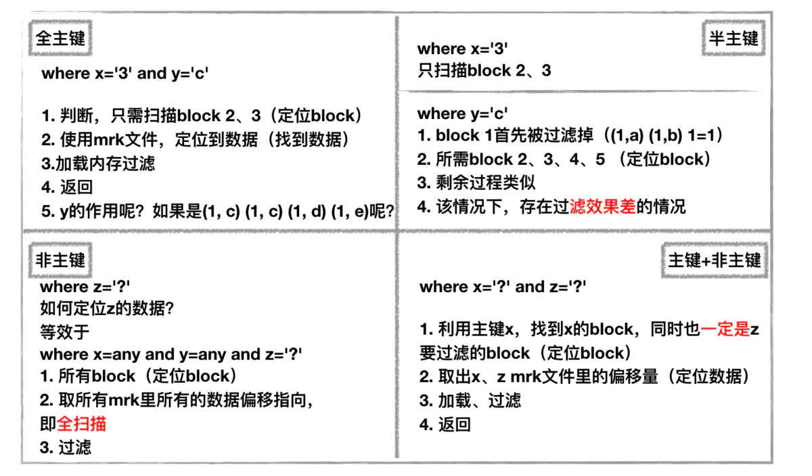

- 过长的主键,并不会对查询性能有太大的影响: 
  - 会拖慢写入性能
  - 会造成过多的内存占用。

- 主键的选择 

  举例来说，你有一个主键是(a, b)，增加一个列c，主键变成(a, b, c)，这种变动，只在下列情况有作用：

  - 你的查询使用到了c列
  - 以(a, b)组合，去重后的值，要远大于index_granularity的值。

### mergeTree引擎家族

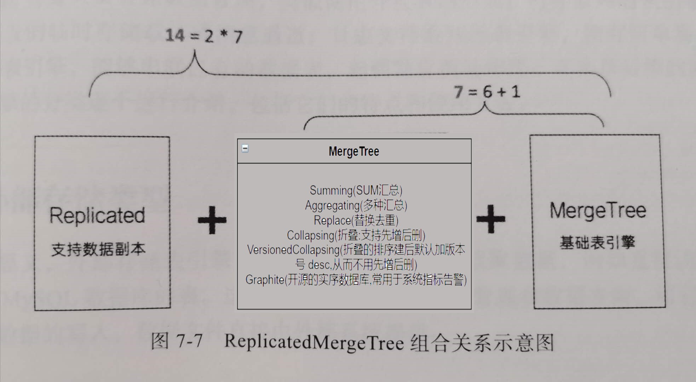

StorageMergeTree::merge函数是MergeTree异步Merge的核心逻辑，不同引擎是在此基础上有各自的实现逻辑.Data Part Merge的工作除了通过后台工作线程自动完成，用户还可以通过Optimize命令来手动触发。

- 自动触发的场景中，系统会根据后台空闲线程的数据来启发式地决定本次Merge最大可以处理的数据量大小，max_bytes_to_merge_at_min_space_in_pool和max_bytes_to_merge_at_max_space_in_pool参数分别决定当空闲线程数最大时可处理的数据量上限以及只剩下一个空闲线程时可处理的数据量上限。当用户的写入量非常大的时候，应该适当调整工作线程池的大小和这两个参数。

- 当用户手动触发merge时，系统则是根据disk剩余容量来决定可处理的最大数据量。

ClickHouse抽象出了IMergeSelector类来实现不同的逻辑。当前主要有两种不同的merge策略：TTL数据淘汰策略和常规策略。

- TTL数据淘汰策略：默认表的设置是1天才会进行TTL merge.TTL数据淘汰策略启用的条件比较苛刻，只有当某个Data Part中存在数据生命周期超时需要淘汰，并且距离上次使用TTL策略达到一定时间间隔（默认1小时）。TTL策略也非常简单，首先挑选出TTL超时最严重Data Part，把这个Data Part所在的数据分区作为要进行数据合并的分区，最后会把这个TTL超时最严重的Data Part前后连续的所有存在TTL过期的Data Part都纳入到merge的范围中。这个策略简单直接，每次保证优先合并掉最老的存在过期数据的Data Part。

- 常规策略：这里的选举策略就比较复杂，基本逻辑是枚举每个可能合并的Data Parts区间，通过启发式规则判断是否满足合并条件，再有启发式规则进行算分，选取分数最好的区间。启发式判断是否满足合并条件的算法在SimpleMergeSelector.cpp::allow函数中，其中的主要思想分为以下几点：

  - 系统默认对合并的区间有一个Data Parts数量的限制要求（每5个Data Parts才能合并）；
  - 如果当前数据分区中的Data Parts出现了膨胀，则适量放宽合并数量限制要求（最低可以两两merge）；
  - 如果参与合并的Data Parts中有很久之前写入的Data Part，也适量放宽合并数量限制要求，放宽的程度还取决于要合并的数据量。

  第一条规则是为了提升写入性能，避免在高速写入时两两merge这种低效的合并方式。

  最后一条规则则是为了保证随着数据分区中的Data Part老化，老龄化的数据分区内数据全部合并到一个Data Part。

  中间的规则更多是一种保护手段，防止因为写入和频繁mutation的极端情况下，Data Parts出现膨胀。

  启发式算法的策略则是优先选择IO开销最小的Data Parts区间完成合并，尽快合并掉小数据量的Data Parts是对在线查询最有利的方式，数据量很大的Data Parts已经有了很较好的数据压缩和索引效率，合并操作对查询带来的性价比较低。


## 四 常用引擎试水

CH有多种引擎,按类分为数据库引擎和表引擎,具体可参考文档 https://clickhouse.tech/docs/en/engines/

### kafka 引擎 : 基本满足当前格式的实时ETL需求,非四字段添加字段就需要改动建表语句

- CREATE TABLE test_kafka (
      log_time String,
      topic String,
      public_json String,
      biz_json String
    ) ENGINE = Kafka SETTINGS kafka_broker_list = '10.100.105.150:9292,10.100.105.151:9292,10.100.105.152:9292,10.100.105.153:9292,10.100.105.154:9292',
                              kafka_topic_list = 'test.fast.app.log',
                              kafka_group_name ='ch_test_group1',
                              kafka_format = 'TabSeparatedRaw',
                              kafka_num_consumers = 1,     //<=kafka的分区数
                              kafka_max_block_size = 3000, //每个块的大小,ch内部的优化机制,默认65535,刷新机制是默认7.5s刷出来,或者满足一个块的大小刷出来
                              kafka_skip_broken_messages = 3000;//每个块格式因为不正确能跳过的条数
- 底层是创建一个consumer订阅kafka,每次查此表会消费kafka数据.即每条数据只可查询到1次.
- 通常与物化视图联合使用,原理是将订阅消费的kafka数据每条都进行物化视图的处理,可写入另一张表,即实时etl.物化后的表可以多次查询.
- 支持tab切割格式(支持每批跳过指定数量的异常格式数据),满足咱们最新格式,非压缩日志的使用场景.

### mysql 引擎  : 可以定时导入数据到CH

- CREATE TABLE mysql_rt_vip
  ENGINE = MergeTree
  PARTITION BY toYYYYMM(updateTime)
  ORDER BY (id) AS
  SELECT *
  FROM mysql('10.100.102.21:3380', 'rt_dwd', 'rt_vip', 'bi_root', '123456') 
- mysql->CH 只第一次,CH->mysql可多次,作为维度表方案并不能实时监听mysql更新,只能定时导入数据
- 可以搭配物化视图
- 新特性的mysql物化未测试

### jdbc 引擎  :  除了mysql的,其他的并不能开箱即用,但是以连通为目的的优化成本低,是 java的

- 通过java开发的jdbc-bridge来跟所有能支持jdbc的存储进行通信,对此抱有很大希望,如果很好用能解决维度表问题,也能解决统一查询接口的问题
- 看源码发现jdbc-bridge是通过SPI机制加载指定目录下的驱动器jar包的,测试了目前我需要通过jdbc连接的几个存储:
  - mysql : 能通,但是存在decimal类型的坑,CH没有这个类型,如果是mysql引擎的话是直接转为String,如果通过jdbc则无法建表.<-换句话说如果表里没有decimal类型的字段是可以通过此方案查询mysql的
  - hive2 : SPI加载找不到 META-INF/services/java.sql.Driver 文件
    hive-jdbc-0.11.0.jar
    hive-jdbc-1.1.0-cdh5.13.0.jar
  - Phoenix jdbc测试 依赖和clickhouse冲突 得重新打包,最好能修改jdbc-bridge的类加载机制
    clickhouse guava-19.0.jar
    phoenix phoenix-core-4.14.0-HBase-1.1.jar guava-15.0.jar


## 五 ClickHouse  单集群HA方案

### ha 部署方案

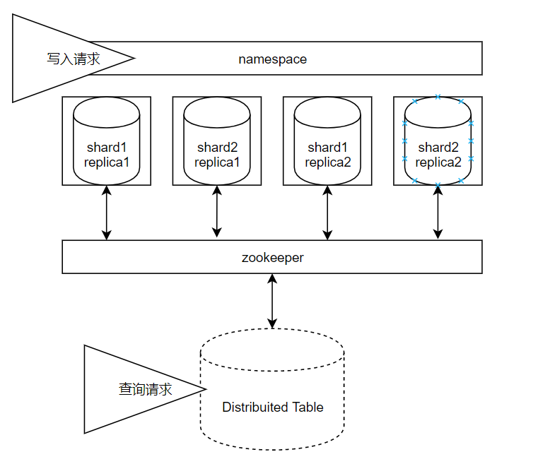

- 本地表创建语句
  CREATE TABLE default.test_01_local on CLUSTER cluster_2s
  (
  EventDate DateTime,
  CounterID UInt32,
  UserID UInt32
  ) ENGINE = ReplicatedMergeTree('/clickhouse/tables/{shard}/test_01_local','{replica}')
  PARTITION BY toYYYYMM(EventDate)
  ORDER BY (CounterID, EventDate, intHash32(UserID))
  SETTINGS index_granularity = 8192;

- 写入本地表
     客户端中  :  insert into default.test_01_local VALUES (now(), 1, 1);

     异步调用  :  clickhouse-client -u default --password xxxxxx --port 9000 -hcentos-1 --query="insert into default.test_01_local VALUES (now(), 10000, 10000)"

- 分布式表创建语句
  CREATE TABLE default.test_01 ON CLUSTER cluster_2s AS default.test_1_local engine = Distributed(cluster_2s, default, test_01_local, rand());

1. 同一物理集群可以配置多套逻辑集群
2. 经过测试,单个物理机器上布2个节点,数据查询有问题(原因仍未定位,docker/物理机部署问题相同),换为单物理机单节点问题解决,且根据CH原理,安装CH集群时会扫描核数,之后每个查询会使用总量1/2的核进行查询加速,且还有异步的merge线程池,所以单节点部署没毛病
3. 采用ReplicatedMergeTree表引擎家族进行HA建表,HA集群每个分片可以包含多个副本,即多分片多副本集群,一般情况2个副本即可够用,不重要数据可采用非HA集群(无副本)
4. 物理存储可以采用新版本的存储策略配置 按批次轮询或者冷热分离,也可以通过软链方式细化磁盘使用,当前用批次轮询即可

### 查询过程中zk交互

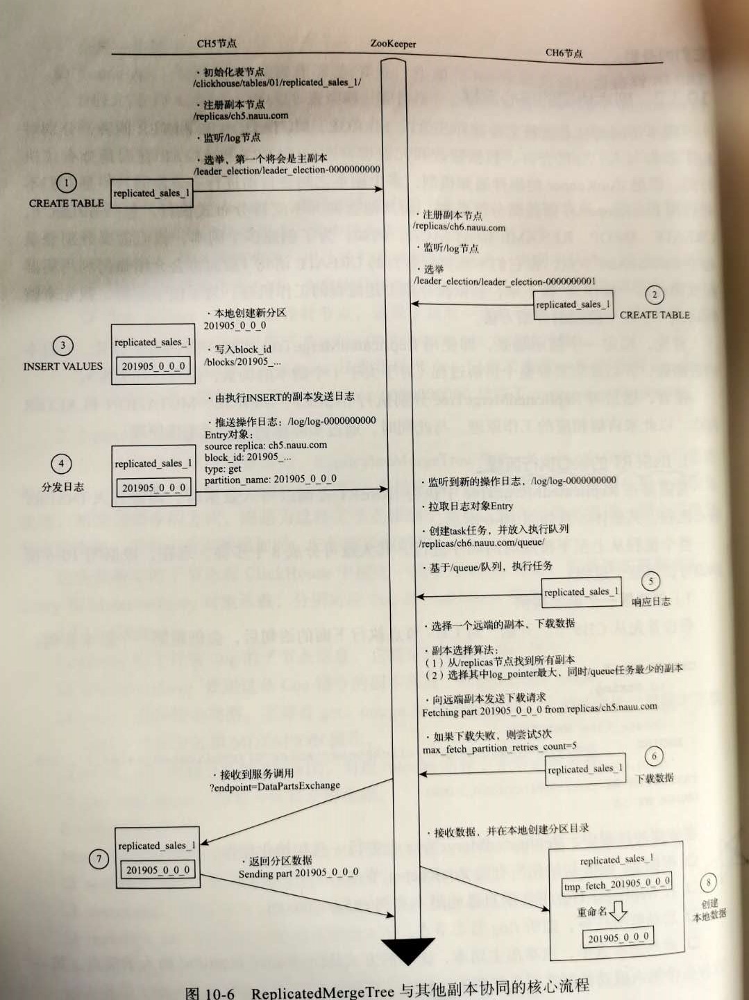

### ha测试和常用操作

1. 节点挂了重启数据问题 

   - 本地数据:只要目录没问题,重启不丢失
   - 副本恢复,如果一个副本挂了,数据写入另一个副本后,挂了的副本重启,挂了期间写入的数据会恢复到挂了的副本的本地表中 -> 可以恢复
2. 数据写时挂了数据问题

   - 因为是按批次写的,即<=默认的8192是一定满足原子性的,如果一次写入量大,中间失败很可能导致提交的此批数据不被最终提交(具体情况待配置名字空间后测试)
   - 适量批次的写入<-是否异常抛出,需要确定写入的方式,最佳实践是通过本地表自己用名字空间控制
3. 磁盘负载均衡

   - 修改名字空间流量
   - 通过命令或工具迁移数据
4. 扩缩容 : 改配置重启即可,需要注意

   - 如果是通过分布式表写入,负载均衡需要定期更新权重配置
   - 如果是自己用名字空间,则通过名字空间控制流量来负载权重
5. 备份/迁移问题 : 

   - 节点迁移/数据迁移 数据目录没问题可重启就行,通过detach(不常用)导入导出
   - 分区通过 freeze/fetch备份数据文件(不备份元数据)

   - remote命令读远程写本地来备份
   - clickhouse-backup(常规的异地冷备)
   - clickhouse-copier (数据迁移,可同集群可跨集群,通过zk管理)
   - https://zhuanlan.zhihu.com/p/220172155 
6. 过期数据删除 : 

   - 字段,表可以设置过期,全过期则该物理block过期
   - 按分区进行操作 mergeTree 系列引擎 : 
     		DETACH 与 ATTACH 相反,但重启还会获取元信息
       			卸载分区 ALTER TABLE db_name.table_name DETACH PARTITION '20201001'
       			装载分区 ALTER TABLE visits ATTACH PARTITION 201901;
       		DROP 删除分区 ALTER TABLE db_name.table_name DROP PARTITION '20201001'
       			从表中删除指定分区。该查询将分区标记为非活动，并在大约10分钟内完全删除数据。
       		DROP DETACHED PARTITION 删除隔离了的分区
   - 按part进行操作,类似分区进行操作,可以通过system.parts查询
7. 数据导入
   - 全量数据导入：数据导入临时表 -> 导入完成后，将原表改名为tmp1 -> 将临时表改名为正式表 -> 删除原表
   - 增量数据导入： 增量数据导入临时表 -> 将原数据除增量外的也导入临时表 -> 导入完成后，将原表改名为tmp1-> 将临时表改成正式表-> 删除原数据表

## 六  优缺点

**优点：**

1. 为了高效的使用CPU，数据不仅仅按列存储，同时还按向量进行处理；
2. 数据压缩空间大，减少IO；处理单查询高吞吐量每台服务器每秒最多数十亿行；
3. 索引非B树结构，不需要满足最左原则；只要过滤条件在索引列中包含即可；即使在使用的数据不在索引中，由于各种并行处理机制ClickHouse全表扫描的速度也很快；
4. 写入速度非常快，50-200M/s，对于大量的数据更新非常适用。

**缺点：**

1. 不支持事务，删除/更新性能差；
2. 不支持高并发，官方建议qps为100，可以通过修改配置文件增加连接数，但是在服务器足够好的情况下；
3. SQL满足日常使用80%以上的语法，已支持类似SQL的join，但性能一般；
4. 尽量做1000条以上批量的写入，避免逐行insert或小批量的insert，update，delete操作，因为ClickHouse底层会不断的做异步的数据合并，会影响查询性能，这个在做实时数据写入的时候要尽量避开；
5. Clickhouse快是因为采用了并行处理机制，即使一个查询，也会用服务器一半的CPU去执行，所以ClickHouse不能支持高并发的使用场景，默认单查询使用CPU核数为服务器核数的一半，安装时会自动识别服务器核数，可以通过配置文件修改该参数。
6. 主键并不是唯一建,与HBase相比,去重成本高
7. Cpp源码学习成本高
8. 没用hdfs+CPU密集型导致的运维,调优要求较高


## 七 优化

1. 关闭虚拟内存，物理内存和虚拟内存的数据交换，会导致查询变慢。
2. 批量写入数据时，必须控制每个批次的数据中涉及到的分区的数量，在写入之前最好对需要导入的数据进行排序。无序的数据或者涉及的分区太多，会导致ClickHouse无法及时对新导入的数据进行合并，从而影响查询性能。
3. ClickHouse的分布式表性能性价比不如物理表高，建表分区字段值不宜过多，防止数据导入过程磁盘可能会被打满。
4. CPU一般在50%左右会出现查询波动，达到70%会出现大范围的查询超时，CPU是最关键的指标，要非常关注。