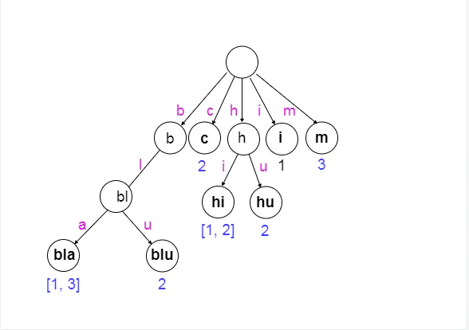

# 0. 前言

Elasticsearch 是一个分布式可扩展的实时搜索和分析引擎，它建立在全文搜索引擎 Apache Lucene™ 的基础上。Elasticsearch 之所以可以实现近乎实时的检索，依靠的技术手段是非常多的，本文将从 反向索引、Term Index 两块知识点入手，分析 Elasticsearch 之所以那么快的原因。

# 1. 反向索引

## 1.1. 正向索引

- 什么是正向索引
  在解释反向索引之前，需要先了解一下什么是正向索引，这也将解释倒排索引之所以会出现的背景原因。
  所谓正向索引，其结构就是每个文档和关键字做关联，每个文档都有与之对应的关键字，记录关键字在文档中出现的位置和次数，用户查询的时候是根据关键字去查询的。
  例如，搜索引擎在处理网页文档的时候，会从网页中提取出来一些特殊关键词，比如文章标题、文本内容、作者、单位、网页阅读数、点赞数、评论数等等，同时统计关键词出现的次数、位置、格式等信息，之后将这些提取的词组成一个集关键词合。
  这样，网页文档与关键词之间的映射关系是 **一个网页文件对应多个关键词**，被存储进搜索引擎的索引库，其所实现的是一个 **“文档-关键词”** 矩阵， 如下表展示：

| 网页    | 关键词                 |
| :------ | :--------------------- |
| web_1   | 马云, 马云, 马化腾,... |
| web_2   | 马云, 汽车, 飞机, ...  |
| ...     | ...                    |
| web_x_1 | 火星, 金星, ...        |
| ...     | ...                    |
| web_x_2 | 火星, 火星, 木星, ...  |
| ...     | ...                    |
| web_n   | ...                    |

在上表所展示的 **“文档-关键词”** 矩阵索引中，如果用户使用搜索引擎查找目标关键字（比如 **火星**），搜索引擎就会从索引库中所有的关键字包含 **火星** 的文档，也就是 **web_x_1、web_x_2**，并根据网页文件自身的价值评分高低（比如关键词出现的次数）按顺序展示给用户，用户得到的就是 **按顺序** 展示的 **web_x_2**、**web_x_1** 两个网页。这就是正向索引实现的大致流程。

- 正向索引的问题
  这个过程存在一个致命的问题，那就是在海量的网页里找到所有的关键词包含 **火星** 的网页，将是一个漫长的过程，在上面的例子中，如果总共有 1000亿个网页，并且有100万个包含火星，那么需要的计算量是惊人的。
  实际上，受制于时间、内存、处理器等等资源的限制，技术上正向索引是不能实现的。
  在这种背景下，倒排索引出现了。

## 1.2. 反向索引

- 什么是反向索引
  反向索引（Inverted Index），也叫倒排索引，相比于正向索引，其采用的是 **“关键词-文档”** 矩阵，关键词与网页文档之间的映射关系是 **一个关键词对应多个网页文档**，如下图所示：

| 关键词 | 网页             |
| :----- | :--------------- |
| 马云   | web_1, web_2     |
| 马化腾 | web_1            |
| 汽车   | web_2            |
| 飞机   | web_2            |
| ...    | ...              |
| 火星   | web_x_2, web_x_1 |
| ...    | ...              |
| 金星   | web_x_1          |
| 木星   | web_x_2          |
| ...    | ...              |

在这个矩阵中，**火星** 关键词对应的所有网页都被提前找到，甚至网页文档的权重都被提前计算好并排序，当用户输入 **火星** 关键词时，就会立刻到 web_x_2, web_x_1 的反馈结果。
这里有些人会有疑问，关键词数量会不会太多，以至于超过网页问的数量，这样效率不会反而变低了么，其实不然，人类的语言词汇数量是相对有限、且固定的，但网页数量却没有上限。比如汉语中，汉字30000个、词汇大概40万，但汉语网站数量却远远不止这么些。
需要注意的是，由于每个字或词对应的文档数量在动态变化，所以倒排表的建立和维护都较为复杂，但是在查询的时候由于可以一次得到查询关键字所对应的所有文档，所以效率高于正排表。

# 2. Term Index

## 2.1. Term & Posting List

- 在上面的例子中，创建的是一个简单的反向索引，但 Elasticsearch 的索引结构实际上并不表现为这种形态，首先网页文档在索引中只表现为一个 int 类型的 **文档di**，而且索引中用于查找网页文档的只有 **关键词** 一项，实际我们在做业务中需要面对的情况要复杂得多。
  下面展示了一个商品信息的二维数据表样例：

| id   | Name            | Color | Rate   |
| :--- | :-------------- | :---- | :----- |
| 1    | iphone 666 plus | black | high   |
| 2    | Huawei mate 98k | blue  | high   |
| 3    | Chuzi game over | black | middle |

针对这个表，Elasticsearch 会创建如下的索引：
索引一：**Name**

| Term            | Posting List |
| :-------------- | :----------- |
| iphone 666 plus | 1            |
| Hauwei mate 98k | 2            |
| Chuzi game over | 3            |

索引二：**Color**

| Term  | Posting List |
| :---- | :----------- |
| black | [1, 3]       |
| blue  | 2            |

索引三：**Rate**

| Term   | Posting List |
| :----- | :----------- |
| high   | [1, 2]       |
| middle | 3            |

在这个索引中，Name、Color、Rate 这些字段被称为 **filed**， iphone 666 plus、blue、middle 这些被称作 **Term**，而 Term 对应的所有商品的 id 比如 [1, 3] 就是 **Posting List**。
当用户要查找 **Color=blue** 的商品时，通过索引三的 Term 和 Posting List 很快就可以找到，目标是 id 为 2 的商品，进而通过索引一找到商品 Name 为 华为 mate 98k。

## 2.2. Term Dictionary

上面简单解释了 Term 和 Posting List，但实际生产中 Elasticsearch 需要面对的是数以亿计的数据记录，数据的 Term 的数量是惊人的，这样往往需要花费大量时间才能命中，而且多数时候查找是多条件查找，这就需要多次进行重复查找，效率仍然不高。
这时就需要对 Term 进行优化排序，即使用 [二分查找](https://links.jianshu.com/go?to=https%3A%2F%2Fbaike.baidu.com%2Fitem%2F%E4%BA%8C%E5%88%86%E6%9F%A5%E6%89%BE%2F10628618%3Ffr%3Daladdin) 查找 Term，这种查找方法类似于通过字典查找，被称为 Term Dictionary 。
同样是上面的例子，Name、Color、Rate 三个索引下所有的 Term，按照 **首字母在英语字母表中位置** 排序后如下：

| Term             | Posting List |
| :--------------- | :----------- |
| black            | [1, 3]       |
| blue             | 2            |
| Chuizi game over | 3            |
| high             | [1, 2]       |
| Huawei mate 98k  | 2            |
| iphone 666 plus  | 1            |
| middle           | 3            |

当用户想要查找 rate 为 high 的商品时，通过二分法很快就可以查到，查找过程的时间复杂度为 log N，这样就大大提高了查找的速度。关于二分查找，细节这里就不做赘述了，如果不清楚的朋友们可以自行百度，或点击 [二分查找](https://links.jianshu.com/go?to=https%3A%2F%2Fbaike.baidu.com%2Fitem%2F%E4%BA%8C%E5%88%86%E6%9F%A5%E6%89%BE%2F10628618%3Ffr%3Daladdin) 获取更多信息。

## 2.3. Term Index

到这里很多人会有疑问，那这和传统的 B-tree 有什么区别呢，这就需要引入另一个概念 Term Index。
Term Index 其实也可以理解为一个树形结构，从 Term 的第一个字母开始进行第一层排序，如果有多个 Term 首字母相同，则从该字母为起始点进行第二层排序，如果以该字母为首的只有一个 Term，则不再进行第二次排序。
同样是上面的例子，其 Term Index 如下图所示：

在上图中，字母 b 为首的 Term 有两个，分别为 blue 和 black，这时就需要进行第二层排序，即对第二位字母进行排序，这时我们发现两个 Term 的第二位字母都为 l，于是进行第三层排序，第三层排序的结果是 bla、blu ，分别对应 black、blue 两个 Term，并对应 [1, 3]、2 两个 Posting List。对应关系如下图所示：

在 Term Index 中需要保存的是 Term 的前面部分字段，以及与 Term Dictionary 之间的映射关系，这使得存储的信息量减少。再结合 FST（Finite State Transducer）压缩技术，Term Iindex 可以被压缩到足够小，以至于可以被缓存进服务器内存中。这样，在用户查找的时候，先在内存里从 Term Index 找到 Term Dictionary 中的位置映射关系，然后再去磁盘上找对应的 Term，进而查找对应的 Posting List，这就大大减少了磁盘的读取次数，也就提高了效率和速度。

## 2.4. FST（Finite State Transducer）

关于 FST 压缩技术，请参考这篇文章：[https://www.shenyanchao.cn/blog/2018/12/04/lucene-fst/](https://links.jianshu.com/go?to=https%3A%2F%2Fwww.shenyanchao.cn%2Fblog%2F2018%2F12%2F04%2Flucene-fst%2F)，英语好的可以看下这篇论文[https://cs.nyu.edu/~mohri/pub/fla.pdf](https://links.jianshu.com/go?to=https%3A%2F%2Fcs.nyu.edu%2F~mohri%2Fpub%2Ffla.pdf)，里面对FST有详细的解释。

这里先埋一个坑，将来有时间再来填。