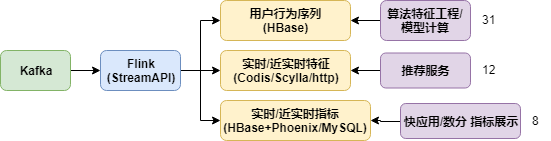
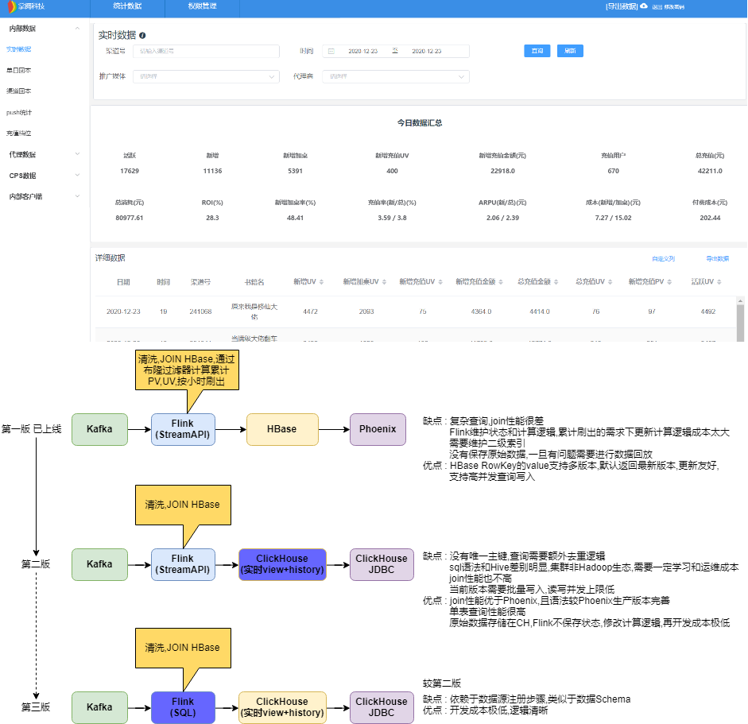
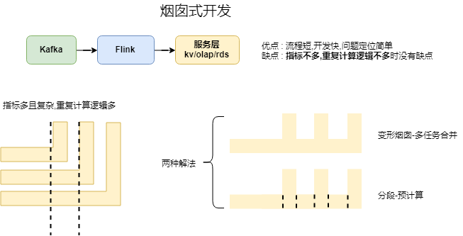
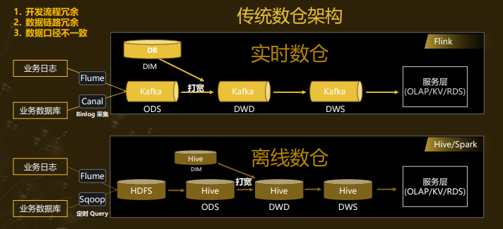
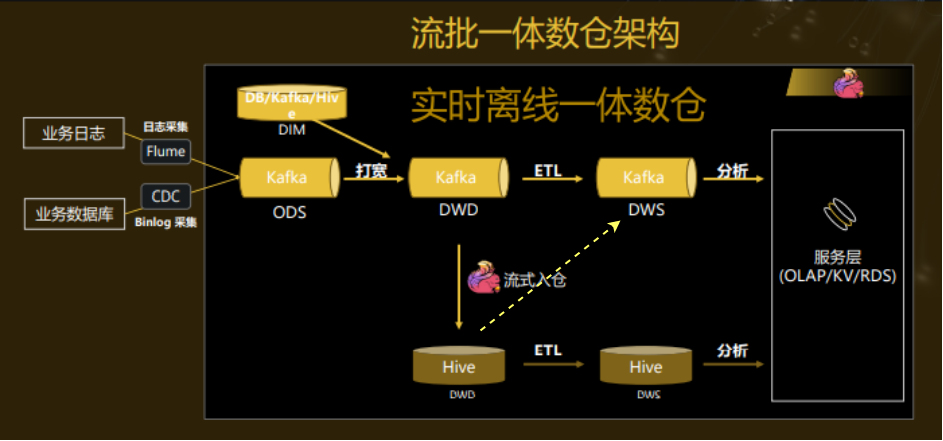
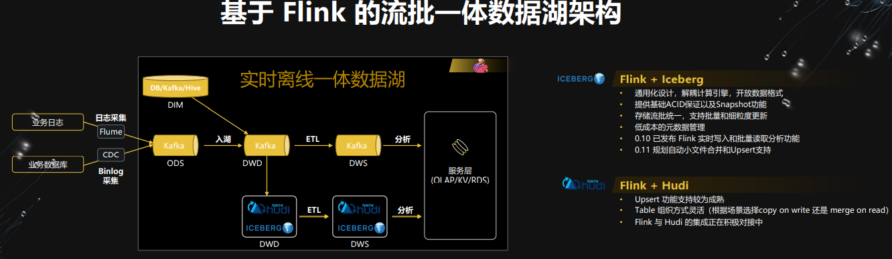
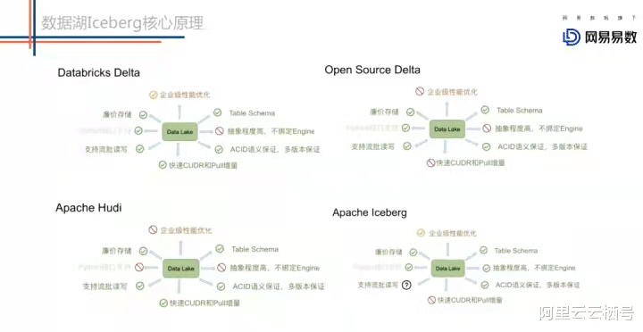

# Flink应用的分享

## 一 、Flink目前的应用情况和问题

### 1.Flink目前的应用场景

### 2.以快应用为例,实时指标的方案演进,olap目前的情况和问题

实时指标演进 : 第一版 单一的实时指标需求(计算后查询) -> 第二版 支持OLAP(查询时计算) -> 第三版 全SQL编程

以快应用当天累计小时新增加桌指标为例

1. ClickHouse 集群搭建 : [4分片2副本集群](http://10.100.105.54:5000/queries/new)
2. [慢查询/写入监控](http://10.100.105.138:3000/d/XtvXKW1Gk/bi-m8-clickhouse?orgId=2&refresh=5s) 
3. [Flink 消费到 ClickHouse + 负载均衡设置](http://bj-m5-hadoop-1-86:8088/proxy/application_1591842169154_2960/#/job/6fa53c8f3e69755b5a15fc51b08f4f58/overview)
4. [ClickHouse SQL指标计算](http://10.100.105.54:8082/#!/sql) 
5. [调度系统CH脚本调度](http://10.100.105.53:6688/#/projects/definition/list/226)

### 3.Flink SQL的之前的调研情况，问题和下一步计划

### 4.Flink 进一步应用的畅想

- Flink SQL 流/批 生产实践 <- 将开发和问题修复难度降维
- Flink 1.12 原生MySQL CDC接入 <- 目前现状是服务端日志双打(mysql+格式化日志),问题1双打费资源,2.元数据需要独立维护3.数据不准
- 多Souce/Sink支持 Exactly Once语义

## 二 、实时指标的通用架构演进

### 1.烟囱式开发

### 2.实时数仓

数仓的本质是预计算,实时指标通过分层预计算的实现方案就是实时数仓

实时数仓本身的问题 :

1. 毛刺,延时,维护难度随实时数仓层级增长呈指数递增 <- 维护较少层级
2. 对消息中间件本身的依赖大大增加 <- kafka的服务化,双集群双机房故障自动切换,offset备份,重要日志双打,生产消费血缘采集等

***Lambda* 问题的根源在于一个头下面长了两个脖子,两个脖子连着的两个身体躯干都是割裂的,一旦对起数来,通常都是tmbd**

解决这个问题的基础在于 : 

1. 一个指标只有一个计算逻辑 <-**计算口径,计算实施人统一** : 提供离线和实时指标的人在一个团队(阿里就是实时和离线团队合并)
2. 实时方案可以降级到批但是批方案处理不了实时问题 <- **数据源头统一** : 由实时同步到批
3. 同时在整个计算过程中使用同一套语言 <- **语言统一** : Flink SQL 从1.10版本开始,对Hive的支持就已经非常完善(已经跑通benchmark)且流批都是用同一个计划生成器

### 3.流批一体

本方案看似完美,实则该掉蛋还是会掉蛋

1. kafka dws层的数据修复工作在非简单回放就能修复的情况下,需要从hive dwd层到kafka dws层修复,此时会因hive分区的滞后而滞后
2. kafka和flink费劲心思实现的exactly once语义因为hive的更新支持差而受到致命一击,从而打破数据统一的大目标

所以流批统一的好处只在节省了资源,加速了hive离线计算的进度,但在一些频繁更新的场景下仍然存在对数的需求

**问题的根源在于 原生的hive 作为长久以来数仓的经典实现方案,仅能温饱,不支持实时upsert和实时增量数据查询**

### 4.湖仓一体

**阿里数据湖调研**

[网易: Flink + Iceberg 数据湖探索与实践 范欣欣](https://mparticle.uc.cn/article.html?uc_param_str=frdnsnpfvecpntnwprdssskt&btifl=100&app=uc-iflow&title_type=1&wm_id=bc640814aeaa49a2a2dad4089ac6dbfc&wm_cid=385473935352796160&pagetype=share&client=&uc_share_depth=1)