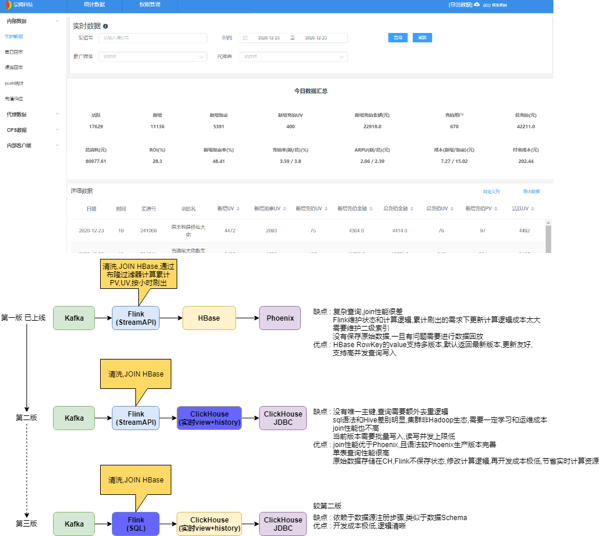
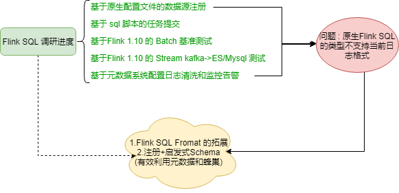

# Flink应用的分享和汇报

## 一 、Flink目前的应用情况和问题

### 1.Flink目前的应用场景

### 2.以快应用为例,实时指标的方案演进,olap目前的情况和问题

### 3.Flink SQL的之前的调研情况，问题和下一步计划

### 4.Flink 进一步应用的畅想

- Flink SQL 流/批 生产实践
- Flink 1.12 原生MySQL CDC接入
- 多Souce/Sink支持 Exactly Once语义

## 二 、实时指标的通用架构演进

