##  Checkpoint 与 State 的关系

**Checkpoint** 是从 source 触发到下游所有节点完成的一次全局操作。

**State** 存储了程序运行中需要统计的数据.

回顾一下刚才这段 word count 代码。keyby 接口的调用会创建 keyed stream 对 key 进行划分，这是使用 keyed state 的前提。在此之后，sum 方法会调用内置的 StreamGroupedReduce 实现。

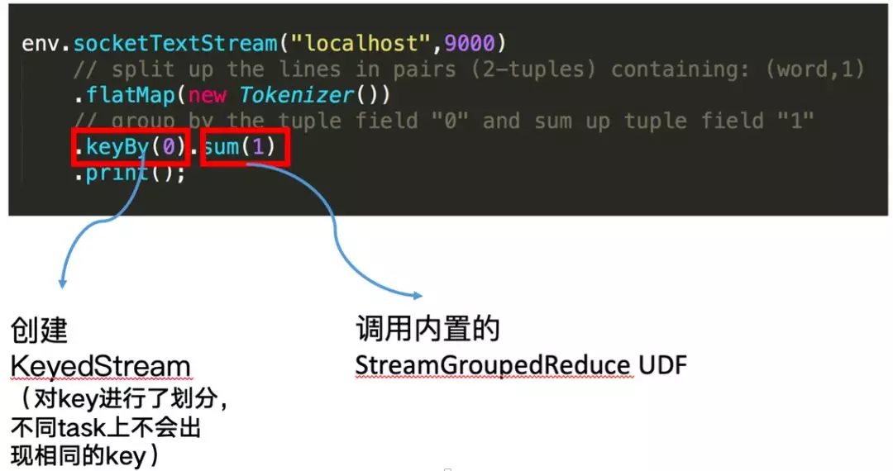

## State分类

### 什么是 keyed state

对于 keyed state，有两个特点：

- 只能应用于 KeyedStream 的函数与操作中，例如 Keyed UDF, window state
- keyed state 是已经分区 / 划分好的，每一个 key 只能属于某一个 keyed state

对于如何理解已经分区的概念，我们需要看一下 keyby 的语义，大家可以看到下图左边有三个并发，右边也是三个并发，左边的词进来之后，通过 keyby 会进行相应的分发。例如对于 hello word，hello 这个词通过 hash 运算永远只会到右下方并发的 task 上面去。

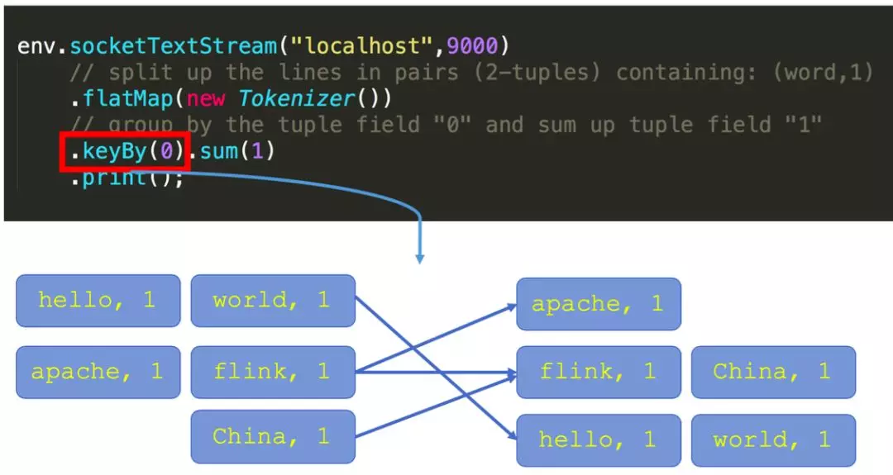


### 什么是 operator state

- 又称为 non-keyed state，每一个 operator state 都仅与一个 operator 的实例绑定
- 常见的 operator state 是 source state，例如记录当前 source 的 offset

再看一段使用 operator state 的 word count 代码：

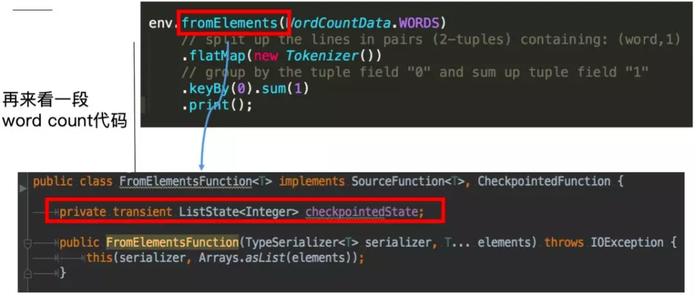


这里的 fromElements 会调用 FromElementsFunction 的类，其中就使用了类型为 list state 的 operator state。根据 state 类型做一个分类如下图： 


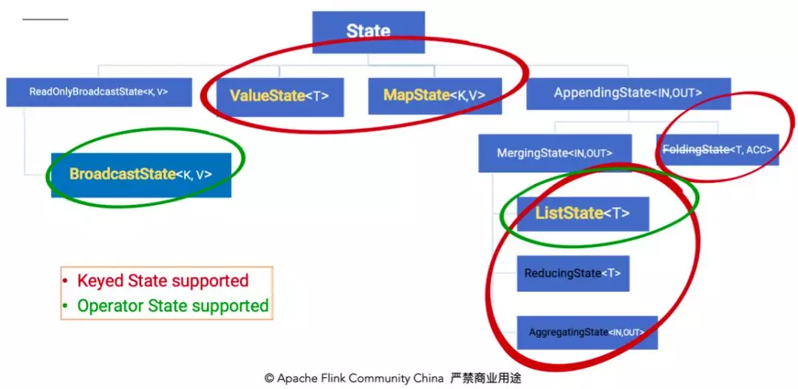


除了从这种分类的角度，还有一种分类的角度是从 Flink 是否直接接管：

- Managed State：由 Flink 管理的 state，刚才举例的所有 state 均是 managed state
- Raw State：Flink 仅提供 stream 可以进行存储数据，对 Flink 而言 raw state 只是一些 bytes

在实际生产中，都只推荐使用 managed state，本文将围绕该话题进行讨论。

###  Statebackend 的分类

下图阐释了目前 Flink 内置的三类 state backend，其中 MemoryStateBackend 和 FsStateBackend 在运行时都是存储在 java heap 中的，只有在执行 Checkpoint 时，FsStateBackend 才会将数据以文件格式持久化到远程存储上。而 RocksDBStateBackend 则借用了 RocksDB（内存磁盘混合的 LSM DB）对 state 进行存储。

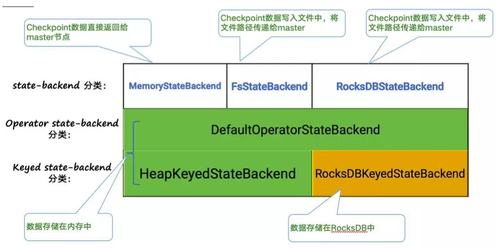

对于 HeapKeyedStateBackend，有两种实现：

- 支持异步 Checkpoint（默认）：存储格式 CopyOnWriteStateMap
- 仅支持同步 Checkpoint：存储格式 NestedStateMap

特别在 MemoryStateBackend 内使用 HeapKeyedStateBackend 时，Checkpoint 序列化数据阶段默认有最大 5 MB 数据的限制。

对于 RocksDBKeyedStateBackend，每个 state 都存储在一个单独的 column family 内，其中 keyGroup，Key 和 Namespace 进行序列化存储在 DB 作为 key。

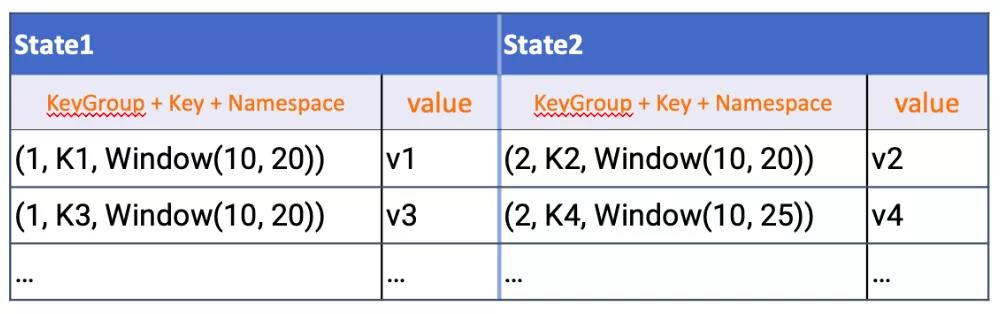

##  Checkpoint 执行机制详解

本小节将对 Checkpoint 的执行流程逐步拆解进行讲解，下图左侧是 Checkpoint Coordinator，是整个 Checkpoint 的发起者，中间是由两个 source，一个 sink 组成的 Flink 作业，最右侧的是持久化存储，在大部分用户场景中对应 HDFS。

**a. 第一步**，Checkpoint Coordinator 向所有 source 节点 trigger Checkpoint。

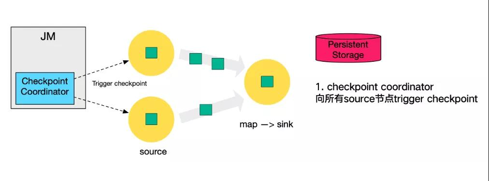

**b. 第二步**，source 节点向下游广播 barrier，这个 barrier 就是实现 Chandy-Lamport 分布式快照算法的核心，下游的 task 只有收到所有 input 的 barrier 才会执行相应的 Checkpoint。

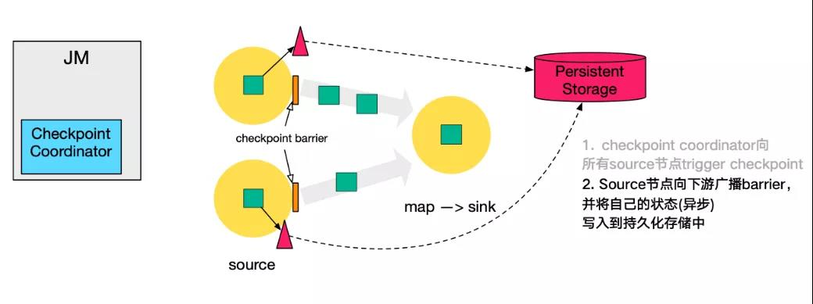

**c. 第三步**，当 task 完成 state 备份后，会将备份数据的地址（state handle）通知给 Checkpoint coordinator。

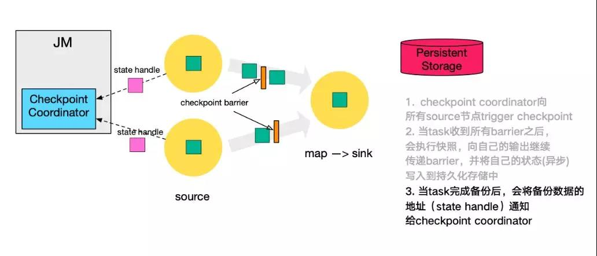

**d. 第四步**，下游的 sink 节点收集齐上游两个 input 的 barrier 之后，会执行本地快照，这里特地展示了 RocksDB incremental Checkpoint 的流程，首先 RocksDB 会全量刷数据到磁盘上（红色大三角表示），然后 Flink 框架会从中选择没有上传的文件进行持久化备份（紫色小三角）。

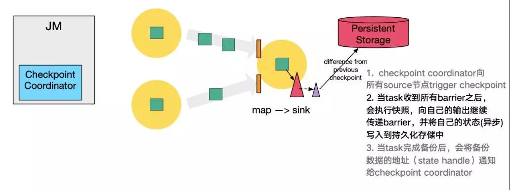

**e. 同样的**，sink 节点在完成自己的 Checkpoint 之后，会将 state handle 返回通知 Coordinator。

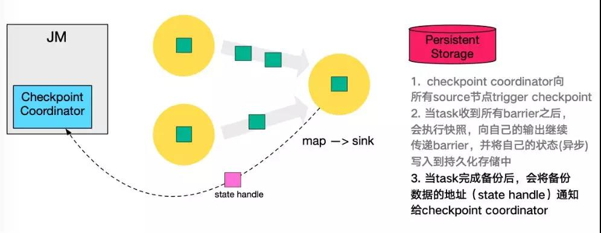

**f. 最后**，当 Checkpoint coordinator 收集齐所有 task 的 state handle，就认为这一次的 Checkpoint 全局完成了，向持久化存储中再备份一个 Checkpoint meta 文件。

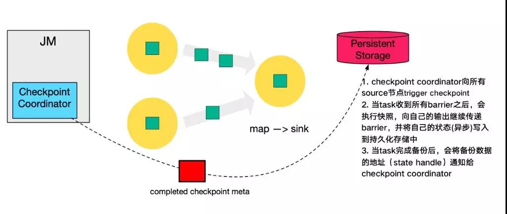

###  Checkpoint 的 EXACTLY_ONCE 语义

**EXACTLY ONCE** : Flink 通过一个 input buffer 将在对齐阶段收到的数据缓存起来，等对齐完成之后再进行处理。 **AT LEAST ONCE** : 无需缓存收集到的数据，会对后续直接处理，所以导致 restore 时，数据可能会被多次处理。

下图是官网文档里面就 Checkpoint 对齐 的示意图：

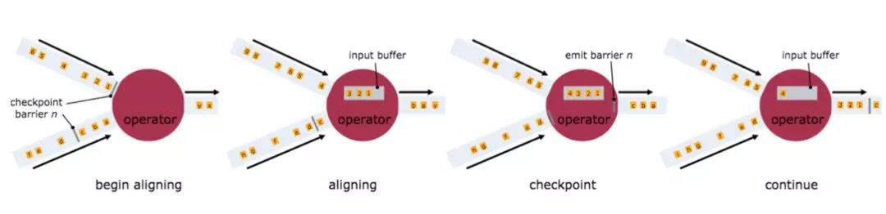

***需要特别注意的是，Flink 的 Checkpoint 机制只能保证 Flink 的计算过程可以做到 EXACTLY ONCE，端到端的 EXACTLY ONCE 需要 source 和 sink 支持。***


###  Savepoint 与 Checkpoint 的区别

作业恢复时，二者均可以使用，主要区别如下：

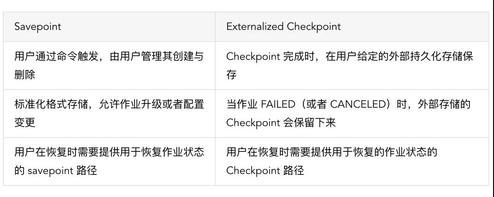

## checkpoint 基础配置

| 配置                                                   | 解释                                                         | 默认值                                   |
| ------------------------------------------------------ | ------------------------------------------------------------ | ---------------------------------------- |
| exactly-once vs. at-least-once                         | 一致性模型,是否在等待对齐通过input buff进行缓存              | EXACTLY_ONCE                             |
| interval                                               | chk两次之间的间隔,即为JM的Checkpoint Coordinator 向所有 source 节点 trigger Checkpoint的周期 | -1(不进行chk)                            |
| checkpoint timeout                                     | 超时的时间如果配置超时后任务失败则chk超过此时间任务会失败    | 10min                                    |
| minimum time between checkpoints                       | 2次chk的最小间隔,确保有一定时间进行非chk的计算               | 0ms                                      |
| number of concurrent checkpoints                       | 允许的并发chk数                                              | 1                                        |
| externalized checkpoints/externalizedCheckpointCleanup | 是否外部持久化/取消作业时外部化检查点的清理行为              | 有清理行为策略就意味需要外部持久化检查点 |
| fail/continue task on checkpoint errors(过时)          | chk失败后的策略,任务->失败或者任务继续                       | chk失败就job失败                         |
| TOLERABLE_CHECKPOINT_NUMBER(作为替换上一个配置的实现)  | job可容忍的chk失败次数                                       | -1(即为chk失败就job失败)                 |
| prefer checkpoint for recovery                         | 任务是否从最新的检查点进行回滚                               | false                                    |
| CHECKPOINTS_DIRECTORY                                  | 保存检查点的位置一般是hdfs,flink-conf.yaml中配置             |                                          |
| forceCheckpointing                                     | 这是一个有误导性的名称，实际上是指在协调器正在处理checkpoint时是否必须触发快照 |                                          |


### 下面是设置 Flink Checkpoint 参数配置的建议及注意点：

1. 当 Checkpoint 时间比设置的 Checkpoint 间隔时间要长时，可以设置 Checkpoint 间最小时间间隔。这样在上次 Checkpoint 完成时，不会立马进行下一次 Checkpoint，而是会等待一个最小时间间隔，之后再进行 Checkpoint。否则，每次 Checkpoint 完成时，就会立马开始下一次 Checkpoint，系统会有很多资源消耗 Checkpoint 方面，而真正任务计算的资源就会变少。
2. 如果Flink状态很大，在进行恢复时，需要从远程存储上读取状态进行恢复，如果状态文件过大，此时可能导致任务恢复很慢，大量的时间浪费在网络传输方面。此时可以设置 Flink Task 本地状态恢复，任务状态本地恢复默认没有开启，可以设置参数 state.backend.local-recovery 值为 true 进行激活。
3. Checkpoint 保存数，Checkpoint 保存数默认是1，也就是只保存最新的 Checkpoint 的状态文件，当进行状态恢复时，如果最新的 Checkpoint 文件不可用时(比如 HDFS 文件所有副本都损坏或者其他原因)，那么状态恢复就会失败，如果设置 Checkpoint 保存数 2，即使最新的Checkpoint恢复失败，那么Flink 会回滚到之前那一次 Checkpoint 的状态文件进行恢复。考虑到这种情况，用户可以增加 Checkpoint 保存数。
4. 建议设置的 Checkpoint 的间隔时间最好大于 Checkpoint 的完成时间。

### 代码设置例子:

```
StreamExecutionEnvironment env = StreamExecutionEnvironment.getExecutionEnvironment();

// start a checkpoint every 1000 ms
env.enableCheckpointing(1000);

// advanced options:

// set mode to exactly-once (this is the default)
env.getCheckpointConfig().setCheckpointingMode(CheckpointingMode.EXACTLY_ONCE);

// make sure 500 ms of progress happen between checkpoints
env.getCheckpointConfig().setMinPauseBetweenCheckpoints(500);

// checkpoints have to complete within one minute, or are discarded
env.getCheckpointConfig().setCheckpointTimeout(60000);

// allow only one checkpoint to be in progress at the same time
env.getCheckpointConfig().setMaxConcurrentCheckpoints(1);

// enable externalized checkpoints which are retained after job cancellation
env.getCheckpointConfig().enableExternalizedCheckpoints(ExternalizedCheckpointCleanup.RETAIN_ON_CANCELLATION);

// allow job recovery fallback to checkpoint when there is a more recent savepoint
env.getCheckpointConfig().setPreferCheckpointForRecovery(true);
```

# 源码分析

### checkpoint 保存的原则3个

```
org.apache.flink.runtime.checkpoint.CheckpointRetentionPolicy
RETAIN_ON_CANCELLATION 取消/失败的时候保存
RETAIN_ON_FAILURE 仅失败时候保存
NEVER_RETAIN_AFTER_TERMINATION 绝不保存
```

### 据此3原则推出5种默认的CheckpointProperties

```
org.apache.flink.runtime.checkpoint.CheckpointProperties
SYNC_SAVEPOINT 同步savepoint (submit时也保存,force=true)
SAVEPOINT 异步savepoint (submit时也保存,force=true)
CHECKPOINT_NEVER_RETAINED 不保存的checkpoint (force=false)
CHECKPOINT_RETAINED_ON_FAILURE 失败保存的checkpoint (force=false)
CHECKPOINT_RETAINED_ON_CANCELLATION 取消时/失败时保存的checkpoint (force=false)
```

### 2种CheckpointStorage

```
FsCheckpointStorage 文件系统保存介质(hdfs)
MemoryBackendCheckpointStorage 内存保存介质
```