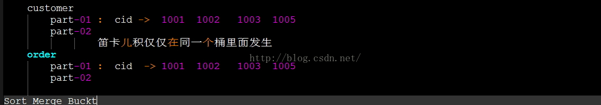
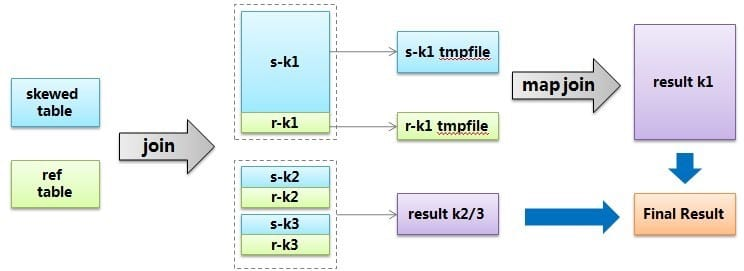
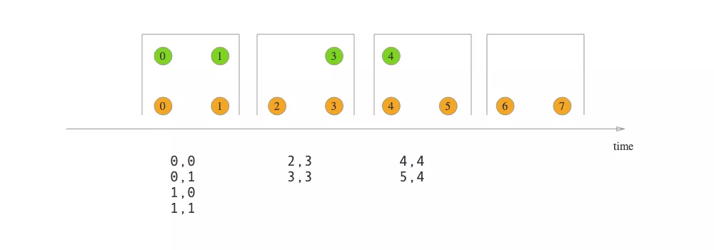
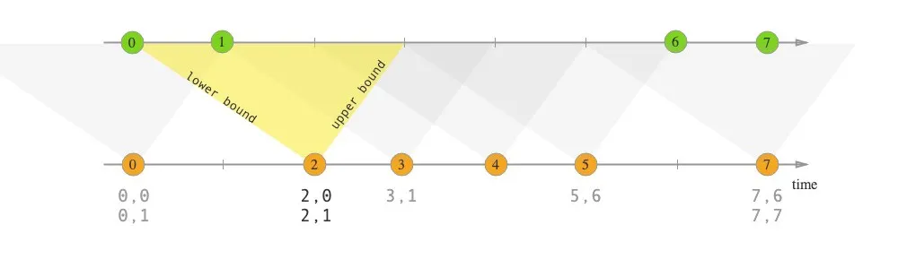
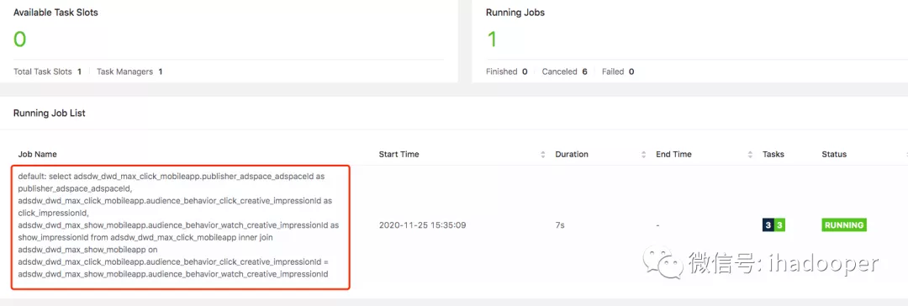
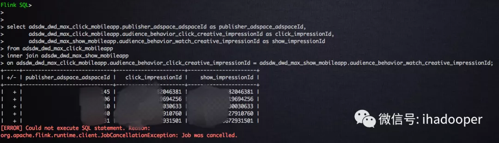
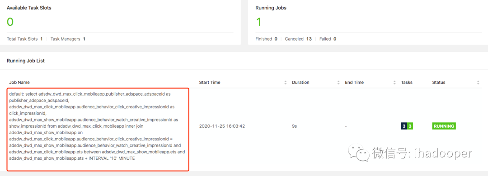
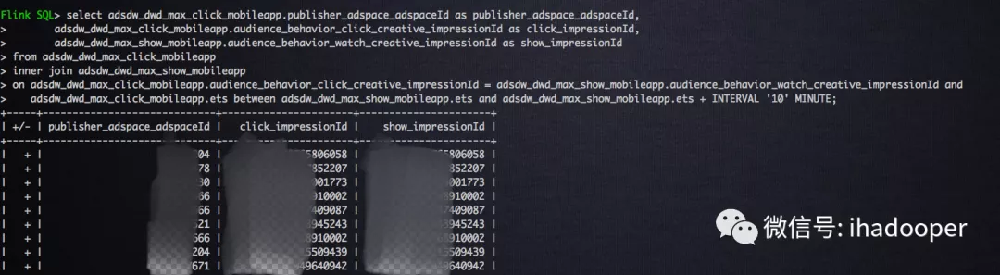

# join 背景

## mysql -> 单点,有界数据集 join表连接的三种算法思想：Nested-Loop Join和Index Nested-Loop Join和Block Nested-Loop Join和BKA

### 一.Nested-Loop Join

在Mysql中，使用Nested-Loop Join的算法思想去优化join，Nested-Loop Join翻译成中文则是“嵌套循环连接”。

举个例子：
select * from t1 inner join t2 on t1.id=t2.tid
（1）t1称为外层表，也可称为驱动表。
（2）t2称为内层表，也可称为被驱动表。

**在Mysql的实现中，Nested-Loop Join有3种实现的算法：**

- Simple Nested-Loop Join：SNLJ，简单嵌套循环连接
- Index Nested-Loop Join：INLJ，索引嵌套循环连接
- Block Nested-Loop Join：BNLJ，缓存块嵌套循环连接

在选择Join算法时，会有优先级，理论上会优先判断能否使用INLJ、BNLJ：
**Index Nested-LoopJoin > Block Nested-Loop Join > Simple Nested-Loop Join**

### 二.Simple Nested-Loop

1. 简单嵌套循环连接实际上就是简单粗暴的嵌套循环，如果table1有1万条数据，table2有1万条数据，那么数据比较的次数=1万 * 1万 =1亿次，这种查询效率会非常慢。
2. 所以Mysql继续优化，然后衍生出Index Nested-LoopJoin、Block Nested-Loop Join两种NLJ算法。在执行join查询时mysql会根据情况选择两种之一进行join查询。

### 三.Index Nested-LoopJoin（减少内层表数据的匹配次数）

1. 索引嵌套循环连接是基于索引进行连接的算法，索引是基于内层表的，通过外层表匹配条件直接与内层表索引进行匹配，避免和内层表的每条记录进行比较， 从而利用索引的查询减少了对内层表的匹配次数，优势极大的提升了 join的性能：

> 原来的匹配次数 = 外层表行数 * 内层表行数
> 优化后的匹配次数= 外层表的行数 * 内层表索引的高度

1. 使用场景：只有内层表join的列有索引时，才能用到Index Nested-LoopJoin进行连接。
2. 由于用到索引，如果索引是辅助索引而且返回的数据还包括内层表的其他数据，则会回内层表查询数据，多了一些IO操作。

### 四.Block Nested-Loop Join（减少内层表数据的循环次数）

1. 缓存块嵌套循环连接通过一次性缓存多条数据，把参与查询的列缓存到Join Buffer 里，然后拿join buffer里的数据批量与内层表的数据进行匹配，从而减少了内层循环的次数（遍历一次内层表就可以批量匹配一次Join Buffer里面的外层表数据）。
2. 当不使用Index Nested-Loop Join的时候，默认使用Block Nested-Loop Join。
3. 什么是Join Buffer？
   （1）Join Buffer会缓存所有参与查询的列而不是只有Join的列。
   （2）可以通过调整join_buffer_size缓存大小
   （3）join_buffer_size的默认值是256K，join_buffer_size的最大值在MySQL 5.1.22版本前是4G-1，而之后的版本才能在64位操作系统下申请大于4G的Join Buffer空间。
   （4）使用Block Nested-Loop Join算法需要开启优化器管理配置的optimizer_switch的设置block_nested_loop为on，默认为开启。

### 五.BKA

   Batched Key Access Join算法的工作步骤如下：

1) 将外部表中相关的列放入Join Buffer中。

2) 批量的将Key（索引键值）发送到Multi-Range Read（MRR）接口

3) Multi-Range Read（MRR）通过收到的Key，根据其对应的ROWID进行排序，然后再进行数据的读取操作。

4) 返回结果集给客户端。

### 六.如何优化Join速度

1. 用小结果集驱动大结果集，减少外层循环的数据量：
   如果小结果集和大结果集连接的列都是索引列，mysql在内连接时也会选择用小结果集驱动大结果集，因为索引查询的成本是比较固定的，这时候外层的循环越少，join的速度便越快。
2. 为匹配的条件增加索引：争取使用INLJ，减少内层表的循环次数
3. 增大join buffer size的大小：当使用BNLJ时，一次缓存的数据越多，那么外层表循环的次数就越少
4. 减少不必要的字段查询：
   （1）当用到BNLJ时，字段越少，join buffer 所缓存的数据就越多，外层表的循环次数就越少；
   （2）当用到INLJ时，如果可以不回表查询，即利用到覆盖索引，则可能可以提示速度。（未经验证，只是一个推论）

---

## hive 分布式有界数据集的 join 优化方案

## 1.Hive Common Join

如果不指定MapJoin或者不符合MapJoin的条件，那么Hive解析器会将Join操作转换成Common Join,即：在Reduce阶段完成join.
整个过程包含Map、Shuffle、Reduce阶段。

- Map阶段

读取源表的数据，Map输出时候以Join on条件中的列为key，如果Join有多个关联键，则以这些关联键的组合作为key;
Map输出的value为join之后所关心的(select或者where中需要用到的)列；同时在value中还会包含表的Tag信息，用于标明此value对应哪个表；
按照key进行排序

- Shuffle阶段

根据key的值进行hash,并将key/value按照hash值推送至不同的reduce中，这样确保两个表中相同的key位于同一个reduce中

- Reduce阶段
  根据key的值完成join操作，期间通过Tag来识别不同表中的数据。

## 2.map join 左小表放入内存 <- nested-loop join 的外层循环变成O(1)

### 1，什么是MapJoin?

MapJoin顾名思义，就是在Map阶段进行表之间的连接。而不需要进入到Reduce阶段才进行连接。这样就节省了在Shuffle阶段时要进行的大量数据传输。从而起到了优化作业的作用。
**2，MapJoin的原理：**

通常情况下，要连接的各个表里面的数据会分布在不同的Map中进行处理。即同一个Key对应的Value可能存在不同的Map中。这样就必须等到Reduce中去连接。

要使MapJoin能够顺利进行，那就必须满足这样的条件：除了一份表的数据分布在不同的Map中外，其他连接的表的数据必须在每个Map中有完整的拷贝。

**3，MapJoin适用的场景：**
通过上面分析你会发现，并不是所有的场景都适合用MapJoin. 它通常会用在如下的一些情景：在二个要连接的表中，有一个很大，有一个很小，这个小表可以存放在内存中而不影响性能。

这样我们就把小表文件复制到每一个Map任务的本地，再让Map把文件读到内存中待用。

**4，MapJoin的实现方法**：

   1）在Map-Reduce的驱动程序中使用静态方法DistributedCache.addCacheFile()增加要拷贝的小表文件，。JobTracker在作业启动之前会获取这个URI列表，并将相应的文件拷贝到各个TaskTracker的本地磁盘上。

   2）在Map类的setup方法中使用DistributedCache.getLocalCacheFiles()方法获取文件目录，并使用标准的文件读写API读取相应的文件。 

### 5，Hive内置提供的优化机制之一就包括MapJoin。

在Hive v0.7之前，需要使用hint提示 /*+ mapjoin(table) */才会执行MapJoin 。Hive v0.7之后的版本已经不需要给出MapJoin的指示就进行优化。它是通过如下配置参数来控制的：

 hive> set hive.auto.convert.join=true; 

Hive还提供另外一个参数--表文件的大小作为开启和关闭MapJoin的阈值。

 hive.mapjoin.smalltable.filesize=25000000 即25M

## 3.left simi join 

1. left semi join 的限制是， JOIN 子句中右边的表只能在 ON 子句中设置过滤条件，在 WHERE 子句、SELECT 子句或其他地方过滤都不行。
2. left semi join 是只传递表的 join key 给 map 阶段，因此left semi join 中最后 select 的结果只许出现左表。
3. 因为 left semi join 是 in(keySet) 的关系，遇到右表重复记录，左表会跳过，而 join 则会一直遍历。这就导致右表有重复值得情况下 left semi join 只产生一条，join 会产生多条，也会导致 left semi join 的性能更高。

## 4.bucket mapjoin

1 条件
1） set hive.optimize.bucketmapjoin = true;
2） 一个表的bucket数是另一个表bucket数的整数倍
3） bucket列 == join列
4） 必须是应用在map join的场景中

2 注意
1）如果表不是bucket的，只是做普通join。

## 5.SMB join （针对bucket mapjoin 的一种优化）

1 条件
1）
set hive.auto.convert.sortmerge.join=true;
set hive.optimize.bucketmapjoin = true;
set hive.optimize.bucketmapjoin.sortedmerge = true;
set hive.auto.convert.sortmerge.join.noconditionaltask=true;
2） 小表的bucket数=大表bucket数
3） Bucket 列 == Join 列 == sort 列
4） 必须是应用在bucket mapjoin 的场景中

2 注意
hive并不检查两个join的表是否已经做好bucket且sorted，需要用户自己去保证join的表，否则可能数据不正确。有两个办法

1）hive.enforce.sorting 设置为true。
2）手动生成符合条件的数据，通过在sql中用distributed c1 sort by c1 或者 cluster by c1
表创建时必须是CLUSTERED且SORTED，如下
create table test_smb_2(mid string,age_id string)
CLUSTERED BY(mid) SORTED BY(mid) INTO 500 BUCKETS;

## 6.SMBJoin

​       smb是sort  merge bucket操作，首先进行排序，继而合并，然后放到所对应的bucket中去，bucket是hive中和分区表类似的技术，就是按照key进行hash，相同的hash值都放到相同的buck中去。在进行两个表联合的时候。我们首先进行分桶，在join会大幅度的对性能进行优化。也就是说，在进行联合的时候，是table1中的一小部分和table1中的一小部分进行联合，table联合都是等值连接，相同的key都放到了同一个bucket中去了，那么在联合的时候就会大幅度的减小无关项的扫描。


       
   具体的看看一个例子：

```
set hive.auto.convert.sortmerge.join=true;
set hive.optimize.bucketmapjoin = true;
set hive.optimize.bucketmapjoin.sortedmerge = true;
set hive.auto.convert.sortmerge.join.noconditionaltask=true;

create table emp_info_bucket(ename string,deptno int)
partitioned by (empno string)
clustered by(deptno) into 4 buckets;

insert overwrite table emp_info_bucket
partition (empno=7369)
select ename ,deptno from emp

create table dept_info_bucket(deptno string,dname string,loc string)
clustered by (deptno) into 4 buckets;

insert overwrite table dept_info_bucket
select * from dept;
select * from emp_info_bucket emp  join dept_info_bucket dept
on(emp.deptno==dept.deptno);//正常的情况下，应该是启动smbjoin的但是这里的数据量太小啦，还是启动了mapjoin
```

## 7.skew join

其中logs表里面会有一个特殊用户user_id = 0，代表未登录用户，假如这种用户占了相当的比例，那么个别reduce会收到比其他reduce多得多的数据，因为它要接收所有user_id = 0的记录进行处理，使得其处理效果会非常差，其他reduce都跑完很久了它还在运行。

hive给出的解决方案叫skew join，其原理把这种user_id = 0的特殊值先不在reduce端计算掉，而是先写入hdfs，然后启动一轮map join专门做这个特殊值的计算，期望能提高计算这部分值的处理速度。当然你要告诉hive这个join是个skew join，即：set

```
hive.optimize.skewjoin = true;
```

还有要告诉hive如何判断特殊值，根据hive.skewjoin.key设置的数量hive可以知道，比如默认值是100000，那么超过100000条记录的值就是特殊值。总结起来，skew join的流程可以用下图描述：

[](https://i.loli.net/2019/07/29/5d3e9fb85641275474.jpg)

---

## Flink 分布式,无界数据集 

| 类型                                                         | api            | 原理 |
| ------------------------------------------------------------ | -------------- | ---- |
| 2流窗口 inner join                                           | join()         |      |
| 2流窗口 outer join                                           | coGroup()      |      |
| 2流相对时间 join 按照指定字段以及右流相对左流偏移的时间区间进行关联 | intervalJoin() |      |

在数据库中的静态表上做 OLAP 分析时，两表 join 是非常常见的操作。同理，在流式处理作业中，有时也需要在两条流上做 join 以获得更丰富的信息。Flink DataStream API 为用户提供了3个算子来实现双流 join，分别是：

- join()
- coGroup()
- intervalJoin()

本文举例说明它们的使用方法，顺便聊聊比较特殊的 interval join 的原理。

**准备数据**

从 Kafka 分别接入点击流和订单流，并转化为 POJO。

```
DataStream<String> clickSourceStream = env
  .addSource(new FlinkKafkaConsumer011<>(
    "ods_analytics_access_log",
    new SimpleStringSchema(),
    kafkaProps
  ).setStartFromLatest());
DataStream<String> orderSourceStream = env
  .addSource(new FlinkKafkaConsumer011<>(
    "ods_ms_order_done",
    new SimpleStringSchema(),
    kafkaProps
  ).setStartFromLatest());

DataStream<AnalyticsAccessLogRecord> clickRecordStream = clickSourceStream
  .map(message -> JSON.parseObject(message, AnalyticsAccessLogRecord.class));
DataStream<OrderDoneLogRecord> orderRecordStream = orderSourceStream
  .map(message -> JSON.parseObject(message, OrderDoneLogRecord.class));
```

**join()**

join() 算子提供的语义为"Window join"，即按照指定字段和（滚动/滑动/会话）窗口进行 inner join，支持处理时间和事件时间两种时间特征。

以下示例以10秒滚动窗口，将两个流通过商品 ID 关联，取得订单流中的售价相关字段。



```
clickRecordStream
  .join(orderRecordStream)
  .where(record -> record.getMerchandiseId())
  .equalTo(record -> record.getMerchandiseId())
  .window(TumblingProcessingTimeWindows.of(Time.seconds(10)))
  .apply(new JoinFunction<AnalyticsAccessLogRecord, OrderDoneLogRecord, String>() {
    @Override
    public String join(AnalyticsAccessLogRecord accessRecord, OrderDoneLogRecord orderRecord) throws Exception {
      return StringUtils.join(Arrays.asList(
        accessRecord.getMerchandiseId(),
        orderRecord.getPrice(),
        orderRecord.getCouponMoney(),
        orderRecord.getRebateAmount()
      ), '\t');
    }
  })
  .print().setParallelism(1);
```


简单易用。

**coGroup()**

只有 inner join 肯定还不够，如何实现 left/right outer join 呢？答案就是利用 coGroup() 算子。它的调用方式类似于 join() 算子，也需要开窗，但是 CoGroupFunction 比 JoinFunction 更加灵活，可以按照用户指定的逻辑匹配左流和/或右流的数据并输出。

以下的例子就实现了点击流 left join 订单流的功能，是很朴素的 nested loop join 思想（二重循环）。

```
clickRecordStream
  .coGroup(orderRecordStream)
  .where(record -> record.getMerchandiseId())
  .equalTo(record -> record.getMerchandiseId())
  .window(TumblingProcessingTimeWindows.of(Time.seconds(10)))
  .apply(new CoGroupFunction<AnalyticsAccessLogRecord, OrderDoneLogRecord, Tuple2<String, Long>>() {
    @Override
    public void coGroup(Iterable<AnalyticsAccessLogRecord> accessRecords, Iterable<OrderDoneLogRecord> orderRecords, Collector<Tuple2<String, Long>> collector) throws Exception {
      for (AnalyticsAccessLogRecord accessRecord : accessRecords) {
        boolean isMatched = false;
        for (OrderDoneLogRecord orderRecord : orderRecords) {
          // 右流中有对应的记录
          collector.collect(new Tuple2<>(accessRecord.getMerchandiseName(), orderRecord.getPrice()));
          isMatched = true;
        }
        if (!isMatched) {
          // 右流中没有对应的记录
          collector.collect(new Tuple2<>(accessRecord.getMerchandiseName(), null));
        }
      }
    }
  })
  .print().setParallelism(1);
```

**intervalJoin()**

join() 和 coGroup() 都是基于窗口做关联的。但是在某些情况下，两条流的数据步调未必一致。例如，订单流的数据有可能在点击流的购买动作发生之后很久才被写入，如果用窗口来圈定，很容易 join 不上。所以 Flink 又提供了"Interval join"的语义，按照指定字段以及右流相对左流偏移的时间区间进行关联，即：

> right.timestamp ∈ [left.timestamp + lowerBound; left.timestamp + upperBound]



interval join 也是 inner join，虽然不需要开窗，但是需要用户指定偏移区间的上下界，并且只支持事件时间。

示例代码如下。注意在运行之前，需要分别在两个流上应用 assignTimestampsAndWatermarks() 方法获取事件时间戳和水印。

```
clickRecordStream
  .keyBy(record -> record.getMerchandiseId())
  .intervalJoin(orderRecordStream.keyBy(record -> record.getMerchandiseId()))
  .between(Time.seconds(-30), Time.seconds(30))
  .process(new ProcessJoinFunction<AnalyticsAccessLogRecord, OrderDoneLogRecord, String>() {
    @Override
    public void processElement(AnalyticsAccessLogRecord accessRecord, OrderDoneLogRecord orderRecord, Context context, Collector<String> collector) throws Exception {
      collector.collect(StringUtils.join(Arrays.asList(
        accessRecord.getMerchandiseId(),
        orderRecord.getPrice(),
        orderRecord.getCouponMoney(),
        orderRecord.getRebateAmount()
      ), '\t'));
    }
  })
  .print().setParallelism(1);
```


由上可见，interval join 与 window join 不同，是两个 KeyedStream 之上的操作，并且需要调用 between() 方法指定偏移区间的上下界。如果想令上下界是开区间，可以调用 upperBoundExclusive()/lowerBoundExclusive() 方法。

##### **interval join 的实现原理**

以下是 KeyedStream.process(ProcessJoinFunction) 方法调用的重载方法的逻辑。

```
public <OUT> SingleOutputStreamOperator<OUT> process(
        ProcessJoinFunction<IN1, IN2, OUT> processJoinFunction,
        TypeInformation<OUT> outputType) {
    Preconditions.checkNotNull(processJoinFunction);
    Preconditions.checkNotNull(outputType);
    final ProcessJoinFunction<IN1, IN2, OUT> cleanedUdf = left.getExecutionEnvironment().clean(processJoinFunction);
    final IntervalJoinOperator<KEY, IN1, IN2, OUT> operator =
        new IntervalJoinOperator<>(
            lowerBound,
            upperBound,
            lowerBoundInclusive,
            upperBoundInclusive,
            left.getType().createSerializer(left.getExecutionConfig()),
            right.getType().createSerializer(right.getExecutionConfig()),
            cleanedUdf
        );
    return left
        .connect(right)
        .keyBy(keySelector1, keySelector2)
        .transform("Interval Join", outputType, operator);
}
```

可见是先对两条流执行 connect() 和 keyBy() 操作，然后利用 IntervalJoinOperator 算子进行转换。在 IntervalJoinOperator 中，会利用两个 MapState 分别缓存左流和右流的数据。

```
private transient MapState<Long, List<BufferEntry<T1>>> leftBuffer;
private transient MapState<Long, List<BufferEntry<T2>>> rightBuffer;

@Override
public void initializeState(StateInitializationContext context) throws Exception {
    super.initializeState(context);
    this.leftBuffer = context.getKeyedStateStore().getMapState(new MapStateDescriptor<>(
        LEFT_BUFFER,
        LongSerializer.INSTANCE,
        new ListSerializer<>(new BufferEntrySerializer<>(leftTypeSerializer))
    ));
    this.rightBuffer = context.getKeyedStateStore().getMapState(new MapStateDescriptor<>(
        RIGHT_BUFFER,
        LongSerializer.INSTANCE,
        new ListSerializer<>(new BufferEntrySerializer<>(rightTypeSerializer))
    ));
}
```

其中 Long 表示事件时间戳，List<BufferEntry<T>> 表示该时刻到来的数据记录。

当左流和右流有数据到达时，会分别调用 processElement1() 和 processElement2() 方法，它们都调用了 processElement() 方法，代码如下。

```
@Override
public void processElement1(StreamRecord<T1> record) throws Exception {
    processElement(record, leftBuffer, rightBuffer, lowerBound, upperBound, true);
}

@Override
public void processElement2(StreamRecord<T2> record) throws Exception {
    processElement(record, rightBuffer, leftBuffer, -upperBound, -lowerBound, false);
}

@SuppressWarnings("unchecked")
private <THIS, OTHER> void processElement(
        final StreamRecord<THIS> record,
        final MapState<Long, List<IntervalJoinOperator.BufferEntry<THIS>>> ourBuffer,
        final MapState<Long, List<IntervalJoinOperator.BufferEntry<OTHER>>> otherBuffer,
        final long relativeLowerBound,
        final long relativeUpperBound,
        final boolean isLeft) throws Exception {
    final THIS ourValue = record.getValue();
    final long ourTimestamp = record.getTimestamp();
    if (ourTimestamp == Long.MIN_VALUE) {
        throw new FlinkException("Long.MIN_VALUE timestamp: Elements used in " +
                "interval stream joins need to have timestamps meaningful timestamps.");
    }
    if (isLate(ourTimestamp)) {
        return;
    }
    addToBuffer(ourBuffer, ourValue, ourTimestamp);
    for (Map.Entry<Long, List<BufferEntry<OTHER>>> bucket: otherBuffer.entries()) {
        final long timestamp  = bucket.getKey();
        if (timestamp < ourTimestamp + relativeLowerBound ||
                timestamp > ourTimestamp + relativeUpperBound) {
            continue;
        }
        for (BufferEntry<OTHER> entry: bucket.getValue()) {
            if (isLeft) {
                collect((T1) ourValue, (T2) entry.element, ourTimestamp, timestamp);
            } else {
                collect((T1) entry.element, (T2) ourValue, timestamp, ourTimestamp);
            }
        }
    }
    long cleanupTime = (relativeUpperBound > 0L) ? ourTimestamp + relativeUpperBound : ourTimestamp;
    if (isLeft) {
        internalTimerService.registerEventTimeTimer(CLEANUP_NAMESPACE_LEFT, cleanupTime);
    } else {
        internalTimerService.registerEventTimeTimer(CLEANUP_NAMESPACE_RIGHT, cleanupTime);
    }
}
```

这段代码的思路是：

1. 取得当前流 StreamRecord 的时间戳，调用 isLate() 方法判断它是否是迟到数据（即时间戳小于当前水印值），如是则丢弃。
2. 调用 addToBuffer() 方法，将时间戳和数据一起插入当前流对应的 MapState。
3. 遍历另外一个流的 MapState，如果数据满足前述的时间区间条件，则调用 collect() 方法将该条数据投递给用户定义的 ProcessJoinFunction 进行处理。collect() 方法的代码如下，注意结果对应的时间戳是左右流时间戳里较大的那个。

```
private void collect(T1 left, T2 right, long leftTimestamp, long rightTimestamp) throws Exception {
    final long resultTimestamp = Math.max(leftTimestamp, rightTimestamp);
    collector.setAbsoluteTimestamp(resultTimestamp);
    context.updateTimestamps(leftTimestamp, rightTimestamp, resultTimestamp);
    userFunction.processElement(left, right, context, collector);
}
```

​	4.调用 TimerService.registerEventTimeTimer() 注册时间戳为 timestamp + relativeUpperBound 的定时器，该定时器负责在水印超过区间的上界时执行状态的清理逻辑，防止数据堆积。注意左右流的定时器所属的 namespace 是不同的，具体逻辑则位于 onEventTime() 方法中。

```
@Override
public void onEventTime(InternalTimer<K, String> timer) throws Exception {
    long timerTimestamp = timer.getTimestamp();
    String namespace = timer.getNamespace();
    logger.trace("onEventTime @ {}", timerTimestamp);
    switch (namespace) {
        case CLEANUP_NAMESPACE_LEFT: {
            long timestamp = (upperBound <= 0L) ? timerTimestamp : timerTimestamp - upperBound;
            logger.trace("Removing from left buffer @ {}", timestamp);
            leftBuffer.remove(timestamp);
            break;
        }
        case CLEANUP_NAMESPACE_RIGHT: {
            long timestamp = (lowerBound <= 0L) ? timerTimestamp + lowerBound : timerTimestamp;
            logger.trace("Removing from right buffer @ {}", timestamp);
            rightBuffer.remove(timestamp);
            break;
        }
        default:
            throw new RuntimeException("Invalid namespace " + namespace);
    }
}
```

---

## flink sql  双流join

regular join/interval join/temproal table join

**01 数据准备**

 一般来说大部分公司的实时的数据是保存在 kafka，物料数据保存在 MySQL 等类似的关系型数据库中，根据 Flink SQL 提供的 Kafka/JDBC connector，我们先注册两张 Flink Kafka Table 以及注册一张 Flink MySQL Table，明细建表语句如下所示：

- 注册 Flink Kafka Table, 作为两条需要 join 的数据流；对于点击流，我们定义Process time 时间属性，用来做 temproal table join，同时也定义 Event Time 和 watermark，用来做双流 join；对于曝光流，我们定义 Event Time 和watermark，用来做双流 join。

```
DROP TABLE IF EXISTS flink_rtdw.demo.adsdw_dwd_max_click_mobileapp;
CREATE TABLE flink_rtdw.demo.adsdw_dwd_max_click_mobileapp (
  ...   
  publisher_adspace_adspaceId INT COMMENT '广告位唯一ID',
  ...
  audience_behavior_click_creative_impressionId BIGINT COMMENT '受众用户点击的广告创意的ImpressionId',
  audience_behavior_click_timestamp BIGINT COMMENT '受众用户点击广告的时间戳(毫秒)',
  ...
  procTime AS PROCTIME(), 
  ets AS TO_TIMESTAMP(FROM_UNIXTIME(audience_behavior_click_timestamp / 1000)),
  WATERMARK FOR ets AS ets - INTERVAL '5' MINUTE
) WITH (
  'connector' = 'kafka',
  'topic' = 'adsdw.dwd.max.click.mobileapp',
  'properties.group.id' = 'adsdw.dwd.max.click.mobileapp_group',
  'properties.bootstrap.servers' = 'broker1:9092,broker2:9092,broker3:9092',
  'properties.sasl.jaas.config' = 'org.apache.kafka.common.security.scram.ScramLoginModule required username="kafka-administrator" password="kafka-administrator-password";',
  'properties.security.protocol' = 'SASL_PLAINTEXT',
  'properties.sasl.mechanism' = 'SCRAM-SHA-256',
  'avro-confluent.schema-registry.url' = 'http://schema.registry.url:8081',
  'avro-confluent.schema-registry.subject' = 'adsdw.dwd.max.click.mobileapp-value',
  'format' = 'avro-confluent'
);
```

- 注册 Flink Mysql Table, 作为维度表

```
DROP TABLE IF EXISTS flink_rtdw.demo.adsdw_dwd_max_show_mobileapp;
CREATE TABLE flink_rtdw.demo.adsdw_dwd_max_show_mobileapp (
     ...
     audience_behavior_watch_creative_impressionId BIGINT COMMENT '受众用户观看到的广告创意的ImpressionId',
     audience_behavior_watch_timestamp BIGINT COMMENT '受众用户观看到广告的时间(毫秒)',
     ...
     ets AS TO_TIMESTAMP(FROM_UNIXTIME(audience_behavior_watch_timestamp / 1000)),
     WATERMARK FOR ets AS ets - INTERVAL '5' MINUTE
) WITH (
  'connector' = 'kafka',
  'topic' = 'adsdw.dwd.max.show.mobileapp',
  'properties.group.id' = 'adsdw.dwd.max.show.mobileapp_group',
  'properties.bootstrap.servers' = 'broker1:9092,broker2:9092,broker3:9092',
  'properties.sasl.jaas.config' = 'org.apache.kafka.common.security.scram.ScramLoginModule required username="kafka-administrator" password="kafka-administrator-password";',
  'properties.security.protocol' = 'SASL_PLAINTEXT',
  'properties.sasl.mechanism' = 'SCRAM-SHA-256',
  'avro-confluent.schema-registry.url' = 'http://schema.registry.url:8081',
  'avro-confluent.schema-registry.subject' = 'adsdw.dwd.max.show.mobileapp-value',
  'format' = 'avro-confluent'
);
```

**02 Flink SQL join 之 regular join**

首先介绍 regular join, 因为 regular join 是最通用的 join 类型，不支持时间窗口以及时间属性，任何一侧数据流有更改都是可见的，直接影响整个 join 结果。如果有一侧数据流增加一个新纪录，那么它将会把另一侧的所有的过去和将来的数据合并在一起，因为 regular join 没有剔除策略，这就影响最新输出的结果; 正因为历史数据不会被清理，所以 regular join 支持数据流的任何更新操作。对于 regular join 来说，更适合用于离线场景和小数据量场景。

- 使用语法

```
SELECT columnsFROM t1  [AS <alias1>][LEFT/INNER/FULL OUTER] JOIN t2ON t1.column1 = t2.key-name1
```

- 使用场景：离线场景和小数据量场景

- 根据小节 1 中的数据，我们来做一个简单的 regular join，将 click 流和曝光流根据 impressionId 进行 regualr join，输出广告位和 impressionId，具体 SQL语句如下所示：

```
select adsdw_dwd_max_click_mobileapp.publisher_adspace_adspaceId as publisher_adspace_adspaceId,
       adsdw_dwd_max_click_mobileapp.audience_behavior_click_creative_impressionId as click_impressionId,
       adsdw_dwd_max_show_mobileapp.audience_behavior_watch_creative_impressionId as show_impressionId
from adsdw_dwd_max_click_mobileapp  
inner join adsdw_dwd_max_show_mobileapp 
on adsdw_dwd_max_click_mobileapp.audience_behavior_click_creative_impressionId = adsdw_dwd_max_show_mobileapp.audience_behavior_watch_creative_impressionId;
```

- 提交到 Flink 集群的 job 以及输出的结果如下所示：






**03 Flink SQL join 之 interval join**

相对于 regular join，interval Join 则利用窗口的给两个输入表设定一个 Join 的时间界限，超出时间范围的数据则对 join 不可见并可以被清理掉，这样就能修正 regular join 因为没有剔除数据策略带来 join 结果的误差以及需要大量的资源。但是使用interval join，需要定义好时间属性字段，可以是计算发生的 Processing Time，也可以是根据数据本身提取的 Event Time；如果是定义的是 Processing Time，则Flink 框架本身根据系统划分的时间窗口定时清理数据；如果定义的是 Event Time，Flink 框架分配 Event Time 窗口并根据设置的 watermark 来清理数据。而在前面的数据准备中，我们根据点击流和曝光流提取实践时间属性字段，并且设置了允许 5 分钟乱序的 watermark。目前 Interval join 已经支持 inner ,left outer, right outer , full outer 等类型的 join。因此，interval join 只需要缓存时间边界内的数据，存储空间占用小，计算更为准确的实时 join 结果。

- 使用语法

```
--写法1SELECT columnsFROM t1  [AS <alias1>][LEFT/INNER/FULL OUTER] JOIN t2ON t1.column1 = t2.key-name1 AND t1.timestamp BETWEEN t2.timestamp  AND  BETWEEN t2.timestamp + + INTERVAL '10' MINUTE;
```

```
--写法2SELECT columnsFROM t1  [AS <alias1>][LEFT/INNER/FULL OUTER] JOIN t2ON t1.column1 = t2.key-name1 AND t2.timestamp <= t1.timestamp and t1.timestamp <=  t2.timestamp + + INTERVAL ’10' MINUTE ;
```

- 如何设置边界条件

```
right.timestamp ∈ [left.timestamp + lowerBound, left.timestamp + upperBound]
```

- 使用场景：双流join场景

- 根据小节1中的数据，我们来做一个inertval join(用between and 的方式)，将click流和曝光流根据impressionId进行interval join, 边界条件是点击流介于曝光流发生到曝光流发生后的10分钟，输出广告位和impressionId，具体SQL语句如下所示：

```
select adsdw_dwd_max_click_mobileapp.publisher_adspace_adspaceId as publisher_adspace_adspaceId,
       adsdw_dwd_max_click_mobileapp.audience_behavior_click_creative_impressionId as click_impressionId,
       adsdw_dwd_max_show_mobileapp.audience_behavior_watch_creative_impressionId as show_impressionId
from adsdw_dwd_max_click_mobileapp  
inner join adsdw_dwd_max_show_mobileapp
on adsdw_dwd_max_click_mobileapp.audience_behavior_click_creative_impressionId = adsdw_dwd_max_show_mobileapp.audience_behavior_watch_creative_impressionId and
   adsdw_dwd_max_click_mobileapp.ets between adsdw_dwd_max_show_mobileapp.ets and adsdw_dwd_max_show_mobileapp.ets + INTERVAL '10' MINUTE;
```

- 提交到 Flink 集群的job以及输出的结果如下所示：





- Interval join 有多种写法来实现 interval join，根据小节1中的数据我们用 <= 的方式来实现，还是做同样的逻辑，将 click 流和曝光流根据 impressionId 进行 interval join, 边界条件是点击流介于曝光流发生到曝光流发生后的 10 分钟，输出广告位和 impressionId，具体 SQL 语句如下所示：

```
select adsdw_dwd_max_click_mobileapp.publisher_adspace_adspaceId as publisher_adspace_adspaceId,
       adsdw_dwd_max_click_mobileapp.audience_behavior_click_creative_impressionId as click_impressionId,
       adsdw_dwd_max_show_mobileapp.audience_behavior_watch_creative_impressionId as show_impressionId
from adsdw_dwd_max_click_mobileapp  
inner join adsdw_dwd_max_show_mobileapp
on adsdw_dwd_max_click_mobileapp.audience_behavior_click_creative_impressionId = adsdw_dwd_max_show_mobileapp.audience_behavior_watch_creative_impressionId and 
   adsdw_dwd_max_show_mobileapp.ets <= adsdw_dwd_max_click_mobileapp.ets and adsdw_dwd_max_click_mobileapp.ets <= adsdw_dwd_max_show_mobileapp.ets + INTERVAL '10' MINUTE;
```

**04 Flink SQL join 之 temproal table join**

上节中 interval Join 提供了剔除数据的策略，解决资源问题以及计算更加准确，这是有个前提：join 的两个流需要时间属性，需要明确时间的下界，来方便剔除数据；显然，这种场景不适合维度表的 join，因为维度表没有时间界限，对于这种场景，Flink 提供了 temproal table join 来覆盖此类场景。

在 regular join和interval join中，join 两侧的表是平等的，任意的一个表的更新，都会去和另外的历史纪录进行匹配，temproal table 的更新对另一表在该时间节点以前的记录是不可见的。而在temproal table join 中，比较明显的使用场景之一就是点击流去 join 广告位的维度表，引入广告位的中文名称。

- 使用语法

```
SELECT columnsFROM t1  [AS <alias1>][LEFT] JOIN t2 FOR SYSTEM_TIME AS OF t1.proctime [AS <alias2>]ON t1.column1 = t2.key-name1
```

- 使用场景：维度表 join 场景

- 根据小节1中的数据，我们来做一个 temproal table join，将 click 流和广告位维度表根据广告位 Id 进行 temproal rable join，输出广告位和广告位中文名字，具体 SQL 语句如下所示：

```
select adsdw_dwd_max_click_mobileapp.publisher_adspace_adspaceId as publisher_adspace_adspaceId,       mysql_dim_table.name as publisher_adspace_namefrom adsdw_dwd_max_click_mobileappjoin mysql_dim_table FOR SYSTEM_TIME AS OF adsdw_dwd_max_click_mobileapp.procTimeon adsdw_dwd_max_click_mobileapp.publisher_adspace_adspaceId = mysql_dim_table.ID;
```

**05 总结**

上面简单介绍 Flink SQL 三种 join 方式的使用，一般对于流式 join 来说，对于双流join 的场景，推荐使用 interval join，对于流和维度表 join 的场景推荐使用 temproal table join。