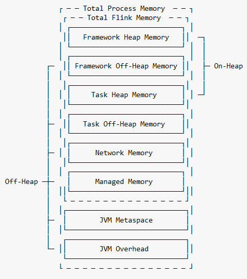

TaskExecutorProcess memory 

A TaskExecutor's memory consists of the following components.
Framework Heap Memory
Framework Off-Heap Memory
Task Heap Memory
Task Off-Heap Memory
Network Memory
Managed Memory
JVM Metaspace
JVM Overhead

