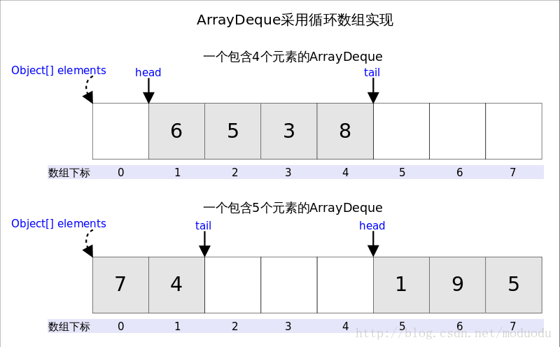

# Flink1.10 3 种重启策略

## 故障率重启策略

```
ExecutionEnvironment env = ExecutionEnvironment.getExecutionEnvironment();
env.setRestartStrategy(RestartStrategies.failureRateRestart(
  3, // max failures per interval
  Time.of(5, TimeUnit.MINUTES), //time interval for measuring failure rate
  Time.of(10, TimeUnit.SECONDS) // delay
));
```

flink-conf.yaml

```
restart-strategy: failure-rate
restart-strategy.failure-rate.max-failures-per-interval: 3
restart-strategy.failure-rate.failure-rate-interval: 5 min
restart-strategy.failure-rate.delay: 10 s
```

| **配置参数**                                  | **描述**                                   | **默认值**       |
| --------------------------------------------- | ------------------------------------------ | ---------------- |
| 重新启动-strategy.failure-rate.max-故障每间隔 | 失败作业之前的给定时间间隔内的最大重启次数 | 1                |
| 重启strategy.failure-rate.failure速率间隔     | 测量故障率的时间间隔。                     | 1分钟            |
| 重启strategy.failure-rate.delay               | 两次连续重启尝试之间的延迟                 | akka.ask.timeout |


## 固定延迟重启策略

```
ExecutionEnvironment env = ExecutionEnvironment.getExecutionEnvironment();
env.setRestartStrategy(RestartStrategies.fixedDelayRestart(
  3, // number of restart attempts
  Time.of(10, TimeUnit.SECONDS) // delay
));
```

flink-conf.yaml

```
restart-strategy: fixed-delay
restart-strategy.fixed-delay.attempts: 3
restart-strategy.fixed-delay.delay: 10 s
```

| 配置参数                              | **描述**                                                     | **默认值**                                     |
| ------------------------------------- | ------------------------------------------------------------ | ---------------------------------------------- |
| restart-strategy.fixed-delay.attempts | Flink在作业声明失败之前重试执行的次数。                      | 1或者Integer.MAX_VALUE如果通过检查点激活       |
| restart-strategy.fixed-delay.delay    | 延迟重试意味着在执行失败后，重新执行不会立即开始，而是仅在一定延迟之后。当程序与外部系统交互时，延迟重试可能会有所帮助，例如，在尝试重新执行之前，连接或待处理事务应达到超时。 | akka.ask.timeout，如果通过检查点激活，则为10秒 |


## 禁用重启策略

```
ExecutionEnvironment env = ExecutionEnvironment.getExecutionEnvironment();
env.setRestartStrategy(RestartStrategies.noRestart());
```

flink-conf.yaml

```
restart-strategy: none
```


## 作为后备的集群级中的重启策略(默认)

作业可以使用flink-conf.yaml配置中的配置来生成不同的任务重启策略,使用集群级重新启动策略。


## 源码分析

```
通过将配置抽到common包中,解耦了配置和失败后处理的实现
策略的配置  org.apache.flink.api.common.restartstrategy.RestartStrategies 
失败后的处理
org.apache.flink.runtime.executiongraph.failover.flip1.ExecutionFailureHandler
	//表示故障转移的拓扑
	private final FailoverTopology<?, ?> failoverTopology;
	//判断任务是否应该被重启的策略
	private final FailoverStrategy failoverStrategy;
	//****判断是否重新启动和何时重新启动的策略。****
	private final RestartBackoffTimeStrategy restartBackoffTimeStrategy;
	//从任务提交后的重启次数
	private long numberOfRestarts;

	//失败处理方法
	private FailureHandlingResult handleFailure(
			final Throwable cause,
			final Set<ExecutionVertexID> verticesToRestart) {
		//获取注解 t.getClass().getAnnotation(ThrowableAnnotation.class)判断是否是不可恢复类型
		if (isUnrecoverableError(cause)) {
			return FailureHandlingResult.unrecoverable(new JobException("The failure is not recoverable", cause));
		}
		
		/**
		 *真正的重启策略实现有3个,其中norestart直接返回不能重启,之前根据集群配置重启的策略已经通过flink-conf.yaml的解析转为了以下3中之一
		 * FailureRateRestartBackoffTimeStrategy
		 * FixedDelayRestartBackoffTimeStrategy
         * NoRestartBackoffTimeStrategy
		 */
	    restartBackoffTimeStrategy.notifyFailure(cause);//个人觉得没啥意义
		if (restartBackoffTimeStrategy.canRestart()) {//是否可以重启
			numberOfRestarts++;//保留累计重启次数
			return FailureHandlingResult.restartable(
				verticesToRestart,//重启的excutions节点id Set
				restartBackoffTimeStrategy.getBackoffTime());//重启间隔
		} else {
			return FailureHandlingResult.unrecoverable(
				new JobException("Recovery is suppressed by " + restartBackoffTimeStrategy, cause));
		}
	}
//---------------------------------------
	//具体实现
	//FailureRateRestartBackoffTimeStrategy
	//failureTimestamps是一个时间戳的数组实现的双端队列ArrayDeque<>,便于头尾删减,容量是时间段内可以允许失败的次数,非线程安全.jdk注释:这个类用作队列时,可能比{@link Stack}作为堆栈使用时，比{@link LinkedList}更快。
	public boolean canRestart() {
		if (isFailureTimestampsQueueFull()) {
			Long now = clock.absoluteTimeMillis();
			Long earliestFailure = failureTimestamps.peek();
			return (now - earliestFailure) > failuresIntervalMS;
		} else {
			return true;
		}
	}
	
//---------------------------------------
/**
 *Flink1.10 异常的包装和通过注解分类4种
 *NonRecoverableError 恢复不了的异常,需要立即失败
 *PartitionDataMissingError 数据消费异常,需要撤销生产者
 *EnvironmentError 表示与运行环境相关的错误，如硬件错误、服务问题等,这种情况我们考虑把这台机器列入黑名单。
 *RecoverableError 可恢复问题*****
 */

例如: @ThrowableAnnotation(ThrowableType.NonRecoverableError)
public class SuppressRestartsException extends RuntimeException {
	private static final long serialVersionUID = 221873676920848349L;
	public SuppressRestartsException(Throwable cause) {
		super("Unrecoverable failure. This suppresses job restarts. Please check the " +
				"stack trace for the root cause.", cause);
	}
}

```

### ArrayDeque 实现

可以看出这个数据结构不能收尾相撞,相撞时需要扩容,需要保留收尾节点index



# 容错策略（Failover Strategies）

Flink支持不同的容错策略，可以通过Flink的配置文件flink-conf.yaml中的配置参数jobmanager.execution.failover-strategy对其进行配置。

- 对于流任务,容错策略基于chk检查点机制进行全部job重启

- 对于批任务,可以通过配置具体容错策略配置进行优化.除了全部job重启策略,还可以根据下游任务是否在上游任务之后调度来区分执行的边界,从而划分批作业调度Region,进而更细粒度按Region进行任务的故障重启

#### 重新启动所有（Restart All Failover Strategy）

此策略重新启动作业中的所有任务以从任务失败中恢复。

#### 重新启动流水线区域（Restart Pipelined Region Failover Strategy）(默认)

此策略将任务分为不相交的区域。 当检测到任务故障时，此策略将计算必须重新启动以从故障中恢复的最小区域集。 与“重新启动所有”相比，对于某些作业，这可能导致要重新启动的任务更少。