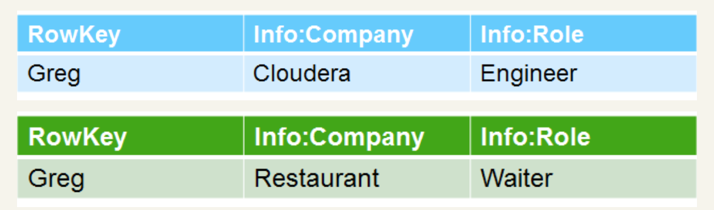
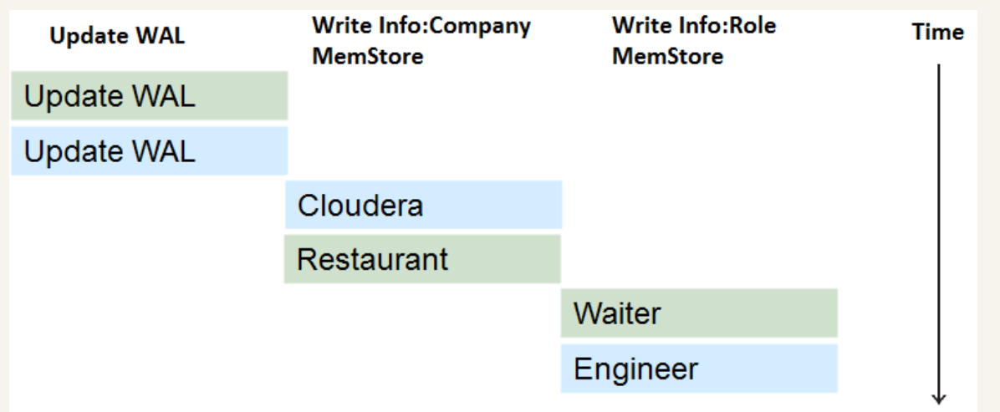
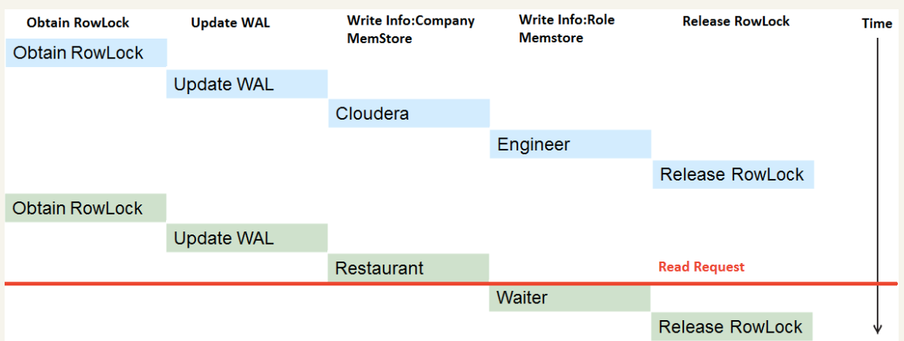
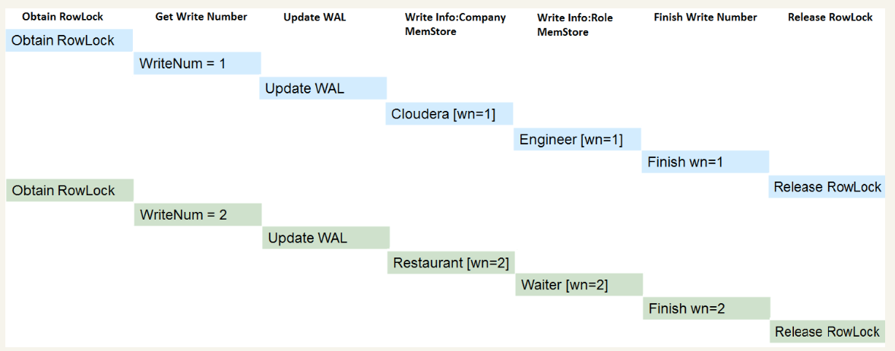
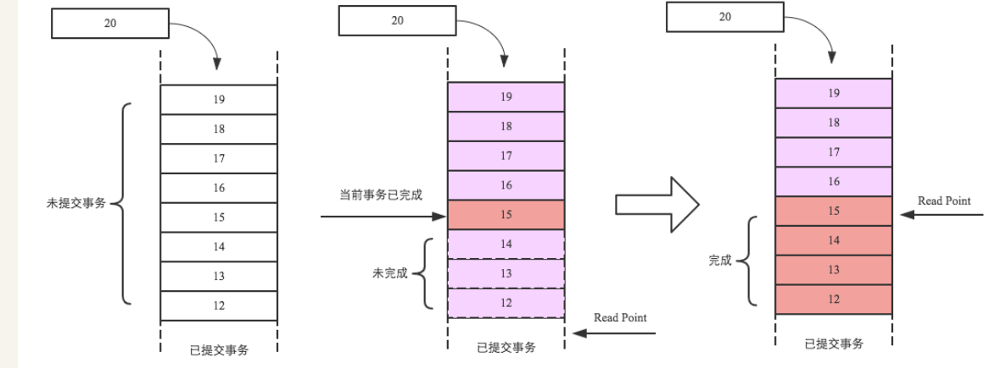

# 数据库事务系列－HBase行级事务模型

 [2017年7月26日](http://hbasefly.com/2017/07/26/transaction-2/) [范欣欣](http://hbasefly.com/author/libisthanksgmail-com/) [HBase](http://hbasefly.com/category/hbase/)

HBase是BigTable的开源实现，事务模型也与BigTable一脉相承 – 仅支持行级别的事务。虽然Jeff Dean大神在接受采访时公开承认目前在技术领域最后悔的事情就是没有在BigTable中加入跨行事务模型，以至于之后很多团队都在BigTable之上重复造各种各样的分布式事务轮子。这点笔者是认同的，现在确实有很多团队在HBase之上造了很多轮子（Tephra | Trafodian | Omid），试想如果这个工作做在了BigTable里面，这些团队的人是不是可以做更多其他有意义的事情了~ 所幸的是之后Google又发布了一篇介绍分布式事务模型的的paper – Percolator，现在很多团队都参考该论文实现分布式事务，包括TiDB、Omid等，也算是一种弥补吧。

虽说HBase目前只支持行级事务，但行级事务也是事务！麻雀虽小，肝脏具全。这篇文章一起看看HBase行级事务所满足的ACID特性。下文中隔离性部分基本翻译文章[《Apache HBase Internals: Locking and Multiversion Concurrency Control》](https://blog.cloudera.com/blog/2013/01/apache-hbase-internals-locking-and-multiversion-concurrency-control/)，大家可以阅读原文。

### **HBase事务原子性保证** <-改变WAL结构为多行一个wal

HBase数据会首先写入WAL，再写入Memstore。写入Memstore异常很容易可以回滚，因此保证写入/更新原子性只需要保证写入WAL的原子性即可。HBase 0.98之前版本需要保证WAL写入的原子性并不容易，这由WAL的结构决定。假设一个行级事务更新R行中的3列（c1, c2, c3），来看看之前版本和当前版本的WAL结构：

1. 之前版本WAL结构：

```
<logseq1-for-edit1>:<KeyValue-for-edit-c1>
<logseq2-for-edit2>:<KeyValue-for-edit-c2>
<logseq3-for-edit3>:<KeyValue-for-edit-c3>
```

每个KV都会形成一个WAL单元，这样一行事务更新多少列就会产生多少个WAL单元。在将这些WAL单元append到日志文件的时候，一旦出现宕机或其他异常，就会出现部分写入成功的情况，原子性更新就无法保证。

2. 当前版本WAL结构：

```
<logseq#-for-entire-txn>:<WALEdit-for-entire-txn>
<logseq#-for-entire-txn>:<-1, 3, <Keyvalue-for-edit-c1>, <KeyValue-for-edit-c2>, <KeyValue-for-edit-c3>>
```

通过这种结构，每个事务只会产生一个WAL单元。这样就可以保证WAL写入时候的原子性。

### **HBase事务一致性保证：强一致性保证** 

### **HBase事务隔离性** 

#### **写写并发控制**  <- 二阶段 1.获取全部行锁2.操作3.释放所有行锁

**读写并发控制**  **<- MVCC 写事务加自增id,读事务根据1.当前最大事务id2.配置时提交读还是未提交读来过滤 自增id的范围就是读写并发控制的范围**

**1. 为什么需要写写并发控制？**

现在假设有两个并发写入请求同时进来，分别对同一行数据进行写入。下图所示RowKey为Greg，现在分别更新列族info下的Company列和Role列：



如果没有任何并发控制策略的话，写入数据（先写WAL，再写memstore）可能会出现不同KV写入”交叉”现象，如下图所示：



这样的话，用户最终读取到的数据就会产生不一致，如下：


**2. 如何实现写写并发控制？**

实现写写并发其实很简单，只需要在写入（或更新）之前先获取行锁，如果获取不到，说明已经有其他线程拿了该锁，就需要不断重试等待或者自旋等待，直至其他线程释放该锁。拿到锁之后开始写入数据，写入完成之后释放行锁即可。这种行锁机制是实现写写并发控制最常用的手段，后面可以看到MySQL也是使用行锁来实现写写并发的。

**3. 如何实现批量写入多行的写写并发？**

HBase支持批量写入（或批量更新），即一个线程同时更新同一个Region中的多行记录。那如何保证当前事务中的批量写入与其他事务中的批量写入的并发控制呢？思路还是一样的，使用行锁。但这里需要注意的是必须使用**两阶段锁协议**，即：

**(1) 获取所有待写入（更新）行记录的行锁**

**(2) 开始执行写入（更新）操作**

**(3) 写入完成之后再统一释放所有行记录的行锁**

不能更新一行锁定（释放）一行，多个事务之间容易形成死锁。两阶段锁协议就是为了避免死锁，MySQL事务写写并发控制同样使用两阶段锁协议。

**4. 笔者疑惑**

**其实笔者一直在这里有个疑惑，还是使用上面例子说明吧。大家都知道，HBase是支持多版本的，那么在数据写入的时候加锁给待写入数据都打上版本信息，此时释放锁。即使之后出现交叉的现象，对于读请求来说，最终读到的数据都是根据最大版本号来的。即使该表只设置了一个版本号，那也可以根据版本号将之前版本的数据清理掉，和交叉不交叉并没有太大关系。不知道大家怎么理解这个问题？有兴趣的可以留言评论！**

多版本不是用来处理事务的,写入的时候也会写入多版本,hbase自动的多版本是时间戳

#### **读写并发控制** 

**1. 为什么需要读写并发控制？**

现在我们通过在写入更新之前加锁、写入更新之后释放锁实现写写并发控制，那读写之间是不是也需要一定的并发控制呢？如果不加并发控制，会出现什么现象呢？接着看下图：



上图分别是两个事务更新同一行数据，现在假设第一个事务已经更新完成，在第二个事务更新到一半的时候进来一个读请求，如果没有任何并发控制的话，读请求就会读到不一致的数据，Company列为Restaurant，Role列为Engineer，如下图所示：


可见，读写之间也需要一种并发控制来保证读取的数据总能够保持一致性，不会出现各种诡异的不一致现象。

**2. 如何实现读写并发控制？**

实现读写并发最简单的方法就是仿照写写并发控制 – 加锁。但几乎所有数据库都不会这么做，性能太差，对于读多写少的应用来说必然不可接受。那还有其他方法吗？

当然，这就是今天要重点提到的MVCC机制 – Mutil Version Concurrent Control。HBase中MVCC机制实现主要分为两步：

**(1) 为每一个写（更新）事务分配一个Region级别自增的序列号**

**(2) 为每一个读请求分配一个已完成的最大写事务序列号**

示意图如下所示：



上图中两个写事务分别分配了序列号1和序列号2，读请求进来的时候事务1已经完成，事务2还未完成，因此分配事务1对应的序列号1给读请求。此时序列号1对本次读可见，序列号2对本次读不可见，读到的数据是：


具体实现中，所有的事务都会生成一个Region级别的自增序列，并添加到队列中，如下图最左侧队列，其中最底端为已经提交的事务，队列中的事务为未提交事务。现假设当前事务编号为15，并且写入完成（中间队列红色框框），但之前的写入事务还未完成（序列号为12、13、14的事务还未完成），此时当前事务必须等待，而且对读并不可见，直至之前所有事务完成之后才会对读可见（即读请求才能读取到该事务写入的数据）。如最右侧图，15号事务之前的所有事务都成功完成，此时Read Point就会移动到15号事务处，表示15号事务之前的所有改动都可见。



 Note：上文所讲的自增序列就是上一篇文章的SequenceId！！！可能有朋友有疑问：如果这两个自增序列是同一个序列，那是不是这个队列的顺序必须与事务写入WAL的顺序一致？如果不一致有什么问题？如果要求一致的话怎么才能实现？

#### **千万不要查看1.1.2的代码，会把你彻底搞混的！建议阅读更高版本的相关代码！** =

所以，MVCC的精髓是写入的时候分配递增版本信息（SequenceId），读取的时候分配唯一的版本用于读取可见，比之大的版本不可见。这里需要注意版本必须递增，而且版本递增的范围一定程度上决定了事务是什么事务，比如HBase是Region级别的递增版本，那么事务就是region级别事务。MySQL中版本是单机递增版本，那么MySQL事务就支持单机跨行事务。Percolator中版本是集群递增版本，那么Percolator事务就是分布式事务。

### **HBase事务持久性保证** 

HBase事务持久化可以理解为WAL持久化，目前实现了多种持久化策略：SKIP_WAL，ASYNC_WAL，SYNC_WAL，FSYNC_WAL。SKIP_WAL表示不写WAL，这样写入更新性能最好，但在RegionServer宕机的时候有可能会丢失部分数据；ASYNC_WAL表示异步将WAL持久化到硬盘，因为是异步操作所以在异常的情况下也有可能丢失少量数据；SYNC_WAL表示同步将WAL持久化到操作系统缓存，再由操作系统将数据异步持久化到磁盘，这种场景下RS宕掉并不会丢失数据，当操作系统宕掉会导致部分数据丢失；FSYNC_WAL表示WAL写入之后立马落盘，性能相对最差。目前实现中FSYNC_WAL并没有实现！用户可以根据业务对数据丢失的敏感性在客户端配置相应的持久化策略。