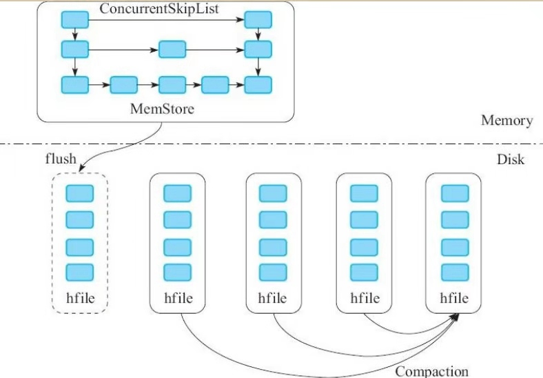

# HBase 介绍

高可靠性、高性能、面向列、可伸缩、实时读写的分布式KV数据库


------

## 快! 如何快?  如何自己实现快??? —— 瓶颈分析


优化速度 的 第一个核心 : 

**写 : 能不落盘就不落盘**

**读 : 能不读盘就不读盘**

得出结论 : 利用 内存层、MemStore刷出前优化、布隆过滤器、客户端查询添加业务缓存 ...

------

## 内存层如何设计?


优化速度 的 第二个核心 : 

**有序**

得出结论 : 内存层需要各种牛逼的数据结构和算法来支持插入,查询时间复杂度好

------

## 根据什么有序? —— KeyValue 结构


hbase 逻辑视图


hbase物理视图


LSM中存储的是多个KeyValue组成的集合，每一个KeyValue一般都会用一个字节数组来表示。

HBase rowkey组成 总体来说，字节数组主要分为以下几个字段。其中Rowkey、Family、Qualifier、Timestamp、Type这5个字段组成KeyValue中的key部分。 

- keyLen：占用4字节，用来存储KeyValue结构中Key所占用的字节长度。 

- valueLen：占用4字节，用来存储KeyValue结构中Value所占用的字节长度->value 4G。 

- rowkeyLen：占用2字节，用来存储rowkey占用的字节长度 -> 64kb。 

- rowkeyBytes：占用rowkeyLen个字节，用来存储rowkey的二进制内容。 

- familyLen：占用1字节，用来存储Family占用的字节长度。 

- familyBytes：占用familyLen字节，用来存储Family的二进制内容。 

- qualifierBytes：占用qualifierLen个字节，用来存储Qualifier的二进制内容。

- - 注意，HBase并没有单独分配字节用来存储qualifierLen，因为可以通过keyLen和其他字段的长度计算出qualifierLen : qualifierLen = keyLen - 2B - rowkeyLen - 1B - familyLen - 8B - 1B 

- timestamp：占用8字节，表示timestamp对应的long值。 这个版本号通常表示数据的写入先后顺序，版本号越大的数据，越优先被用户读取。甚至会设计一定的策略，将那些版本号较小的数据过期淘汰（HBase中有TTL策略）

- type：占用1字节，表示这个KeyValue操作的类型

- - HBase内有Put、Delete、DeleteColumn、DeleteFamily，等等。
  - 本质上，LSM树中存放的并非数据本身，而是操作记录。这对应了LSM树（Log-Structured Merge-Tree）中Log的含义，即操作日志

 在比较这些KeyValue的大小顺序时，HBase按照如下方式（伪代码）来确定大小关系： 

```
int compare(KeyValue a, KeyValue b){
 int ret = Bytes.compare(a.rowKeyBytes, b.rowKeyBytes);
 if(ret != 0) return ret;
 ret = Bytes.compare(a.familyBytes, b.familyBytes);
 if(ret != 0) return ret;
 ret = Bytes.compare(a.qualifierBytes, b.qualifierBytes);
 if(ret != 0) return ret;
 // 注意：timestamp越大，排序越靠前
 ret = b.timestamp - a.timestamp;
 if(ret != 0) return ret;
 ret = a.type - b.type;
 return ret;
} 
```

------

## **rowkey的设计**

- 把重要的信息放左边 ,注意排序是字典序
- rowKey是一个二进制 ,以byte[]形式保存 ,最大不能超过64kb(rowkey length位为2B) .建议越短越好 ,64 位系统 ,内存 8 字节对齐
- 示例 : 

```
public byte[] getRowKey() {
  try {
    //16字节userid + 13字节时间戳 + 3字节日志序列
    return Bytes.toBytes(MD5Util.Bit16Captial(this.userId) + this.time + this.serialNo);
  } catch (Exception e) {
    LOG.error("Get row key error", e);
  }
  return null;
}
// 为什么还需要自己添加时间戳
```

------

## LSM 树 原理 与 HBase的实现


​																				hbase 体系结构


​																			region server 结构

### LSM树



​																				LSM 树结构

- 一个LSM树的索引主要由两部分构成：内存部分和磁盘部分。内存部分是一个ConcurrentSkipListMap，Key就是前面所说的Key部分，Value是一个字节数组。数据写入时，直接写入MemStore中。随着不断写入，一旦内存占用超过一定的阈值时，就把内存部分的数据导出，形成一个有序的数据文件，存储在磁盘上。
- 日志结构的合并树（LSM-tree）是一种基于硬盘的数据结构，与B-tree相比，能显著地减少硬盘磁盘臂的开销，并能在较长的时间提供对文件的高速插入（删除）。然而LSM-tree在某些情况下，特别是在查询需要快速响应时性能不佳。通常LSM-tree适用于索引插入比检索更频繁的应用系统。Bigtable在提供Tablet服务时，使用GFS来存储日志和SSTable，而GFS的设计初衷就是希望通过添加新数据的方式而不是通过重写旧数据的方式来修改文件。而LSM-tree通过滚动合并和多页块的方法推迟和批量进行索引更新，充分利用内存来存储近期或常用数据以降低查找代价，利用硬盘来存储不常用数据以减少存储代价。

### 跳表实现

链表这种数据结构的查询复杂度为O（N）,在查询之后的插入,删除复杂度低,跳表额外添加了一些节点的索引信息优化了这个结构.

跳跃表（SkipList）是一种能高效实现插入、删除、查找的内存数据结构，这些操作的期望复杂度都是O（logN）。


- 跳跃表由多条分层的链表组成（设为S0，S1，S2，...，Sn），例如图中有6条链表。 
- 每条链表中的元素都是有序的。 
- 每条链表都有两个元素：+∞（正无穷大）和-∞（负无穷大），分别表示链表的头部和尾部。 
- 从上到下，上层链表元素集合是下层链表元素集合的子集，即S1是S0的子集，S2是S1的子集。 
- 跳跃表的高度定义为水平链表的层数。

1.查找 

以左上角元素（设为currentNode）作为起点： 

如果发现currentNode后继节点的值小于等于待查询值，则沿着这条链表向后查询，否则，切换到当前节点的下一层链表。 继续查询，直到找到待查询值为止（或者currentNode为空节点）为止。

2.插入

首先，需要按照上述查找流程找到待插入元素的前驱和后继；然后，按照如下随机算法生成一个高度值： 

```
// p是一个(0,1)之间的常数，一般取p=1/4或者1/2
public void randomHeight(double p){
  int height = 0 ;
  while(random.nextDouble() < p) height ++ ;
  return height + 1;
}
```


### 多路归并 —— compaction 合并小文件提升读盘性能


​																					多路归并