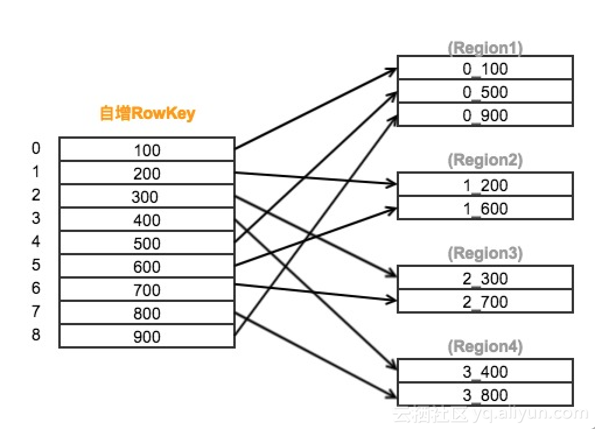

# Apache Phoenix

首先Phoenix是HBase之上的SQL工具，至于HBase是什么，我就不介绍了，你若不懂，就不需要往下继续看了。Phoenix旨在通过标准的SQL语法来简化HBase的使用，并可以使用标准的JDBC连接HBase，而不是通过HBase的Java客户端APIs。它可以让你执行所有的CRUD和DDL操作，比如创建一张表，插入数据以及查询数据。SQL和JDBC可以大大减少用户代码的开发，当然它也提供一些性能优化的手段，通过SQL和JDBC，你可以更方便的将HBase集成到你现有的系统或者工具。

当Phoenix接收到SQL查询后，它会在本地编译成HBase的API，然后推到集群进行分布式的查询或计算。它自动创建了一个元数据库用来存储HBase的表的元数据信息。因为Phoenix是直接调用的HBase的API，coprocessors和自定义的filters，所以对于大量小查询可以实现毫秒级返回，千万级别的数据实现秒级返回。

## 使用场景

Phoenix非常适合HBase的随机访问，它的二级索引特性同时可以让你实现非主键查询的快速返回，而不需要进行全表扫描。它可以让你像传统数据库表的方式创建和管理HBase中的表，同时Phoenix也支持复合主键。

Phoenix可以给Rowkey加盐，从而避免因为简单递增的Rowkey引起的RegionServer热点问题。通过指定不同的租户连接实现数据访问的隔离，从而实现多租户，租户只能访问属于他的数据。

虽然Phoenix有这么多优势，但是它依旧无法替代RDBMS。比如它还有以下限制：

- Phoenix不支持跨行的事务
- 查询优化和join机制比大多数RDBMS要简陋
- 二级索引是通过索引表实现的，主表和索引表的同步会存在问题，虽然只是在一段很短的时间内。所以索引无法完全满足ACID
- 多租户功能比较简单

### 与Hive/Impala/第三方/Region内索引 方案的比较

Hive/Impala也可以作为HBase之上的SQL工具。包括Phoenix这3个工具在很多功能上都有一些重叠，比如它们都提供SQL执行以及JDBC驱动

不像Impala和Hive，Phoenix与HBase结合更加紧密，从而可以更好的利用HBase的一些特性，比如coprocessors和skip scans。

- Phoenix的目标是在HBase之上提供一个高效的类关系型数据库的工具，定位为低延时的查询应用。Impala则主要是基于HDFS的一些主流文件格式如文本或Parquet提供探索式的交互式查询。Hive类似于数据仓库，定位为需要长时间运行的批作业。
- Phoenix很适合需要在HBase之上使用SQL实现CRUD，Impala则适合Ad-hoc的分析类工作负载，Hive则适合批处理如ETL。
- Phoenix非常轻量级，因为它不需要额外的服务。
- Phoenix还支持一些高级功能，比如多个二级索引，flashback查询等。无论是Impala还是Hive都无法提供二级索引支持。

以下是比较：(个人理解比较片面)

|                 | Apache Phoenix                                      | Kylin                               | Impala                       | Hive          | 第三方                                | Region内方案(如Pharos)                             |
| --------------- | --------------------------------------------------- | ----------------------------------- | ---------------------------- | ------------- | ------------------------------------- | -------------------------------------------------- |
| 语法            | SQL                                                 | 只读SQL                             | SQL                          | HiveQL        | 基于slor/ES可实现标签化查询           | 索引是自己需要提前订好的,所以语法可以自己实现      |
| 定位            | 为低延时应用在HBase之上提供高效的SQL查询            | 分布式的大数据分析引擎              | 大数据集之上的交互式探索分析 | 批处理比如ETL | 基于HBase的查询服务,云厂商方案(阿里)  | 可插拔查询方案(个人觉得和Phoenix 本地索引有些类似) |
| 优点            | 支持映射,侵入性更小                                 | 多维分析能力（OLAP）,易用的管理页面 | -                            | 集成HIve      | 标签化,更快,可使用ES的优势,云厂商维护 | 索引利用HBase rowkey机制                           |
| 缺点            | 索引覆盖限制,一些sql优化不好,因为底层也是调HBaseAPI | 只读,先计算Cube                     | -                            | -             | 架构复杂,成本高                       | 对原表有很大影响                                   |
| 二级索引        | Yes                                                 |                                     | No                           | No            | Yes                                   | Yes(ACID实现不完善,只是思路)                       |
| 额外的服务      | No                                                  |                                     | Yes                          | Yes           | Yes                                   | NO                                                 |
| HBase的高级特性 | Yes                                                 |                                     | No                           | No            | Yes                                   | Yes                                                |

## phoenix 安装

1.利用CDH批量下载依赖并修改配置后重启

2.手动加依赖安装(基于 HBase1.2.0-CDH5.11)

a.从官网下载适合的包,解压缩后按下面步骤添加依赖到hbase lib目录下

```
如果添加了这些依赖会导致hbase没有可以重启但是没有日志
rm -rf phoenix-core-4.14.0-cdh5.11.2-tests.jar
rm -rf phoenix-flume-4.14.0-cdh5.11.2-tests.jar
rm -rf phoenix-hive-4.14.0-cdh5.11.2-tests.jar
rm -rf phoenix-kafka-4.14.0-cdh5.11.2-tests.jar
rm -rf phoenix-load-balancer-4.14.0-cdh5.11.2-tests.jar
rm -rf phoenix-pherf-4.14.0-cdh5.11.2-tests.jar
rm -rf phoenix-pig-4.14.0-cdh5.11.2-tests.jar
rm -rf phoenix-queryserver-4.14.0-cdh5.11.2-tests.jar
rm -rf phoenix-queryserver-client-4.14.0-cdh5.11.2-tests.jar
rm -rf phoenix-spark-4.14.0-cdh5.11.2-tests.jar
rm -rf phoenix-tracing-webapp-4.14.0-cdh5.11.2-tests.jar
rm -rf phoenix-core-4.14.0-cdh5.11.2-sources.jar
rm -rf phoenix-flume-4.14.0-cdh5.11.2-sources.jar
rm -rf phoenix-hive-4.14.0-cdh5.11.2-sources.jar
rm -rf phoenix-kafka-4.14.0-cdh5.11.2-sources.jar
rm -rf phoenix-pherf-4.14.0-cdh5.11.2-sources.jar
rm -rf phoenix-pig-4.14.0-cdh5.11.2-sources.jar
rm -rf phoenix-queryserver-4.14.0-cdh5.11.2-sources.jar
rm -rf phoenix-queryserver-client-4.14.0-cdh5.11.2-sources.jar
rm -rf phoenix-spark-4.14.0-cdh5.11.2-sources.jar
rm -rf phoenix-tracing-webapp-4.14.0-cdh5.11.2-sources.jar
rm -rf phoenix-kafka-4.14.0-cdh5.11.2-minimal.jar
rm -rf phoenix-pherf-4.14.0-cdh5.11.2-minimal.jar
 
 cd /opt/cloudera/parcels/CDH/lib/hbase/lib
 直接拷贝这些依赖到上面的目录
 hadoop dfs -get /tmp/jinzl/phoenix/*
或 export JAVA_HOME=/data/server/jdk  && hadoop dfs -get /tmp/jinzl/phoenix/phoenix*
```

b.配置(修改HBase 配置启用2级索引) -> 重启HBase 所有节点

```
<property>
     <name>hbase.regionserver.wal.codec</name>
     <value>org.apache.hadoop.hbase.regionserver.wal.IndexedWALEditCodec</value>
</property>
<property>
     <name>hbase.master.loadbalancer.class</name>
     <value>org.apache.phoenix.hbase.index.balancer.IndexLoadBalancer</value>
</property>
<property>
     <name>hbase.coprocessor.master.classes</name>
     <value>org.apache.phoenix.hbase.index.master.IndexMasterObserver</value>
</property>
```

## phoenix 常用操作

**语法**   :   http://phoenix.apache.org/language/index.html#close 

- **phoenix-sqlline.py** 是执行SQL的命令脚本，在执行该命令之前，你需要指定HBase集群的Zookeeper地址，比如：phoenix-sqlline.py zk01.example.com:2181。如果想要在命令行执行一个SQL文件，可以在命令行直接带上该文件。比如：sqlline.py zk01.example.com:2181 sql_queries.sql
- **phoenix-psql.py** 可以用来加载CSV数据，后面也可以直接带上需要执行的SQL脚本，也可以不加。比如：phoenix-psql.py zk01.example.com:2181 create_stmts.sql data.csvsql_queries.sql
- **phoenix-performance.py** 是性能测试脚本 可以用于一次插入多少行数据。比如：phoenix-psql.py zk01.example.com:2181 100000

### 表创建

```
!help
!quit
!dbinfo
!大小写问题,小写sql不强转用"" 例如select  * from "hz"."test_table";
create table test (id varchar primary key,name varchar,age integer ); 

效果:
HBase => 'TEST', {TABLE_ATTRIBUTES => {coprocessor$1 => '|org.apache.phoenix.coprocessor.ScanRegionObserver|805306366|', coprocessor$2 => '|org.apache.phoenix.coprocessor.UngroupedAggregateRegionObserver|805306366|', coprocessor$3 => '|org.apache.phoenix.coprocessor.GroupedAggregateRegionObserver|805306366|', coprocessor$4 => '|org.apache.phoenix.coprocessor.ServerCachingEndpointImpl|805306366|', coprocessor$5 => '|org.apache.phoenix.hbase.index.Indexer|805306366|org.apache.hadoop.hbase.index.codec.class=org.apache.phoenix.index.PhoenixIndexCodec,index.builder=org.apache.phoenix.index.PhoenixIndexBuilder'}, {NAME => '0', BLOOMFILTER => 'NONE', DATA_BLOCK_ENCODING => 'FAST_DIFF'}

phoenix => TEST TABLE

upsert into test(id,name,age) values('000001','liubei',43);
select * from  test;
upsert into test(id,name,age) values('000001','liubei',42);
select * from  test;
已修改
drop table test;

效果:
HBase => 没有
phoenix => 没有
```

### Hbase 表映射到phoenix 视图

```
HBase shell 创建表：
create 'USER', 'INFO'

效果:
HBase => 'USER', {NAME => 'INFO'}
phoenix => 没有

put 'USER', 'bbbZZZ1004', 'INFO:NAME', 'WeiDong'
put 'USER', 'bbbZZZ1004', 'INFO:AGE', '27'
put 'USER', 'bbbZZZ1004', 'INFO:HOME', 'ZhouKou'
put 'USER', 'bbbZZZ1005', 'INFO:NAME', 'XiaoMeng'
put 'USER', 'bbbZZZ1005', 'INFO:AGE', '27'
put 'USER', 'bbbZZZ1005', 'INFO:HOME', 'YuLin'
put 'USER', 'bbbTTT1006', 'INFO:NAME', 'GuiPing'
put 'USER', 'bbbTTT1006', 'INFO:AGE', '39'
put 'USER', 'bbbTTT1006', 'INFO:HOME', 'ZhengZhou'

scan 'USER', {LIMIT=>10}

#phoenix 创建原HBase表视图
create view USER (
    pk varchar primary key,
    info.name varchar,
    info.age  varchar,
    info.home varchar
) as select * from USER;

phoenix => USER  VIEW
HBase =>  'USER', {TABLE_ATTRIBUTES => {coprocessor$1 => '|org.apache.phoenix.coprocessor.ScanRegionObserver|805306366|', coprocessor$2 => '|org.apache.phoenix.coprocessor.UngroupedAggregateRegionObserver|805306366|', coprocessor$3 => '|org.apache.phoenix.coprocessor.GroupedAggregateRegionObserver|805306366|', coprocessor$4 => '|org.apache.phoenix.coprocessor.ServerCachingEndpointImpl|805306366|'}, {NAME => 'INFO'}

drop view USER;
phoenix => 没有
HBase => 'USER', {TABLE_ATTRIBUTES => {coprocessor$1 => '|org.apache.phoenix.coprocessor.ScanRegionObserver|805306366|', coprocessor$2 => '|org.apache.phoenix.coprocessor.UngroupedAggregateRegionObserver|805306366|', coprocessor$3 => '|org.apache.phoenix.coprocessor.GroupedAggregateRegionObserver|805306366|', coprocessor$4 => '|org.apache.phoenix.coprocessor.ServerCachingEndpointImpl|805306366|'}, {NAME => 'INFO'}

!tables
!describe user
select * from user;
put 'USER', 'cccTTT1007', 'INFO:NAME', 'YongFa'
put 'USER', 'cccTTT1007', 'INFO:AGE', '27'
put 'USER', 'cccTTT1007', 'INFO:HOME', 'LuYi'
put 'USER', 'cccTTT1008', 'INFO:NAME', 'LuiYa'
put 'USER', 'cccTTT1008', 'INFO:AGE', '27'
put 'USER', 'cccTTT1008', 'INFO:HOME', 'ZhengZhou'
put 'USER', 'cccSSS1009', 'INFO:NAME', 'KeMeng'
put 'USER', 'cccSSS1009', 'INFO:AGE', '27'
put 'USER', 'cccSSS1009', 'INFO:HOME', 'NanYang'
select * from user;
```

### 添加二级索引

***索引不指定预分区数时，其默认分区数与表保持一致***

```rust
测试用例 先建表:
create table hbase_test
(
s1 varchar not null primary key,
s2 varchar,
s3 varchar,
s4 varchar,
s5 varchar,
s6 varchar,
s7 varchar,
s8 varchar,
s9 varchar,
s10 varchar,
s11 varchar
);
bulkload导入数据:
准备:
hbase_data.csv
340111200507061443,鱼言思,0,遂宁,国家机关,13004386766,15900042793,广州银行1,市场三街65号-10-8,0,1
320404198104281395,暨梅爱,1,临沧,服务性工作人员,13707243562,15004903315,广州银行1,太平角六街145号-9-5,0,3
371326195008072277,人才奇,1,黔西南,办事人员和有关人员,13005470170,13401784500,广州银行1,金湖大厦137号-5-5,1,0
621227199610189727,谷岚,0,文山,党群组织,13908308771,13205463874,广州银行1,仰口街21号-6-2,1,3
533324200712132678,聂健飞,1,辽阳,不便分类的其他劳动者,15707542939,15304228690,广州银行1,郭口东街93号-9-3,0,2
632622196202166031,梁子伯,1,宝鸡,国家机关,13404591160,13503123724,广州银行1,逍遥一街35号-14-8,1,4
440883197110032846,黎泽庆,0,宝鸡,服务性工作人员,13802303663,13304292508,广州银行1,南平广场113号-7-8,1,4
341500196506180162,暨芸贞,0,黔西南,办事人员和有关人员,13607672019,13200965831,广州银行1,莱芜二路117号-18-3,1,4
511524198907202926,滕眉,0,南阳,国家机关,15100215934,13406201558,广州银行1,江西支街52号-10-1,0,3
420205198201217829,陶秀,0,泸州,商业工作人员,13904973527,15602017043,广州银行1,城武支大厦126号-18-2,1,0
hadoop fs -put hbase_data.csv /tmp/jinzl
执行bulkload
hadoop jar /opt/cloudera/parcels/CDH/lib/hbase/lib/phoenix-4.14.1-HBase-1.1-client.jar org.apache.phoenix.mapreduce.CsvBulkLoadTool -t hbase_test -i /tmp/jinzl/hbase_data.csv
```

#### 1.Global Indexes(全局索引)

全局索引适合那些读多写少的场景。如果使用全局索引，读数据基本不损耗性能，所有的性能损耗都来源于写数据。数据表的添加、删除和修改都会更新相关的索引表（数据删除了，索引表中的数据也会删除；数据增加了，索引表的数据也会增加）。而查询数据的时候，Phoenix会通过索引表来快速低损耗的获取数据。默认情况下，如果你的查询语句中没有索引相关的列的时候，Phoenix不会使用索引。

```
CREATE INDEX index1_hbase_test ON hbase_test(s6);

# 常用删除
drop TABLE if EXISTS TOWER_INFO（表名）
drop index  TOWER_IDX（索引名） ON TOWER_INFO（表名）；
DROP SEQUENCE IF EXISTS test_sequence
```

#### 2.Local Indexes(本地索引)

本地索引适合那些写多读少，或者存储空间有限的场景。和全局索引一样，Phoenix也会在查询的时候自动选择是否使用本地索引。本地索引之所以是本地，只要是因为索引数据和真实数据存储在***同一台机器上******同一张表上***，这样做主要是为了避免网络数据传输的开销。如果你的查询条件没有完全覆盖索引列，本地索引还是可以生效。因为无法提前确定数据在哪个Region上，所以在读数据的时候，还需要检查每个Region上的数据而带来一些性能损耗。

***从这可以看到同一台机器是怎么同一台的,这完全整到一起了,在你自己的表上加了索引L#0字段,修改表原始文件了***

```
新建索引之前效果:
HBASE =>  'HBASE_TEST', {TABLE_ATTRIBUTES => {coprocessor$1 => '|org.apache.phoenix.coprocessor.ScanRegionObserver|805306366|', coprocessor$2 => '|org.apache.phoenix.coprocessor.UngroupedAggregateRegionObserver|805306366|', coprocessor$3 => '|org.apache.phoenix.coprocessor.GroupedAggregateRegionObserver|805306366|', coprocessor$4 => '|org.apache.phoenix.coprocessor.ServerCachingEndpointImpl|805306366|', coprocessor$5 => '|org.apache.phoenix.hbase.index.Indexer|805306366|org.apache.hadoop.hbase.index.codec.class=org.apache.phoenix.index.PhoenixIndexCodec,index.builder=org.apache.phoenix.index.PhoenixIndexBuilder'}, {NAME => '0', BLOOMFILTER => 'NONE', DATA_BLOCK_ENCODING => 'FAST_DIFF'}

create local index index2_hbase_test on hbase_test (s7);

新建本地索引之后效果:
HBASE => 'HBASE_TEST', {TABLE_ATTRIBUTES => {coprocessor$1 => '|org.apache.phoenix.coprocessor.ScanRegionObserver|805306366|', coprocessor$2 => '|org.apache.phoenix.coprocessor.UngroupedAggregateRegionObserver|805306366|', coprocessor$3 => '|org.apache.phoenix.coprocessor.GroupedAggregateRegionObserver|805306366|', coprocessor$4 => '|org.apache.phoenix.coprocessor.ServerCachingEndpointImpl|805306366|', coprocessor$5 => '|org.apache.phoenix.hbase.index.Indexer|805306366|org.apache.hadoop.hbase.index.codec.class=org.apache.phoenix.index.PhoenixIndexCodec,index.builder=org.apache.phoenix.index.PhoenixIndexBuilder', coprocessor$6 => '|org.apache.hadoop.hbase.regionserver.IndexHalfStoreFileReaderGenerator|805306366|', METADATA => {'DATA_TABLE_NAME' => 'HBASE_TEST', 'SPLIT_POLICY' => 'org.apache.phoenix.hbase.index.IndexRegionSplitPolicy'}}, {NAME => '0', BLOOMFILTER => 'NONE', DATA_BLOCK_ENCODING => 'FAST_DIFF'}, {NAME => 'L#0', BLOOMFILTER => 'NONE', DATA_BLOCK_ENCODING => 'FAST_DIFF'}

在查询项中不包含索引字段的条件下，一样查询比较快速
select s2 from hbase_test where s7='13500591348';
select * from hbase_test where s7='13500591348';
```

#### 3.索引覆盖

使用覆盖索引获取数据的过程中，内部不需要再去HBase的原表获取数据，查询需要返回的列都会被存储在索引中。要想达到这种效果，你的select的列，where的列都需要在索引中出现。举个例子，如果你的SQL语句是select s2 from hbase_test where s6='13505503576'，要最大化查询效率和速度最快，可以建立覆盖索引。

如果查询项中不包含除s2和s6之外的列，而且查询条件不包含除s2之外的列，则可以确保该查询使用Index，关键字INCLUDE包含需要返回数据结果的列。这种索引方式的最大好处就是速度快，而我们也知道，索引就是空间换时间，所以缺点也很明显，存储空间耗费较多。

```
CREATE INDEX index1_hbase_test ON hbase_test(s6) INCLUDE(s2);

select s6 from hbase_test where s6='13707243562';
select s2 from hbase_test where s6='13707243562';

效果:
HBase => 'INDEX1_HBASE_TEST', {TABLE_ATTRIBUTES => {coprocessor$1 => '|org.apache.phoenix.coprocessor.ScanRegionObserver|805306366|', coprocessor$2 => '|org.apache.phoenix.coprocessor.UngroupedAggregateRegionObserver|805306366|', coprocessor$3 => '|org.apache.phoenix.coprocessor.GroupedAggregateRegionObserver|805306366|', coprocessor$4 => '|org.apache.phoenix.coprocessor.ServerCachingEndpointImpl|805306366|', METADATA => {'DATA_TABLE_NAME' => 'HBASE_TEST', 'PRIORITY' => '1000'}}, {NAME => '0', BLOOMFILTER => 'NONE', DATA_BLOCK_ENCODING => 'FAST_DIFF'}
```

#### 4.索引函数

函数索引从从Phoenix4.3版本就有，这种索引的内容不局限于列，还能在表达式上建立索引。如果你使用的表达式正好就是索引的话，数据也可以直接从这个索引获取，而不需要从数据库获取。

如果查询项不包含substr(s7,1,10)，则跟不建索引时是一样的。如果想让第一个查询语句走索引，我们可以在建立索引时采用INCLUDE(S7)来实现。

```
create index index2_hbase_test on hbase_test (substr(s7,1,10));

select s1,s7 from hbase_test where substr(s7,1,10)='1550864580';
select s1,substr(s7,1,10) from hbase_test where substr(s7,1,10)='1550864580';
```

#### 5.索引排序

1）不加排序：Create INDEX 索引名 ON 表名（列名A，列表B） 
2）加排序：Create INDEX 索引名 ON 表名（列名A DESC，列表B)

```
create INDEX id_idx on tower_info("tower_id" ASC ,"create_time"  DESC ,"system","sub_system"）
```


###  自增主键

```csharp
create table test ("id" BIGINT not null primary key,"tower_id" integer(11)）;
                   
CREATE SEQUENCE test_sequence  START WITH 10000 INCREMENT BY 1 CACHE 1000;

# 创建自增序列说明如下：

CREATE SEQUENCE [IF NOT EXISTS] SCHEMA.SEQUENCE_NAME
[START WITH number]
[INCREMENT BY number]
[MINVALUE number]
[MAXVALUE number]
[CYCLE]
[CACHE number]

参数说明：
sqe_name:序列名
increment:可选子句，表示序列的增量，正数表示生成一个递增的序列，负数表示生成一个递减的序列，其默认值是1.
minvalue:可选子句，决定序列生成的最小值
maxvalue:可选子句，决定序列生成的最大值
start:可选子句，指定序列的开始位置，默认递增序列的起始值为minvalue,递减序列的起始值为maxvalue.
cache:可选子句，决定是否产生序列号预分配并存储在内存中。
cycle:可选关键字，当序列达到最大值或者最小值时，可以继续复位下去；如果是递增系列达到maxvalue，它将又从minvalue继续递增，如果是递减系列达到minvalue，它将从maxvalue继续递减。如果忽略该关键，当其他达到最大值或者最小时仍继续递增/减时将会返回一个错误。
                   
upsert into test ("id", "tower_id") values (NEXT VALUE FOR test_sequence,100)
DROP SEQUENCE IF EXISTS test_sequence
```

## 数据导入和导出 

### bulkload 导入到HBase

Phoenix提供了批量导入/导出数据的方式。批量导入只支持csv格式，分隔符为逗号。

> ```
> 示例: 
> /tmp/jinzl/hbase_data.csv是hdfs路径
> hadoop jar /opt/cloudera/parcels/CDH/lib/hbase/lib/phoenix-4.14.1-HBase-1.1-client.jar org.apache.phoenix.mapreduce.CsvBulkLoadTool -t hbase_test -i /tmp/jinzl/hbase_data.csv
> ```

### 使用Phoenix从HBase中导出数据到HDFS

> Phoenix还提供了使用MapReduce导出数据到HDFS的功能，以pig的脚本执行。首先准备pig脚本。
>
> ```
> [ec2-user@ip-172-31-22-86 ~]$ cat export.pig 
> REGISTER /opt/cloudera/parcels/CLABS_PHOENIX/lib/phoenix/phoenix-4.7.0-clabs-phoenix1.3.0-client.jar;
> rows = load 'hbase://query/SELECT * FROM ITEM' USING org.apache.phoenix.pig.PhoenixHBaseLoader('ip-172-31-21-45:2181');
> STORE rows INTO 'fayson1' USING PigStorage(',');
> [ec2-user@ip-172-31-22-86 ~]$
> 
> 
> 执行该脚本
> [ec2-user@ip-172-31-22-86 ~]$ pig -x mapreduce export.pig 
> ...
> Counters:
> Total records written : 102000
> Total bytes written : 4068465
> Spillable Memory Manager spill count : 0
> Total bags proactively spilled: 0
> Total records proactively spilled: 0
> 
> Job DAG:
> job_1507035313248_0002
> 
> 2017-10-03 10:45:38,905 [main] INFO  org.apache.pig.backend.hadoop.executionengine.mapReduceLayer.MapReduceLauncher - Success!
> 
> ```

## Phoenix基本优化方法

### 1. ***SALT_BUCKETS***

  HBASE建表之初默认一个region，当写入数据超过region分裂阈值时才会触发region分裂。我们可以通过SALT_BUCKETS方法加盐，在表构建之初就对表进行预分区。SALT_BUCKETS值的范围是1~256（2的8次方），一般将预分区的数量设置为0.5～1 倍核心数。
  加盐的原理是在原始的rowkey前加上一个byte，并填充由rowkey计算得出的hash值，使得原本连续的rowkeys被均匀打散到多个region中，有效地解决了读写热点问题。较多的region同时也增加了表读写并行度，从而提升了HBase表的读写效率。

```
#表指定分区数
CREATE TABLE test_salt
 (
  hrid         varchar not null primary key,
  parentid     bigint,
  departmentid varchar
 )SALT_BUCKETS=40;

#索引指定分区数
(索引不指定预分区数时，其默认分区数与表保持一致)
CREATE INDEX idx_test_salt_departmentid ON TESTN(departmentid) SALT_BUCKETS=20;
```

  加盐原理图解




### 2. Pre-split

  除了使用加盐直接指定分区数外，我们也可以使用split on手动设置分区。这种方法同样是在构建之初就对表进行预分区，较多的region能够增加hbase的并行度，从而提升读取、写入效率。由于对rowkey不引入额外的byte，因此不会改变rowkey的原始顺序。

```
#对表指定五个分区
CREATE TABLE test_split
 (
  hrid         varchar,
  parentid     bigint,
  departmentid varchar
CONSTRAINT my_pk PRIMARY KEY (departmentid, hrid))
SPLIT ON ('market','device','develop','sale');
```


### 3. 分列族

  由于HBase表的不同列族是分开存储，因此把相关性大的列放在同一个列族，能够减少数据检索时扫描的数据量，从而提升读的效率。

```
#对列指定a、b两个列族
CREATE TABLE test_cf
 (
  a.hrid         varchar not null primary key,
  a.parentid     bigint,
  b.departmentid varchar
 );
```


### 4. 使用压缩

  在数据量大的表上可以使用压缩算法来减少存储占用空间，从而提高性能 。常用的压缩方法有GZ，lzo等。

```
#对表实施GZ压缩
CREATE TABLE test_compress
 (
  hrid         varchar not null primary key,
  parentid     bigint,
  departmentid varchar
 )COMPRESSION='GZ'
```

### 5.参数优化

  根据集群配置情况设置合理参数有助于优化HBase性能，可以在hbase-site.xml里配置以下参数

```
1. index.builder.threads.max （Default: 10）
   为主表更新操作建立索引的最大线程数

2. index.writer.threads.max（Default: 10）
   将索引写入索引表的最大线程数

3. hbase.htable.threads.max（Default: 2,147,483,647）
   索引表写入数据的最大线程数

4. index.tablefactory.cache.size（Default: 10）
   缓存10个往索引表写数据的线程

5. index.builder.threads.keepalivetime（Default: 60）
   为主表更新操作建立索引的线程的超时时间

6. index.writer.threads.keepalivetime（Default: 60）
   将索引写入索引表的线程的超时时间

7. hbase.htable.threads.keepalivetime（Default: 60）
   索引表写入数据的线程的超时时间
```

## 其他问题汇总

1. phoenix 使用rowkey模糊查询效率特别低

2. Phoenix中建立hbase的映射表不只是加载元数据，还会为HBase 中每一条数据增加一空列标识，如果数据量太大，可能导致超时中断。建议先建立好Phoenix映射表，然后加载数据或增加服务端配置，延长服务端超时时间。**(这个测过了,没有改变HBase原始数据文件,且官网也说明了不会改变原始数据,view是只读 Table is read only.但是本地索引会改变表结构,当前通过表文件直接导出的需求不能建本地索引)**

3. 异步方式构建索引过程中，出现问题：不识别Phoenix中小写字母表，不知是不是版本低的问题。

4.  创建Phoenix二级索引后，只能通过Phoenix接口加载数据，直接操作hbase无效的，也就是说只能通过jdbc和加载CSV文件方式加载数据。

5. 为已有数据phoenix表补建索引，亦可能导致超时中断。建议建立phoenix-HBase表时即建好索引，再接数据。

6. 日期转换

   ```csharp
   select * from test where "create_time" >= TO_DATE(TO_CHAR(?,'yyyy-MM-dd HH:mm:ss'))
   ```