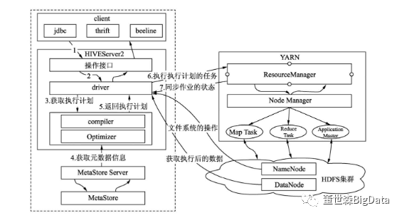
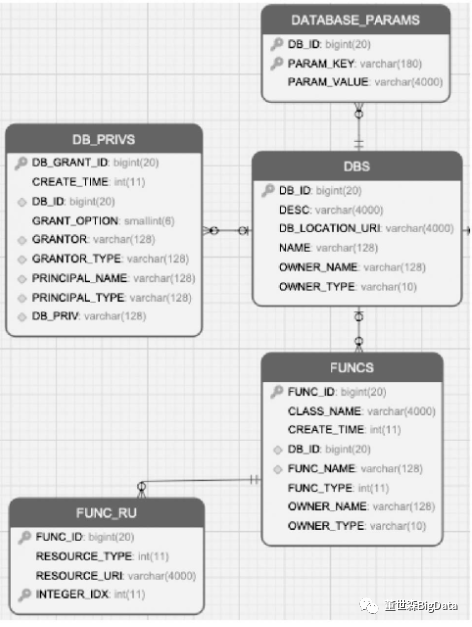
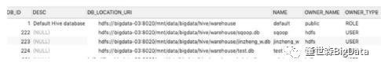
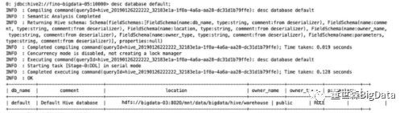
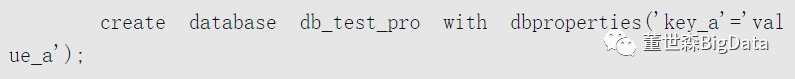
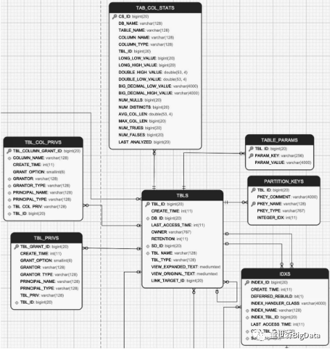
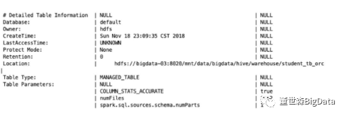
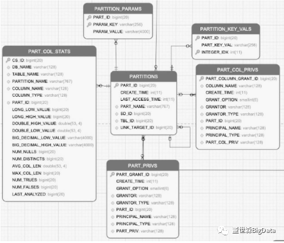
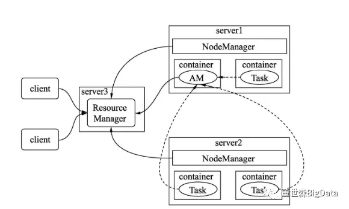
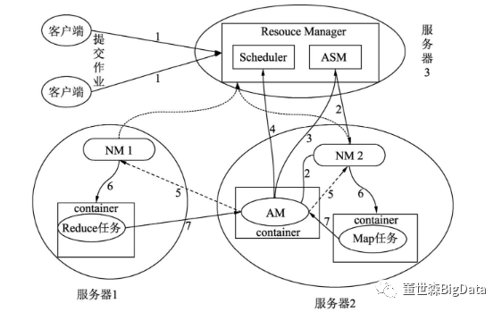

# Hive 组件

hive组件版本 : 1.1.0-cdh5.13.0

Hive是构建在Hadoop大数据平台之上，Hive数据存储依赖于HDFS, HiveSQL的执行引擎依赖于MapReduce、Spark、Tez等分布式计算引擎，Hive作业的资源调度依赖于YARN、Mesos等大数据资源调度管理组件。如果脱离Hadoop生态单聊Hive优化，那无异于隔靴搔痒，解决不了根本的性能问题。在日常工作中，开发者能够利用第三方组件去剖析系统的性能问题，即使系统不是他们实现的，也能够排查到问题的关键点。所以从优化定位问题的角度来看，我们不需要了解所有的实现细节，只需要了解每个组件运行的基本原理，以及具体应用运行时在组件内部运行的大致过程，并能够借助系统的一些监控工具和日志看懂执行过程，建立一个简单的整体数据链路和组件的全局观即可。基于上面几点考虑，本章在介绍各个组件时着眼于各个组件的基本原理介绍。与Hive相关的组件有4个部分：

- Hive元数据
- 资源管理和调度
- 分布式文件系统
- 计算引擎

## Hive架构

Hive依托于Hadoop大数据平台，其架构随着Hadoop版本的迭代和自身的发展也在不断地演变，但在Hadoop步入2.x版本、Hive步入1.x版本后，整体架构稳定，后续的迭代版本就没有太多重大的调整，更多的只是功能增强了。例如，Hive 2.x引入的LLAP, Hive 3.x 在2.x的基础上加大了对LLAP和Tez的支持。

下面我们就来看Hive 1.x的基本结构。

Hive 1.x版本基本结构在Hadoop 2.x版本以后，Hive所有运行的任务都是交由YARN来统一管理。

​													 Hive作业的工作流程中YARN和Hive的协作关系

客户端提交SQL作业到HiveServer2, HiveServer2会根据用户提交的SQL 作业及数据库中现有的元数据信息生成一份可供计算引擎执行的计划。

每个执行计划对应若干MapReduce作业，Hive会将所有的MapReduce作业都一一提交到YARN中，由YARN去负责创建MapReduce作业对应的子任务任务，并协调它们的运行。YARN创建的子任务会与HDFS进行交互，获取计算所需的数据，计算完成后将最终的结果写入HDFS或者本地。从整个Hive运行作业的过程，我们可以知道Hive组件主要包含如下3个部分：

1. 客户端（client）。Hive支持多种客户端的连接，包括beeline、jdbc、thrift和HCatalog。早期的Hive Command Line（CLI）由于可以直接操作HDFS存储的数据,权限控制较为困难，支持的用户数有限，已经被废弃。

   1. beeline : Beeline是 Hive 0.11版本引入的新命令行客户端工具,它是基于SQLLine CLI的JDBC客户端,Hive客户端工具后续将使用Beeline 替代HiveCLI ，并且会废弃掉HiveCLI 客户端工具。

      Beeline支持嵌入模式(embedded mode)和远程模式(remote mode)。在嵌入式模式下，运行嵌入式的Hive(类似Hive CLI)，而远程模式可以通过Thrift连接到独立的HiveServer2进程上。从Hive 0.14版本开始，Beeline使用HiveServer2工作时，它也会从HiveServer2输出日志信息到STDERR。

   2. thrift : 原意为跨语言调用接口,例如将hive的jar放入Groovy的path中,在Groovy客户端可以直接操作hive,同理java等.也为hive server.spark thrift server?

   3. HCatalog : 最开始是独立项目,目的是解决hadoop生态不同组件的元数据共享问题,后来合入hive,作为hive的又一种可以直接提供访问底层文件和元数据的接口方式 <- Flink支持此种

   4. SparkThriftServer : 是Spark社区基于HiveServer2实现的一个Thrift服务。目的是取代HiveServer2。

      因为Spark Thrift Server的接口和协议都和HiveServer2完全一致，因此我们部署好Spark Thrift Server后，可以直接使用hive的beeline访问Spark Thrift Server执行相关语句。可以和Hive Metastore进行交互，获取到hive的元数据。

2. HiveServer2。替代早期的HiveServer，提供了HTTP协议的Web服务接口和RPC协议的thrift服务接口，使得Hive能够接收多种类型客户端的并发访问，并将客户端提交的SQL进行编译转化可供计算引擎执行的作业。借助于HiveServer2, Hive可以做到更为严格的权限验证。在实际使用中需要注意HiveServre2服务Java堆大小的设置，默认情况下是50MB，在查询任务增多的情况下，容器发生内存溢出，导致服务崩溃，用户访问不了Hive。

3. 元数据及元数据服务。Hive的元数据记录了Hive库内对象的信息，包括表的结构信息、分区结构信息、字段信息及相关的统计信息等。

4. 计算引擎 : 基于 Yarn 的 Hadoop MR 任务 / Spark / Flink

5. 分布式文件系统 : HDFS

## Hive元数据

Hive的元数据保存在Hive的metastore数据中，里面记录着Hive数据库、表、分区和列的一些当前状态信息，通过收集这些状态信息，可以帮助我们更好地监控Hive数据库当前的状态，提前感知可能存在的问题；可以帮助基于成本代价的SQL 查询优化，做更为正确的自动优化操作。

扩展：在Hive 3.0以后，可以在Hive的sys数据库中找到元数据表。

**Hive的元数据主要分为5个大部分：**

1. **数据库相关的元数据**
2. **表相关的元数据**
3. **分区相关的元数据**
4. **文件存储相关的元数据**
5. **其他**

1．数据库的元数据

数据库的元数据及这些元数据之间的关系如图所示。

​																		 数据库相关的元数据

DBS：描述Hive中所有的数据库库名、存储地址（用字段DB_LOCATION_URI表示）、拥有者和拥有者类型。DBS表的内容如图所示。

​																	DBS的MySQL查询结构

Hive可以通过命令“desc database库名”来查询DBS的信息，如图所示。

​																		使用desc查询DBS信息

DATABASE_PARAMS：描述数据库的属性信息（DBPROPERTIES）。例如，创建一个带有库属性信息的库，代码如下：

查询MySQL中的DATABASE_PARAMS表，会见到如图所示的信息。在Hive中可以使用命令“desc database extended db_test_pro; ”来查询DBPROPERTIES的信息。

​																		 DBPROPERTIES信息

DB_PRIVS：描述数据库的权限信息。

FUNCS：记录用户自己编写的函数信息（UDF），包括该函数的函数名、对应的类名和创建者等信息。用户可以通过命令“create function函数名…”来创建自定义函数。

FUNCS_RU：记录自定义函数所在文件的路径，例如使用Java编写Hive的自定义函数，FUNCS_RU表会记录该函数所在JAR包的HDFS存储位置，以及该JAR包引用的其他JAR包信息。

2．表的元数据

表的元数据及这些元数据之间的关系如图所示。

​																		 	表相关的元数据

包含以下几个表：

TBLS：记录Hive数据库创建的所有表，包含表所属的数据库、创建时间、创建者和表的类型（包括内部表、外部表、虚拟视图等）。在Hive中使用命令“desc formatted 表名”，查看Detailed Table Information 一节的信息，如图4.7所示。

​																				表的描述信息

TABLE_PARAMS：表的属性信息，对应的是创建表所指定的TBLPROPERTIES内容或者通过收集表的统计信息。收集表的统计信息可以使用如下的命令：analyze table \<tablename> compute statistics

表的统计信息一般包含表存储的文件个数（numFiles）、总文件大小（totalSize）、表的总行数（numRows）、分区数（numPartitions）和未压缩的每行的数据量（rawDataSize）等。

TAB_COL_STATS：表中列的统计信息，包括数值类型的最大和最小值，如LONG_LOW_VALUE、LONG_HIGH_VALUE、DOUBLE_HIGH_VALUE、DOUBLE_LOW_VALUE、BIG_DECIMAL_LOW_VALUE、BIG_DECIMAL_HIGHT_VALUE、空值的个数、列去重的数值、列的平均长度、最大长度，以及值为TRUE/FALSE的个数等。

TBL_PRIVS：表或者视图的授权信息，包括授权用户、被授权用户和授权的权限等。

TBL_COL_PRIVS：表或者视图中列的授权信息，包括授权用户、被授权的用户和授权的权限等。

PARTITION_KEYS：表的分区列。

IDXS:Hive中索引的信息，Hive 3.0已经废弃。

3．分区的元数据

分区的元数据及这些元数据之间的关系如图4.8所示。

图4.8中包含以下几个表：

● PARTITIONS：存储分区信息，包括分区列，分区创建的时间。

● PARTITION_PARAMS：存储分区的统计信息，类似于表的统计信息一样。

● PART_COL_STATS：分区中列的统计信息，类似于表的列统计信息一致。● PART_PRIVS：分区的授权信息，类似于表的授权信息。

● PART_COL_PRIVS：分区列的授权信息，类似于表的字段授权信息。

● PARTITION_KEY_VALS：分区列对应的值。

​																			分区相关的元数据

4．数据存储的元数据

数据存储的元数据及这些元数据之间的关系如图4.9所示。

主要包含以下几个表的内容：

● SDS：保存数据存储的信息，包含分区、表存储的HDFS 路径地址、输入格式（INPUTFORMAT）、输出格式（OUTPUTFORMAT）、分桶的数量、是否有压缩、是否包含二级子目录。

● CDS、COLUMN_V2：表示该分区、表存储的字段信息，包含字段名称和类型等。

● SORT_COLS：保存Hive表、分区有排序的列信息，包括列名和排序方式等。

● BUCKETING_COLS：保存Hive表，分区分桶列的信息、列名等。

● SERDES：保存Hive表、分区序列化和反序列化的方式。

● SERDES_PARAMS：保存Hive，分区序列化和反序列化的配置属性，例如行的间隔符（line.delim）、字段的间隔符（filed.delim）。

● SKEWED_COL_NAMES：保存表、分区有数据倾斜的列信息，包括列名。

● SKEWED_VALUES：保存表、分区有数据倾斜的列值信息。

● SKEWED_COL_VALUE_LOC_MAP：保存表、分区倾斜列对应的本地文件路径。

● SKEWED_STRING_LIST、SKEWED_STRING_LIST_VALUES：保存表，分区有数据倾斜的字符串列表和值信息。

5．其他Hive的元数据还包含很多内容，例如Hive的事务信息、锁信息及权限相关的信息等。在优化的时候比较少用到，这里不多提。

## YARN组件

在生产环境中的大数据集群，所有作业或系统运行所需的资源，都不是直接向操作系统申请，而是交由资源管理器和调度框架代为申请。每个作业或系统所需的资源都是由资源管理和调度框架统一分配、协调。在业界中扮演这一角色的组件有YARN、Mesos等。

### YARN的优点

由资源管理器统一资源的协调和分配，带来的优点有：

（1）提高系统的资源利用率。不同系统和不同业务在不同的时间点对硬件资源的需求是不一样的，例如一些离线业务通常在凌晨时间启动，除了这个阶段的离线业务对资源的占用比较高，其他时间段基本是空闲的，通过统一资源调度和协调，将这些时间段的资源分配给其他系统。

不仅计算资源可以共享，由于允许多套系统部署在一个集群，也能增加系统存储资源的利用率。

（2）协调不同作业/不同系统的资源，减少不同作业和不同系统之间的资源争抢。例如通过资源管理和调度框架并通过一定的资源分配策略，能够保证在多作业情况下，各个作业都能够得到足够的资源得以运行，而不会出现一个作业占用所有资源，导致其他作业全部阻塞的情况。

（3）增强系统扩展性。 资源管理和调度框架，允许硬件资源的动态伸缩，而不会影响作业的运行。

（4）资源调度与管理工具把控着资源的分配和任务的调度，直接影响程序的运行效率。如果任务得到资源少了，必将影响自身的程序运行效率，如果任务占用过多资源，在集群任务运行高峰期，必然导致挤占其他任务运行所需的资源。

那么如何利用资源与调度管理工具？

作为大数据集群的使用者，基于Hive 做业务的开发者要高效地利用资源与调度管理工具，需要知道两方面的内容：

● YARN运行的基本组成和工作原理，能够基本理清程序运行的整体流程，知道哪些过程或者配置可能成为瓶颈，可以先不用了解，但一定要有意识。

● YARN资源调度与分配算法。

### YARN基本组成

YARN的基本结构由一个 ResourceManager 与多个 NodeManager 组成。ResourceManager负责对NodeManager所持有的资源进行统一管理和调度。当在处理一个作业时ResourceManager会在NodeManager所在节点创建一全权负责单个作业运行和监控的程序ApplicationMaster。

如图所示为YARN的基本工作流程。

​																Hive作业在YARN的工作流程

**1.ResouceManager（简称RM）资源管理器负责整个集群资源的调度，该组件由两部分构成：调度器（Scheduler）和ApplicationsMaster（简称ASM）。**

**调度器会根据特定调度器实现调度算法，结合作业所在的队列资源容量，将资源按调度算法分配给每个任务。分配的资源将用容器（container）形式提供，容器是一个相对封闭独立的环境已经将CPU、内存及任务运行所需环境条件封装在一起。**

**通过容器可以很好地限定每个任务使用的资源量。YARN调度器目前在生产环境中被用得较多的有两种：能力调度器（Capacity Scheduler）和公平调度器（Fair Scheduler）。**

**2.ApplicationMaster（简称AM）每个提交到集群的作业（job）都会有一个与之对应的AM 来管理。它负责进行数据切分，并为当前应用程序向RM 去申请资源，当申请到资源时会和NodeManager 通信，启动容器并运行相应的任务。此外，AM还负责监控任务（task）的状态和执行的进度。**

**3.NodeManage（简称NM）NodeManager负责管理集群中单个节点的资源和任务，每个节点对应一个NodeManager, NodeManager负责接收ApplicationMaster的请求启动容器，监控容器的运行状态，并监控当前节点状态及当前节点的资源使用情况和容器的运行情况，并定时回报给ResourceManager。**

### YARN工作流程

**YARN在工作时主要会经历3个步骤：**

（1）ResourceManager收集NodeManager反馈的资源信息，将这些资源分割成若干组，在YARN中以队列表示。

（2）当YARN接收用户提交的作业后，会尝试为作业创建一个代理ApplicationMaster。

（3）由ApplicationMaster将作业拆解成一个个任务（task），为每个任务申请运行所需的资源，并监控它们的运行。

如图所示为提交到YARN的作业被拆解成一个个任务的示意图。

​															 Hive作业在YARN被分成的任务

**YARN在处理任务时的工作流程如图所示。经历了以下几个步骤：**

（1）客户端向YARN提交一个作业（Application）。

（2）作业提交后，RM根据从NM收集的资源信息，在有足够资源的节点分配一个容器，并与对应的NM进行通信，要求它在该容器中启动AM。

（3）AM创建成功后向RM中的ASM注册自己，表示自己可以去管理一个作业（job）。

（4）AM注册成功后，会对作业需要处理的数据进行切分，然后向RM申请资源，RM会根据给定的调度策略提供给请求的资源AM。

（5）AM申请到资源成功后，会与集群中的NM通信，要求它启动任务。

（6）NM接收到AM的要求后，根据作业提供的信息，启动对应的任务。

（7）启动后的每个任务会定时向AM提供自己的状态信息和执行的进度。

（8）作业运行完成后AM会向ASM注销和关闭自己。

​																			YARN内部组件交互图

### YARN资源调度器

资源调度器负责整个集群资源的管理与分配，是YARN 的核心组件。开发者提交的Hive任务，所需的资源都需要经过该组件进行分配。如果提交的任务资源始终被抢占，或者被分配的资源很少，都会影响Hive 的执行效率。

我们就来学习资源的原理和应用场景。在YARN中，资源调度器以层次队列方式组织资源，如图所示。

​																	YARN的application queues

这种组织方式，通过对不同队列资源进行分配和调整，可以适应多种对资源需求不同的作业同时使用，从而提高集群资源利用率。例如有些作业耗CPU 资源，有些耗内存，可以分别将这种资源提交至各自资源较为充裕的队列。

**YARN提供了3种调度器：**

1. **先来先服务调度器（FIFO Scheduler）**
2. **能力调度器（Capacity Scheduler）**
3. **公平调度器（Fair Scheduler）**

FIFO即先来先服务，是Hadoop在设计之初使用的调度方式。这种方式不能充分利用集群的硬件资源，在面对资源需求不同的作业而无法提供根据灵活的调度策略，导致作业某些空闲资源被某个正在运行的资源所占用，正在等待的资源的作业无法获取集群资源进行运行。

为了克服单队列的先来先服务的调度先天不足，YARN提供了多用户的多队列的调度器。

在生产环境中经常被使用到的是能力调度器和公平调度器。在YARN中可供分配和管理的资源有内存和CPU资源，在Hadoop 3.0中将GPU、FPGA资源也纳入可管理的资源中。

内存和CPU资源可以通过下面的配置选项进行调整：

● yarn.nodemanager.resource.cpu-vcores，默认值为-1。默认表示集群中每个节点可被分配的虚拟CPU个数为8。

为什么这里不是物理CPU个数？

因为考虑一个集群中所有的机器配置不可能一样，即使同样是16核心的CPU性能也会有所差异所以YARN在物理CPU和用户之间加了一层虚拟CPU，一个物理CPU可以被划分成多个虚拟的CPU。

● yarn.nodemanager.resource.detect-hardware-capabilities为true，且该配置还是默认值-1, YARN会进行自动给计算可用虚拟CPU。

● yarn.nodemanager.resource.memory-mb，默认值为-1。当该值为-1时，默认表示集群中每个节点可被分配的物理内存是8GB。

● yarn.nodemanager.resource.detect-hardware-capabilities为true，且该配置还是默认值-1, YARN会自动计算可用物理内存。

● yarn.nodemanager.vmem-pmem-ratio，默认值为2.1。该值为可使用的虚拟内存除以物理内存，即YARN 中任务的单位物理内存相对应可使用的虚拟内存。例如，任务每分配1MB的物理内存，虚拟内存最大可使用2.1MB。

● yarn.nodemanager.resource.system-reserved-memory-mb, YARN保留的物理内存，给非YARN任务使用，该值一般不生效，只有当yarn.nodemanager.resource.detect-hardware-capabilities为true的状态才会启用，会根据系统的情况自动计算。

如果发现自身集群资源非常充裕，但是程序运行又较为缓慢，整个集群的资源利用率又很低，就需要关注上面的配置是否设置得过低。用户提交给YARN的作业及所申请的资源，YARN最终是以容器的形式调播给作业，每个作业分解到子任务运行容器中，YARN分配给容器的相关配置可以通过如下配置项目调整：

● yarn.scheduler.minimum-allocation-mb：默认值1024MB，是每个容器请求被分配的最小内存。

如果容器请求的内存资源小于该值，会以1024MB 进行分配；

如果NodeManager可被分配的内存小于该值，则该NodeManager将会被ResouceManager给关闭。

● yarn.scheduler.maximum-allocation-mb：默认值8096MB，是每个容器请求被分配的最大内存。如果容器请求的资源超过该值，程序会抛出InvalidResourceRequest Exception的异常。

● yarn.scheduler.minimum-allocation-vcores：默认值1，是每个容器请求被分配的最少虚拟CPU 个数，低于此值的请求将被设置为此属性的值。此外，配置为虚拟内核少于此值的NodeManager将被ResouceManager关闭。

● yarn.scheduler.maximum-allocation-vcores：默认值4，是每个容器请求被分配的最少虚拟CPU个数，高于此值的请求将抛出InvalidResourceRequestException的异常。如果开发者所提交的作业需要处理的数据量较大，需要关注上面配置项的配置。YARN还能对容器使用的硬件资源进行控制，通过如下的配置：

● yarn.nodemanager.resource.percentage-physical-cpu-limit：默认值100。一个节点内所有容器所能使用的物理CPU的占比，默认为100%。即如果一台机器有16核，CPU的使用率最大为1600%，且该比值为100%，则所有容器最多能使用的CPU资源为1600%，如果该比值为50%，则所有容器能使用的CPU资源为800%。

●yarn.nodemanager.linux-container-executor.cgroups.strict-resource-usage：默认值为false，表示开启CPU的共享模式，共享模式告诉系统容器除了能够使用被分配的CPU资源外，还能使用空闲的CPU资源。