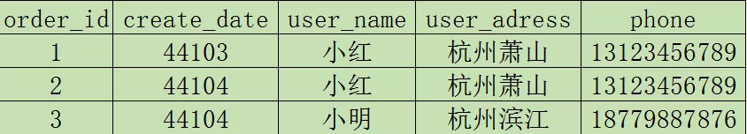

# 数据建模 

### 相关的概念

| 概念                          | 说明                                                         |
| ----------------------------- | :----------------------------------------------------------- |
| ODS，是Operational Data Store | 一个面向主题的、集成的、可变的、当前的细节数据集合，用于支持企业对于即时性的、操作性的、集成的全体信息的需求 |
| ETL                           | 数据抽取、转换、装载，ETL是建立数据仓库最重要的处理过程，也是最体现工作量的环节 |
| 变化数据捕获技术              | 捕获数据变化的机制                                           |
| CDC 变化数据捕获              | 常用的变化数据捕获方法有时间戳、快照、触发器和日志四种(关系型数据库) 。对应维度模型种的渐变维度 |
| 数据仓库                      | 是一个面向主题的、集成的、随时间变化的、非易失的数据集合，用于支持管理者的决策过程 |
| 数据集市                      | 数据集市是按主题域组织的数据集合，用于支持部门级的决策，两种类型的数据集市：独立数据集市和从属数据集市 |
| 代理键 Surrogate key          | 代理关键字一般是指维度表中使用顺序分配的整数值作为主键       |

**业务系统和数据仓库建模区别**

在业务系统中，通常面对业务库的随机读写，目前主要是采用三范式（3NF）模型存储数据。而在数据仓库的建模过程中，由于主要是数据的批量读取操作，但是事物并不是我们所关心的，主要是关注数据的整合以及查询处理性能，因此会采用其他的建模方法，以Kimball维度建模最为经典。

## 1.Kimball和Inmon架构

### 1.Inmon架构

   辐射状企业信息工厂(CIF) 方法由Bill Inmon及业界人士倡导的。在这个环境下，数据从操作性数据源中获取，在ETL系统中处理，将这一过程称为数据获取，从这一过程中获得的原子数据保存在满足第三范式的数据库中，这种规范化的原子数据的仓库被称为CIF架构下的企业级数据仓库(EDW)

   与Kimball方法相似，CIF提倡企业数据协调与集成，但CIF认为要利用规范化的EDW承担这一角色，而Kimball架构强调具有一致性维度的企业总线的重要作用

   Inmon企业级数据仓库的分析数据库通常以部门为中心（而不是围绕业务过程来组织），而且包含汇总数据，并不是原子级别数据，如果ETL过程中数据所应用的业务规则超越了基本概要，如部门改名了或者其他的类似计算，要将分析数据库与EDW原子数据联系起来将变得很困难

### 2.Kimball架构

​    Kimball架构利用了CIF中处于中心地位的EDW，但是此次的EDW完全与分析与报表用户隔离，仅作为数据来源，其中数据是维度的，原子的，以过程为中心的，与企业级数据仓库总线结构保持一致。                                 

****

### 3.架构对比

- **流程**

Inmon架构是自顶向下，即从数据抽取-->数据仓库-->数据集市，以数据源为导向，是一种瀑布流开发方法，模型偏向于3NF，

Kimball:架构是自下向上，即从数据集市(主题划分)-->数据仓库--> 数据抽取，是以需求为导向的，一般使用星型模型 

- **事实表和维表**

Inmon架构下，不强调事实表和维表的概念，因为数据源变化可能会比较大，更加强调的是数据清洗的工作 

kimball架构强调模型由事实表和维表组成，注重事实表与维表的设计

- **数据集市**

Inmon架构中，数据集市有自己的物理存储，是真实存在的。

Kimball数据仓库架构中，数据集市是一个逻辑概念，只是多维数据仓库中的主题域划分，并没有自己的物理存储，也可以说是虚拟的数据集市。是数据仓库的一个访问层，是按主题域组织的数据集合，用于支持部门级的决策。

- **中心**

 Inmon架构是以部门为中心，而Kimball架构是以业务过程为中心 

- **EDW的访问**

Inmon架构中用户可以直接访问企业数据仓库(EDW)

Kimball架构中用户不可以直接访问企业数据仓库(EDW)，只能访问展现区数据

### 4.总结

企业开发中一般选择Kimball维度建模

## 2.数据建模的几种方式

### 1.ER模型

ER模型是属于三范式的，是企业级的主题抽象而不是单独描述某个业务

1.1 什么是范式

   当分类不可再分时，这种关系是规范化的，一个低级范式分解转换为更高级的范式时，就叫做规范化

| 范式 | 说明                                                         |
| ---- | :----------------------------------------------------------- |
| 1NF  | 表中的列只能含有原子性（不可再分）的值;每个属性值唯一，不具有多义性 |
| 2NF  | 满足第一范式,没有部分依赖;每个非主属性必须完全依赖于整个主键，而非主键的一部分 |
| 3NF  | 满足第二范式,没有传递依赖;每个非主属性不能依赖于其他关系中的属性，因为这样的话，这种属性应该归到其他关系中去 |

1.2 第一范式

表中的每一列都是不可拆分的原子项

由上图可知，phone字段里面存了2个值，具有可分割性，不符合1NF，可以改成：

1.3 第二范式

第二范式要同时满足下面两个条件：

- 满足第一范式。
- 没有部分依赖。

上图可以看出，如果一个用户下了很多订单，则用户名，收获地址和手机号有重复出现的情况造成数据冗余，很明显不太符合第二范式，可以改成：

1.4 第三范式

第三范式要同时满足下面两个条件：

- 满足第二范式。
- 没有传递依赖。

简单点说，关系重复，能互相推导出来

如上图所示，如果知道了zip邮编，其实是能推出来省市区的，相反，知道了省市区，也是可以推出邮编的，有传递依赖，造成了冗余，不符合第三范式，需要改造:

1.5 小结

   在关系数据模型设计中，一般需要满足第三范式的要求。如果一个表有良好的主外键设计，就应该是满足3NF的表。

   规范化带来的好处是通过减少数据冗余提高更新数据的效率，同时保证数据完整性。然而，我们在实际应用中也要防止过度规范化的问题。规范化程度越高，划分的表就越多，在查询数据时越有可能使用表连接操作。

​    而如果连接的表过多，会影响查询的性能。关键的问题是要依据业务需求，仔细权衡数据查询和数据更新的关系，制定最适合的规范化程度。还有一点需要注意的是，不要为了遵循严格的规范化规则而修改业务需求。

### 2.维度建模    

   维度建模是一种将大量数据结构化的逻辑设计手段，包含维度和指标，它不像ER模型目的是消除冗余数据，维度建模是面向分析，最终目的是提高查询性能，所以会增加数据冗余，并且违反三范式。

   维度建模也是重点关注让用户快速完成需求分析且对于复杂查询及时响应，维度建模一般可以分为三种：

- 星型模型
- 雪花模型
- 星座模型

  其中最常用的其实是星型模型

2.1 背景

​     在多维分析的商业智能解决方案中，根据事实表和维度表的关系，又可将常见的模型分为星型模型，雪花型模型及星座模型。在设计逻辑型数据的模型的时候，就应考虑数据是按照星型模型，雪花型模型还是星座模型进行组织。

2.2 星型模型

​     星形模型中有一张事实表，以及零个或多个维度表，事实表与维度表通过主键外键相关联，维度表之间没有关联，当所有维表都直接连接到“ 事实表”上时，整个图解就像星星一样，故将该模型称为星型模型。星形模型是最简单，也是最常用的模型。由于星形模型只有一张大表，因此它相比于其他模型更适合于大数据处理。其他模型可以通过一定的转换，变为星形模型。

​    星型架构是一种非正规化的结构，多维数据集的每一个维度都直接与事实表相连接，不存在渐变维度，所以数据有一定的冗余，如在地域维度表中，存在国家 A 省 B 的城市 C 以及国家 A 省 B 的城市 D 两条记录，那么国家 A 和省 B 的信息分别存储了两次，即存在冗余。

2.3 雪花模型

​     当有一个或多个维表没有直接连接到事实表上，而是通过其他维表连接到事实表上时，其图解就像多个雪花连接在一起，故称雪花模型。雪花模型是对星型模型的扩展。它对星型模型的维表进一步层次化，原有的各维表可能被扩展为小的维度表，形成一些局部的 " 层次 " 区域，这些被分解的表都连接到主维度表而不是事实表。如图，将地域维表又分解为国家，省份，城市等维表。它的优点是 : 通过最大限度地减少数据存储量以及联合较小的维表来改善查询性能。雪花型结构去除了数据冗余。

2.4 星座模型

​     星座模型是由星型模型延伸而来，星型模型是基于一张事实表而星座模式是基于多张事实表，并且共享维度表信息，这种模型往往应用于数据关系比星型模型和雪花模型更复杂的场合。星座模型需要多个事实表共享维度表，因而可以视为星形模型的集合，故亦被称为星系模型

2.5 对比

- 星型模型因为数据的冗余所以很多统计查询不需要做外部的连接，因此一般情况下效率比雪花型模型要高。
- 星型结构不用考虑很多正规化的因素，设计与实现都比较简单。
- 雪花型模型由于去除了冗余，有些统计就需要通过表的联接才能产生，所以效率比较低。
- 正规化也是一种比较复杂的过程，相应的数据库结构设计、数据的 ETL、以及后期的维护都要复杂一些。

2.6 小结

​    通过对比，我们可以发现数据仓库大多数时候是比较适合使用星型模型构建底层数据Hive表，通过大量的冗余来减少表查询的次数从而提升查询效率，星型模型对OLAP的分析引擎支持比较友好，这一点在Kylin中比较能体现。而雪花模型在关系型数据库中如MySQL，Oracle中非常常见，尤其像电商的数据库表。在数据仓库中雪花模型和星座模型的应用场景比较少，但也不是没有，所以在具体设计的时候，可以考虑是不是能结合两者的优点参与设计，以此达到设计的最优化目的。

2.7 建模原则：

- 高内聚和低辑合

   将业务相近或者相关、粒度相同的数据设计为一个逻辑或者物理模型：将高概率同 时访问的数据放一起 ，将低概率同时访问的数据分开存储。

- 核心模型与扩展模型分离

​    建立核心模型与扩展模型体系，核心模型包括的宇段支持常用的核心业务，扩展模型包括的字段支持个性化或少量应用的需要 ，不能让扩展模型的宇段过度侵人核心模型，以免破坏核心模型的架构简洁性与可维护性。

- 公共处理逻辑下沉及单一

​    越是底层公用的处理逻辑越应该在数据调度依赖的底层进行封装与实现，不要让公用的处理逻辑暴露给应用层实现，不要让公共逻辑多处同时存在。

- 成本与性能平衡

   适当的数据冗余可换取查询和刷新性能，不宜过度冗余与数据复制。

- 数据可回滚

​    处理逻辑不变，在不同时间多次运行数据结果确定不变。

- 一致性

   具有相同含义的字段在不同表中的命名必须相同，必须使用规范定义中的名称。

- 命名清晰、可理解

​    表命名需清晰、一致，表名需易于消费者理解和使用。

星型模型设计步骤：

1. 选择需要进行分析决策的业务过程。业务过程可以是单个业务事件，比如交易的支付、退款等；也可以是某个事件的状态，比如当前的账户余额等；还可以是一系列相关业务事件组成的业务流程，具体需要看我们分析的是某些事件发生情况，还是当前状态，或是事件流转效率。
2. 选择粒度。在事件分析中，我们要预判所有分析需要细分的程度，从而决定选择的粒度。粒度是维度的一个组合。
3. 识别维表。选择好粒度之后，就需要基于此粒度设计维表，包括维度属性，用于分析时进行分组和筛选。
4. 选择事实。确定分析需要衡量的指标 

### 3.Data Vault模型

​    Data Vault Dan Linstedt 发起创建的一种模型，它是模型的衍生，其设计的出发点也是为了实现数据的整合，但不能直接用于数据分析决策。它强调建立一个可审计的基础数据层，也就是强调数据的历史性、可追溯性和原子性，而不要求对数据进行过度的一致性处理和整合；

 Data Vault方法需要跟踪所有数据的来源，因此其中每个数据行都要包含数据来源和装载时间属性，用以审计和跟踪数据值所对应的源系统。
 Data Vault不区分数据在业务层面的正确与错误，它保留操作型系统的所有时间的所有数据，装载数据时不做数据验证、清洗等工作，这点明显有别于其他数据仓库建模方法

| 概念   | 说明                                                         |
| ------ | :----------------------------------------------------------- |
| 中心表 | 中心表用来保存一个组织内的每个实体的业务主键，业务主键唯一标识某个业务实体，中心表和源系统表是相互独立的 |
| 链接表 | 链接表是中心表之间的链接。一个链接表意味着两个或多个中心表之间有关联。一个链接表通常是一个外键，它代表着一种业务关系 |
| 附属表 | 附属表用来保存中心表和链接表的属性，包括所有的历史变化数据。一个附属表总有一个且唯一一个外键引用到中心表或链接表 |

  同时它基于主题概念将企业数据进行结构化组织，并引入了更进一步的范式处理来优化模型，以应对源系统变更的扩展性。Data Vault 型由以下几部分组成。

   • Hub ：是企业的核心业务实体，由 实体 key 、数据仓库序列代理键、装载时间、数据来源组成。

   • Link ：代表 Hub 之间的关系。这里与 模型最大的区别是将关系作为一个独立的单元抽象，可以提升模型的扩展性。它可以直

接描述 1:1 1:n n:n 的关系，而不需要做任何变更。它由 Hub 的代理键、装载时间、数据来源组成。

   • Satellite ：是 Hub 的详细描述内容， 一个 Hub 可以有多个 Satellite它由 Hub 的代理键、装载时间、来源类型、详细的 Hub 描述信息组成。

​    Data Vault 模型比 ER 模型更容易设计和产出，它的 ETL 加工可实现配置化。

## 3.模型分层

### 1 前言

数据仓库一般分为三层，自上而下分别为数据贴源层（ODS，Operation Data Store）、数据公共层（CDM，Common Data Model）和数据应用层（ADS，Application Data Service）。

### 2 ods层

贴源层，与业务库保持一致，不做任何处理

### 3 cdm层

数据公共层CDM（Common Data Model，又称通用数据模型层），包括DIM维度表、DWD,DW和DWS，由ODS层数据加工而成。主要完成数据加工与整合，建立一致性的维度，构建可复用的面向分析和统计的明细事实表，以及汇总公共粒度的指标

- 公共维度层（DIM）：基于维度建模理念思想，建立企业一致性维度。降低数据计算口径和算法不统一风险。   公共维度层的表通常也被称为逻辑维度表，维度和维度逻        辑表通常一一对应。
- 明细粒度事实层（DWD）：对数据进行规范化编码转换，清洗，统一格式，脱敏等，不做横向整合
- 主题宽表层(DW) 对dwd各种信息进行整合，输出主题宽表(面    向业务过 程，不同业务过程的信息不冗余建设，采用外键形式)
- 公共汇总粒度事实层（DWS）：以分析的主题对象作为建模驱动，基于上层的应用和产品的指标需求，构建公共粒度的汇总指标事实表，以宽表化手段物理化模型。构建命名规范、口径一致的统计指标，为上层提供公共指标，建立汇总宽表、明细事实表。

  公共汇总粒度事实层的表通常也被称为汇总逻辑表，用于存放派生指标数据。

### 4 ads层

​    数据应用层ADS（Application Data Service）：面向业务需求定制开发，存放数据产品个性化的统计指标数据。

### 5 逻辑分层架构

### 6 分层的好处

1. 清晰数据结构：每一个数据分层都有它的作用域，这样我们在使用表的时候能更方便地定位和理解。
2. 数据血缘追踪：简单来讲可以这样理解，我们最终给业务呈现的是一张能直接使用的张业务表，但是它的来源有很多，如果有一张来源表出问题了，我们希望能够快速准确地定位到问题，并清楚它的危害范围。
3. 减少重复开发：规范数据分层，开发一些通用的中间层数据，能够减少极大的重复计算。
4. 把复杂问题简单化：将一个复杂的任务分解成多个步骤来完成，每一层只处理单一的步骤，比较简单和容易理解。而且便于维护数据的准确性，当数据出现问题之后，可以不用修复所有的数据，只需要从有问题的步骤开始修复。

## 4.拉链表

### 拉链表的使用场景

在数据仓库的数据模型设计过程中，经常会遇到下面这种表的设计：

1. 有一些表的数据量很大，比如一张用户表，大约10亿条记录，50个字段，这种表，即使使用ORC压缩，单张表的存储也会超过100G，在HDFS使用双备份或者三备份的话就更大一些。
2. 表中的部分字段会被update更新操作，如用户联系方式，产品的描述信息，订单的状态等等。
3. 需要查看某一个时间点或者时间段的历史快照信息，比如，查看某一个订单在历史某一个时间点的状态。
4. 表中的记录变化的比例和频率不是很大，比如，总共有10亿的用户，每天新增和发生变化的有200万左右，变化的比例占的很小。

那么对于这种表我该如何设计呢？下面有几种方案可选：

- 方案一：每天只留最新的一份，比如我们每天用Sqoop抽取最新的一份全量数据到Hive中。
- 方案二：每天保留一份全量的切片数据。
- 方案三：使用拉链表。

### 为什么使用拉链表

现在我们对前面提到的三种进行逐个的分析。

**方案一**

这种方案就不用多说了，实现起来很简单，每天drop掉前一天的数据，重新抽一份最新的。

优点很明显，节省空间，一些普通的使用也很方便，不用在选择表的时候加一个时间分区什么的。

缺点同样明显，没有历史数据，先翻翻旧账只能通过其它方式，比如从流水表里面抽。

**方案二**

每天一份全量的切片是一种比较稳妥的方案，而且历史数据也在。

缺点就是存储空间占用量太大太大了，如果对这边表每天都保留一份全量，那么每次全量中会保存很多不变的信息，对存储是极大的浪费，这点我感触还是很深的......

当然我们也可以做一些取舍，比如只保留近一个月的数据？但是，需求是无耻的，数据的生命周期不是我们能完全左右的。

**拉链表**

拉链表在使用上基本兼顾了我们的需求。

首先它在空间上做了一个取舍，虽说不像方案一那样占用量那么小，但是它每日的增量可能只有方案二的千分之一甚至是万分之一。

其实它能满足方案二所能满足的需求，既能获取最新的数据，也能添加筛选条件也获取历史的数据。

所以我们还是很有必要来使用拉链表的。

举个简单例子，比如有一张订单表,6月20号有3条记录：

到6月21日，表中有5条记录：

到6月22日，表中有6条记录：

数据仓库中对该表的保留方法：

1. 只保留一份全量，则数据和6月22日的记录一样，如果需要查看6月21日订单001的状态，则无法满足；

2. 每天都保留一份全量，则数据仓库中的该表共有14条记录，但好多记录都是重复保存，没有任务变化，如订单002,004，数据量大了，会造成很大的存储浪费；

如果在数据仓库中设计成历史拉链表保存该表，则会有下面这样一张表：

说明：

1. dw_begin_date表示该条记录的生命周期开始时间，dw_end_date表示该条记录的生命周期结束时间；

2. dw_end_date = '9999-12-31'表示该条记录目前处于有效状态；

3. 如果查询当前所有有效的记录，则select * from order_his where dw_end_date = '9999-12-31'

4. 如果查询2012-06-21的历史快照，则select * from order_his where dw_begin_date <= '2012-06-21' and end_date >= '2012-06-21'，这条语句会查询到以下记录：

和源表在6月21日的记录完全一致：

可以看出，这样的历史拉链表，既能满足对历史数据的需求，又能很大程度的节省存储资源；