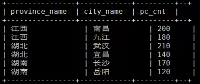

# Hive Sql 常见问题

## 1. 开窗函数

### 一 row_number() over()

有如下数据：

```
江西,高安,100
江西,南昌,200
江西,丰城,100
江西,上高,80
江西,宜春,150
江西,九江,180
湖北,黄冈,130
湖北,武汉,210
湖北,宜昌,140
湖北,孝感,90
湖南,长沙,170
湖南,岳阳,120
湖南,怀化,100
```

需要查询出每个省下人数最多的2个市

```
create table wedw_tmp.t_rn(
 province_name string COMMENT '省份'
,city_name    string COMMENT '市'
,pc_cnt     bigint COMMENT '人数'
)
row format delimited fields terminated by ',';
```

使用row_number函数，对表中的数据按照省份分组，按照人数倒序排序并进行标记

```
select
 province_name
,city_name    
,pc_cnt       
,row_number() over(partition by province_name order by pc_cnt desc) as rn
from
wedw_tmp.t_rn;
```

产生结果：



然后，利用上面的结果，查询出rn<=2的即为最终需求

```
select
 tmp.province_name
,tmp.city_name    
,tmp.pc_cnt
from
(
select
 province_name
,city_name    
,pc_cnt       
,row_number() over(partition by province_name order by pc_cnt desc) as rn
from
wedw_tmp.t_rn
) tmp
where tmp.rn <= 2;
```


### 二 sum() over()

数据准备

```
A,2020-01,15
A,2020-02,19
A,2020-03,12
A,2020-04,5
A,2020-05,29
B,2020-01,8
B,2020-02,6
B,2020-03,13
B,2020-04,5
B,2020-05,24
C,2020-01,16
C,2020-02,2
C,2020-03,33
C,2020-04,51
C,2020-05,54
```

建表

```
create table wedw_tmp.t_sum_over(
 user_name       string COMMENT '姓名'
,month_id        string COMMENT '月份'
,sale_amt        int   COMMENT '销售额'
)
row format delimited fields terminated by ',';
```

对于每个人的一个月的销售额和累计到当前月的销售总额

```
select
user_name
,month_id
,sale_amt
,sum(sale_amt) over(partition by user_name order by month_id rows between unbounded preceding and current row) as all_sale_amt
from wedw_tmp.t_sum_over;
```


注：这些窗口的划分都是在分区内部！超过分区大小就无效了

可以看到如果不指定ROWS BETWEEN,默认统计窗口为从起点到当前行;

关键是理解 ROWS BETWEEN 含义,也叫做window子句：

- **PRECEDING：往前**
- **FOLLOWING：往后**
- **CURRENT ROW：当前行**
- **UNBOUNDED：无边界，UNBOUNDED PRECEDING 表示从最前面的起点开始， UNBOUNDED FOLLOWING：表示到最后面的终点**

其他测试：

```
select
user_name
,month_id
,sale_amt
,sum(sale_amt) over(partition by user_name order by month_id) as all_sale_amt1 --默认为从起点行到当前行

,sum(sale_amt) over(partition by user_name order by month_id rows between unbounded preceding and current row) as all_sale_amt2 --从起点行到当前行

,sum(sale_amt) over(partition by user_name order by month_id rows between 3 preceding and current row) as all_sale_amt3 --当前行及往前3行之和

,sum(sale_amt) over(partition by user_name order by month_id rows between 3 preceding and 1 following) as all_sale_amt4 --当前行及往前3行往后1行之和

,sum(sale_amt) over(partition by user_name order by month_id rows between current row and unbounded following) as all_sale_amt5 --当前行及往后所有行之和
from wedw_tmp.t_sum_over;
```


### 三 lag/lead() over()

**LAG(col,n,DEFAULT) 用于统计窗口内往上第n行值**

第一个参数为列名，第二个参数为往上第n行（默认为1），第三个参数为默认值（当往上第n行为NULL时候，取默认值，如不指定，则为NULL）

**LEAD(col,n,DEFAULT) 用于统计窗口内往下第n行值**

第一个参数为列名，第二个参数为往下第n行（默认为1），第三个参数为默认值（当往下第n行为NULL时候，取默认值，如不指定，则为NULL）

**以lag() over()为例：**

数据准备

```

create table t_hosp(
 user_name string
,age int
,in_hosp date
,out_hosp date)
row format delimited fields terminated by ',';

xiaohong,25,2020-05-12,2020-06-03
xiaoming,30,2020-06-06,2020-06-15
xiaohong,25,2020-06-14,2020-06-19
xiaoming,30,2020-06-20,2020-07-02

user_name:用户名
age:年龄
in_hosp:住院日期
out_hosp：出院日期
```

需求：求同一个患者每次住院与上一次出院的时间间隔

第一步：

```
select
user_name
,age
,in_hosp
,out_hosp
,LAG(out_hosp,1,in_hosp) OVER(PARTITION BY user_name ORDER BY out_hosp asc) AS pre_out_date
from
t_hosp;

其中，LAG(out_hosp,1,in_hosp) OVER(PARTITION BY user_name ORDER BY out_hosp asc)
表示根据user_name分组按照out_hosp升序取每条数据的上一条数据的out_hosp，
如果上一条数据为空，则使用默认值in_hosp来代替
```

结果：


第二步：每条数据的in_hosp与pre_out_date的差值即本次住院日期与上次出院日期的间隔

```
select
user_name
,age
,in_hosp
,out_hosp
,datediff(in_hosp,LAG(out_hosp,1,in_hosp) OVER(PARTITION BY user_name ORDER BY out_hosp asc)) as days
from
t_hosp;
```

结果：


## 2.行/列转换 & 集合/表生成函数

1.students_info(学生信息行转列表)

```
create table  students_info
(`SNO`      string  comment '学生编号',
`name`       string  comment '姓名',
`DEPART`    string  comment '选修课程'
)
--学生信息表数据插入
insert into  students_info  values    (103,'张三','公司法')
                                        ,(103,'张三','心理学')
                                        ,(105,'王五','python程序设计')
                                        ,(109,'李麻子','数据结构与算法')
                                        ,(109,'李麻子','机器学习');

select * from  students_infostudents_info(学生信息表)
```


**行转列** 集合函数

```
select max(sno), name
   , concat_ws(',', collect_set(DEPART)) as DEPART
from students_info
group by name;
# 对于非group by字段，可以用Hive的collect_set函数收集这些字段，返回一个数组；
使用数字下标，可以直接访问数组中的元素； 
  select a,collect_set(b) as bb from t where b<='xxxxxx' group by a
会按照a分组 通过collect_set会把每个a所对应的b构建成一个以逗号分隔的数组返回。上述SQL返回：
a1,["b1","b2"]
a2,["b1","b2","b3","b4"] 
 可以按照这个返回的数组做文章，即为
select * from (select a,collect_set(b) as bb from t where b<='xxxxxx' group by a)  where size(tmp.bb)=1 and tmp.bb[0]='xxxxxxxx';
表示某bb所对应的数组长度为1 并且第一个bb为xxxxxxxx的a
```


​																					行转列搞定 

### 集合函数

| **Return Type** | **Name(Signature)**             | **Description**                                              |
| --------------- | ------------------------------- | ------------------------------------------------------------ |
| int             | size(Map<K.V>)                  | Returns the number of elements in the map type.**求map的长度** |
| int             | size(Array<T>)                  | Returns the number of elements in the array type.**求数组的长度** |
| array<K>        | map_keys(Map<K.V>)              | Returns an unordered array containing the keys of the input map.**返回map中的所有key** |
| array<V>        | map_values(Map<K.V>)            | Returns an unordered array containing the values of the input map.**返回map中的所有value** |
| boolean         | array_contains(Array<T>, value) | Returns TRUE if the array contains value.**如该数组Array包含value返回true。，否则返回false** |
| array           | sort_array(Array<T>)            | Sorts the input array in ascending order according to the natural ordering of the array elements and returns it (as of version [0.9.0](https://issues.apache.org/jira/browse/HIVE-2279)).**按自然顺序对数组进行排序并返回** |

### 表生成函数

| **Return Type** | **Name(Signature)**               | **Description**                                              |
| --------------- | --------------------------------- | ------------------------------------------------------------ |
| Array Type      | explode(array<*TYPE*> a)          | For each element in a, generates a row containing that element.**对于a中的每个元素，将生成一行且包含该元素** |
| N rows          | explode(ARRAY)                    | Returns one row for each element from the array..**每行对应数组中的一个元素** |
| N rows          | explode(MAP)                      | Returns one row for each key-value pair from the input map with two columns in each row: one for the key and another for the value. (As of Hive [0.8.0](https://issues.apache.org/jira/browse/HIVE-1735).).**每行对应每个map键-值，其中一个字段是map的键，另一个字段是map的值** |
| N rows          | posexplode(ARRAY)                 | Behaves like `explode` for arrays, but includes the position of items in the original array by returning a tuple of `(pos, value)`. (As of [Hive 0.13.0](https://issues.apache.org/jira/browse/HIVE-4943).).**与explode类似，不同的是还返回各元素在数组中的位置** |
| N rows          | stack(INT n, v_1, v_2, ..., v_k)  | Breaks up v_1, ..., v_k into n rows. Each row will have k/n columns. n must be constant..**把M列转换成N行，每行有M/N个字段，其中n必须是个常数** |
| tuple           | json_tuple(jsonStr, k1, k2, ...)  | Takes a set of names (keys) and a JSON string, and returns a tuple of values. This is a more efficient version of the `get_json_object` UDF because it can get multiple keys with just one call..**从一个JSON字符串中获取多个键并作为一个元组返回，与get_json_object不同的是此函数能一次获取多个键值** |
| tuple           | parse_url_tuple(url, p1, p2, ...) | This is similar to the `parse_url()` UDF but can extract multiple parts at once out of a URL. Valid part names are: HOST, PATH, QUERY, REF, PROTOCOL, AUTHORITY, FILE, USERINFO, QUERY:<KEY>..**返回从URL中抽取指定N部分的内容，参数url是URL字符串，而参数p1,p2,....是要抽取的部分，这个参数包含HOST, PATH, QUERY, REF, PROTOCOL, AUTHORITY, FILE, USERINFO, QUERY:** |
|                 | inline(ARRAY<STRUCT[,STRUCT]>)    | Explodes an array of structs into a table. (As of Hive [0.10](https://issues.apache.org/jira/browse/HIVE-3238).).**将结构体数组提取出来并插入到表中** |

2.求出一个数据表中在某天内首次登陆的人

```
select count(a.id)   
from (select id,collect_set(time) as t from t_action_login where time<='20150906' group by id) as a where size(a.t)=1 and a.t[0]='20150906';  
# collect_set(col) 返回去重数组,对于非 group by 字段，可以收集这些字段，返回一个数组
# collect_list(col) 返回不去重数组
```

3.students_info(学生信息列转行表) 列转行

```
create table  students_info
(`SNO`      string  comment '学生编号',
`name`       string  comment '姓	名',
`DEPART`    string  comment '选修课程'
)
--成绩表数据插入
insert into students_info values (103,'张三','公司法,心理学')
                                ,(105,'王五','python程序设计')
                                ,(109,'李麻子','数据结构与算法,机器学习');
select * from  students_info;
```


​														students_info(学生信息列转行表) 列转行

**列转行** UDTF

```
select SNO, name, add_depart
from students_info si
lateral view explode(split(si.DEPART,',')) depart_view AS add_depart;
# lateral view 需要指定视图别名和生成的新列的别名,对于本例分别是depart_view和add_depart
# posexplode(array) 与explode类似,但是还返回的是元素在数组的位置(pos, value)
# json_tuple(jsonStr, k1, k2, ...) 从一个JSON字符串中获取多个键并作为一个元组返回，与get_json_object不同的是此函数能一次获取多个键值,更高效
```


​																				列转行之后的样子


4.行列转换 数据如下：


现在需要转换为


行转列

```
Select 
name,
sum(case when item=数学 then score end) as math,
sum(case when item=英语 then score end) as english,
From table
Group by name;
```

列转行

```
select table_4.name,
a.item,
a.score
from table_4
lateral view explode(
str_to_map(concat('math=',math,'&english=',english),'&','=')
) a as item,score；
```

## 3.条件函数

| **Return Type** | **Name(Signature)**                                        | **Description**                                              |
| --------------- | ---------------------------------------------------------- | ------------------------------------------------------------ |
| T               | if(boolean testCondition, T valueTrue, T valueFalseOrNull) | Returns valueTrue when testCondition is true, returns valueFalseOrNull otherwise.**如果testCondition 为true就返回valueTrue,否则返回valueFalseOrNull ，（valueTrue，valueFalseOrNull为泛型）** |
| T               | nvl(T value, T default_value)                              | Returns default value if value is null else returns value (as of HIve [0.11](https://issues.apache.org/jira/browse/HIVE-2288)).**如果value值为NULL就返回default_value,否则返回value** |
| T               | COALESCE(T v1, T v2, ...)                                  | Returns the first v that is not NULL, or NULL if all v's are NULL.**返回第一非null的值，如果全部都为NULL就返回NULL  如：COALESCE (NULL,44,55)=44/strong>** |
| T               | **CASE a WHEN b THEN c [WHEN d THEN e]* [ELSE f] END**     | When a = b, returns c; when a = d, returns e; else returns f.**如果a=b就返回c,a=d就返回e，否则返回f  如CASE 4 WHEN 5  THEN 5 WHEN 4 THEN 4 ELSE 3 END 将返回4** |
| T               | **CASE WHEN a THEN b [WHEN c THEN d]* [ELSE e] END**       | When a = true, returns b; when c = true, returns d; else returns e.**如果a=ture就返回b,c= ture就返回d，否则返回e  如：CASE WHEN  5>0  THEN 5 WHEN 4>0 THEN 4 ELSE 0 END 将返回5；CASE WHEN  5<0  THEN 5 WHEN 4<0 THEN 4 ELSE 0 END 将返回0** |
| boolean         | isnull( a )                                                | Returns true if a is NULL and false otherwise.**如果a为null就返回true，否则返回false** |
| boolean         | isnotnull ( a )                                            | Returns true if a is not NULL and false otherwise.**如果a为非null就返回true，否则返回false** |

## 4.类型转换

| **Return Type**                   | ***\*Name(Signature)\** ** | Description                                                  |
| --------------------------------- | -------------------------- | ------------------------------------------------------------ |
| binary                            | binary(string\|binary)     | Casts the parameter into a binary.**将输入的值转换成二进制** |
| **Expected "=" to follow "type"** | cast(expr as <type>)       | Converts the results of the expression expr to <type>. For example, cast('1' as BIGINT) will convert the string '1' to its integral representation. A null is returned if the conversion does not succeed. If cast(expr as boolean) Hive returns true for a non-empty string.**将expr转换成type类型 如：cast("1" as BIGINT) 将字符串1转换成了BIGINT类型，如果转换失败将返回NULL** |

## 5.日期函数

**日期函数**

| **Return Type** | **Name(Signature)**                                   | **Description**                                              |
| --------------- | ----------------------------------------------------- | ------------------------------------------------------------ |
| int             | **datediff(string enddate, string startdate)**        | Returns the number of days from startdate to enddate: datediff('2009-03-01', '2009-02-27') = 2.**计算开始时间startdate到结束时间enddate相差的天数** |
| string          | **date_format(date/timestamp/string ts, string fmt)** | Converts a date/timestamp/string to a value of string in the format specified by the date format fmt (as of Hive [1.2.0](https://issues.apache.org/jira/browse/HIVE-10276)). Supported formats are Java SimpleDateFormat formats –https://docs.oracle.com/javase/7/docs/api/java/text/SimpleDateFormat.html. The second argument fmt should be constant. Example: date_format('2015-04-08', 'y') = '2015'.date_format can be used to implement other UDFs, e.g.:dayname(date) is date_format(date, 'EEEE')dayofyear(date) is date_format(date, 'D')**按指定格式返回时间date 如：date_format("2016-06-22","MM-dd")=06-22** |
| string          | **to_date(string timestamp)**                         | Returns the date part of a timestamp string: to_date("1970-01-01 00:00:00") = "1970-01-01".**返回时间字符串的日期部分** |
| bigint          | **unix_timestamp()**                                  | Gets current Unix timestamp in seconds.**获取本地时区下的时间戳** |
| date            | **current_date**                                      | Returns the current date at the start of query evaluation (as of Hive [1.2.0](https://issues.apache.org/jira/browse/HIVE-5472)). All calls of current_date within the same query return the same value.**返回当前时间日期** |
| string          | from_unixtime(bigint unixtime[, string format])       | Converts the number of seconds from unix epoch (1970-01-01 00:00:00 UTC) to a string representing the timestamp of that moment in the current system time zone in the format of "1970-01-01 00:00:00".**将时间的秒值转换成format格式（format可为“yyyy-MM-dd hh:mm:ss”,“yyyy-MM-dd hh”,“yyyy-MM-dd hh:mm”等等）如from_unixtime(1250111000,"yyyy-MM-dd") 得到2009-03-12** |
| bigint          | unix_timestamp(string date)                           | Converts time string in format `yyyy-MM-dd HH:mm:ss` to Unix timestamp (in seconds), using the default timezone and the default locale, return 0 if fail: unix_timestamp('2009-03-20 11:30:01') = 1237573801**将格式为yyyy-MM-dd HH:mm:ss的时间字符串转换成时间戳  如unix_timestamp('2009-03-20 11:30:01') = 1237573801** |
| bigint          | unix_timestamp(string date, string pattern)           | Convert time string with given pattern (see [http://docs.oracle.com/javase/tutorial/i18n/format/simpleDateFormat.html]) to Unix time stamp (in seconds), return 0 if fail: unix_timestamp('2009-03-20', 'yyyy-MM-dd') = 1237532400.**将指定时间字符串格式字符串转换成Unix时间戳，如果格式不对返回0 如：unix_timestamp('2009-03-20', 'yyyy-MM-dd') = 1237532400** |
| string          | date_add(string startdate, int days)                  | Adds a number of days to startdate: date_add('2008-12-31', 1) = '2009-01-01'.**从开始时间startdate加上days** |
| string          | date_sub(string startdate, int days)                  | Subtracts a number of days to startdate: date_sub('2008-12-31', 1) = '2008-12-30'.**从开始时间startdate减去days** |
| timestamp       | current_timestamp                                     | Returns the current timestamp at the start of query evaluation (as of Hive [1.2.0](https://issues.apache.org/jira/browse/HIVE-5472)). All calls of current_timestamp within the same query return the same value.**返回当前时间戳** |
| string          | add_months(string start_date, int num_months)         | Returns the date that is num_months after start_date (as of Hive [1.1.0](https://issues.apache.org/jira/browse/HIVE-9357)). start_date is a string, date or timestamp. num_months is an integer. The time part of start_date is ignored. If start_date is the last day of the month or if the resulting month has fewer days than the day component of start_date, then the result is the last day of the resulting month. Otherwise, the result has the same day component as start_date.**返回当前时间下再增加num_months个月的日期** |
| string          | last_day(string date)                                 | Returns the last day of the month which the date belongs to (as of Hive [1.1.0](https://issues.apache.org/jira/browse/HIVE-9358)). date is a string in the format 'yyyy-MM-dd HH:mm:ss' or 'yyyy-MM-dd'. The time part of date is ignored.**返回这个月的最后一天的日期，忽略时分秒部分（HH:mm:ss）** |
| string          | next_day(string start_date, string day_of_week)       | Returns the first date which is later than start_date and named as day_of_week (as of Hive[1.2.0](https://issues.apache.org/jira/browse/HIVE-9520)). start_date is a string/date/timestamp. day_of_week is 2 letters, 3 letters or full name of the day of the week (e.g. Mo, tue, FRIDAY). The time part of start_date is ignored. Example: next_day('2015-01-14', 'TU') = 2015-01-20.**返回当前时间的下一个星期X所对应的日期 如：next_day('2015-01-14', 'TU') = 2015-01-20  以2015-01-14为开始时间，其下一个星期二所对应的日期为2015-01-20** |
| double          | months_between(date1, date2)                          | Returns number of months between dates date1 and date2 (as of Hive [1.2.0](https://issues.apache.org/jira/browse/HIVE-9518)). If date1 is later than date2, then the result is positive. If date1 is earlier than date2, then the result is negative. If date1 and date2 are either the same days of the month or both last days of months, then the result is always an integer. Otherwise the UDF calculates the fractional portion of the result based on a 31-day month and considers the difference in time components date1 and date2. date1 and date2 type can be date, timestamp or string in the format 'yyyy-MM-dd' or 'yyyy-MM-dd HH:mm:ss'. The result is rounded to 8 decimal places. Example: months_between('1997-02-28 10:30:00', '1996-10-30') = 3.94959677**返回date1与date2之间相差的月份，如date1>date2，则返回正，如果date1 |

## 6.常用string拼接

| **Return Type**      | **Name(Signature)**                                          | **Description**                                              |
| -------------------- | ------------------------------------------------------------ | ------------------------------------------------------------ |
| string               | **concat(string\|binary A, string\|binary B...)**            | Returns the string or bytes resulting from concatenating the strings or bytes passed in as parameters in order. For example, concat('foo', 'bar') results in 'foobar'. Note that this function can take any number of input strings..**对二进制字节码或字符串按次序进行拼接** |
| string               | **concat_ws(string SEP, string A, string B...)**             | Like concat() above, but with custom separator SEP..**与concat()类似，但使用指定的分隔符喜进行分隔** |
| string               | **concat_ws(string SEP, array<string>)**                     | Like concat_ws() above, but taking an array of strings. (as of Hive [0.9.0](https://issues.apache.org/jira/browse/HIVE-2203)).**拼接Array中的元素并用指定分隔符进行分隔** |
| string               | **format_number(number x, int d)**                           | Formats the number X to a format like '#,###,###.##', rounded to D decimal places, and returns the result as a string. If D is 0, the result has no decimal point or fractional part. (As of Hive [0.10.0](https://issues.apache.org/jira/browse/HIVE-2694); bug with float types fixed in [Hive 0.14.0](https://issues.apache.org/jira/browse/HIVE-7257), decimal type support added in [Hive 0.14.0](https://issues.apache.org/jira/browse/HIVE-7279)).**将数值X转换成"#,###,###.##"格式字符串，并保留d位小数，如果d为0，将进行四舍五入且不保留小数** |
| string               | **get_json_object(string json_string, string path)**         | Extracts json object from a json string based on json path specified, and returns json string of the extracted json object. It will return null if the input json string is invalid. **NOTE: The json path can only have the characters [0-9a-z_], i.e., no upper-case or special characters. Also, the keys \*cannot start with numbers.*** This is due to restrictions on Hive column names..**从指定路径上的JSON字符串抽取出JSON对象，并返回这个对象的JSON格式，如果输入的JSON是非法的将返回NULL,注意此路径上JSON字符串只能由数字 字母 下划线组成且不能有大写字母和特殊字符，且key不能由数字开头，这是由于Hive对列名的限制** **EXAMPLE : select get_json_object(public_json,'$.channel_id')** |
| int                  | **length(string A)**                                         | Returns the length of the string..**返回字符串的长度**       |
| string               | **parse_url(string urlString, string partToExtract [, string keyToExtract])** | Returns the specified part from the URL. Valid values for partToExtract include HOST, PATH, QUERY, REF, PROTOCOL, AUTHORITY, FILE, and USERINFO. For example, parse_url('http://facebook.com/path1/p.php?k1=v1&k2=v2#Ref1', 'HOST') returns 'facebook.com'. Also a value of a particular key in QUERY can be extracted by providing the key as the third argument, for example, parse_url('http://facebook.com/path1/p.php?k1=v1&k2=v2#Ref1', 'QUERY', 'k1') returns 'v1'..**返回从URL中抽取指定部分的内容，参数url是URL字符串，而参数partToExtract是要抽取的部分，这个参数包含(HOST, PATH, QUERY, REF, PROTOCOL, AUTHORITY, FILE, and USERINFO,例如：parse_url('http://facebook.com/path1/p.php?k1=v1&k2=v2#Ref1', 'HOST') ='facebook.com'，如果参数partToExtract值为QUERY则必须指定第三个参数key  如：parse_url('http://facebook.com/path1/p.php?k1=v1&k2=v2#Ref1', 'QUERY', 'k1') =‘v1’** |
| string               | **regexp_replace(string INITIAL_STRING, string PATTERN, string REPLACEMENT)** | Returns the string resulting from replacing all substrings in INITIAL_STRING that match the java regular expression syntax defined in PATTERN with instances of REPLACEMENT. For example, regexp_replace("foobar", "oo\|ar", "") returns 'fb.' Note that some care is necessary in using predefined character classes: using '\s' as the second argument will match the letter s; '\\s' is necessary to match whitespace, etc..**按照Java正则表达式PATTERN将字符串INTIAL_STRING中符合条件的部分成REPLACEMENT所指定的字符串，如里REPLACEMENT这空的话，抽符合正则的部分将被去掉  如：regexp_replace("foobar", "oo\|ar", "") = 'fb.' 注意些预定义字符的使用，如第二个参数如果使用'\s'将被匹配到s,'\\s'才是匹配空格** |
| map<string,string>   | **str_to_map(text[, delimiter1, delimiter2])**               | Splits text into key-value pairs using two delimiters. Delimiter1 separates text into K-V pairs, and Delimiter2 splits each K-V pair. Default delimiters are ',' for delimiter1 and '=' for delimiter2..**将字符串str按照指定分隔符转换成Map，第一个参数是需要转换字符串，第二个参数是键值对之间的分隔符，默认为逗号;第三个参数是键值之间的分隔符，默认为"="** |
| string               | **translate(string\|char\|varchar input, string\|char\|varchar from, string\|char\|varchar to)** | Translates the input string by replacing the characters present in the `from` string with the corresponding characters in the `to` string. This is similar to the `translate`function in [PostgreSQL](http://www.postgresql.org/docs/9.1/interactive/functions-string.html). If any of the parameters to this UDF are NULL, the result is NULL as well. (Available as of Hive [0.10.0](https://issues.apache.org/jira/browse/HIVE-2418), for string types)Char/varchar support added as of [Hive 0.14.0](https://issues.apache.org/jira/browse/HIVE-6622)..**将input出现在from中的字符串替换成to中的字符串 如：translate("MOBIN","BIN","M")="MOM"** |
| int                  | find_in_set(string str, string strList)                      | Returns the first occurance of str in strList where strList is a comma-delimited string. Returns null if either argument is null. Returns 0 if the first argument contains any commas. For example, find_in_set('ab', 'abc,b,ab,c,def') returns 3..**返回以逗号分隔的字符串中str出现的位置，如果参数str为逗号或查找失败将返回0，如果任一参数为NULL将返回NULL回** |
| int                  | instr(string str, string substr)                             | Returns the position of the first occurrence of `substr` in `str`. Returns `null` if either of the arguments are `null` and returns `0` if `substr` could not be found in `str`. Be aware that this is not zero based. The first character in `str` has index 1..**查找字符串str中子字符串substr出现的位置，如果查找失败将返回0，如果任一参数为Null将返回null，注意位置为从1开始的** |
| int                  | locate(string substr, string str[, int pos])                 | Returns the position of the first occurrence of substr in str after position pos..**查找字符串str中的pos位置后字符串substr第一次出现的位置** |
| string               | lower(string A) lcase(string A)                              | Returns the string resulting from converting all characters of B to lower case. For example, lower('fOoBaR') results in 'foobar'..**将字符串A的所有字母转换成小写字母** |
| string               | lpad(string str, int len, string pad)                        | Returns str, left-padded with pad to a length of len..**从左边开始对字符串str使用字符串pad填充，最终len长度为止，如果字符串str本身长度比len大的话，将去掉多余的部分** |
| string               | ltrim(string A)                                              | Returns the string resulting from trimming spaces from the beginning(left hand side) of A. For example, ltrim(' foobar ') results in 'foobar '..**去掉字符串A前面的空格** |
| string               | regexp_extract(string subject, string pattern, int index)    | Returns the string extracted using the pattern. For example, regexp_extract('foothebar', 'foo(.*?)(bar)', 2) returns 'bar.' Note that some care is necessary in using predefined character classes: using '\s' as the second argument will match the letter s; '\\s' is necessary to match whitespace, etc. The 'index' parameter is the Java regex Matcher group() method index. See docs/api/java/util/regex/Matcher.html for more information on the 'index' or Java regex group() method..**抽取字符串subject中符合正则表达式pattern的第index个部分的子字符串，注意些预定义字符的使用，如第二个参数如果使用'\s'将被匹配到s,'\\s'才是匹配空格** |
| string               | repeat(string str, int n)                                    | Repeats str n times..**重复输出n次字符串str**                |
| string               | reverse(string A)                                            | Returns the reversed string..**反转字符串**                  |
| string               | rpad(string str, int len, string pad)                        | Returns str, right-padded with pad to a length of len..**从右边开始对字符串str使用字符串pad填充，最终len长度为止，如果字符串str本身长度比len大的话，将去掉多余的部分** |
| string               | rtrim(string A)                                              | Returns the string resulting from trimming spaces from the end(right hand side) of A. For example, rtrim(' foobar ') results in ' foobar'..**去掉字符串后面出现的空格** |
| array<array<string>> | sentences(string str, string lang, string locale)            | Tokenizes a string of natural language text into words and sentences, where each sentence is broken at the appropriate sentence boundary and returned as an array of words. The 'lang' and 'locale' are optional arguments. For example, sentences('Hello there! How are you?') returns ( ("Hello", "there"), ("How", "are", "you") )..**字符串str将被转换成单词数组，如：sentences('Hello there! How are you?') =( ("Hello", "there"), ("How", "are", "you") )** |
| string               | space(int n)                                                 | Returns a string of n spaces..**返回n个空格**                |
| array                | split(string str, string pat)                                | Splits str around pat (pat is a regular expression)..**按照正则表达式pat来分割字符串str,并将分割后的数组字符串的形式返回** |
| string               | substr(string\|binary A, int start) substring(string\|binary A, int start) | Returns the substring or slice of the byte array of A starting from start position till the end of string A. For example, substr('foobar', 4) results in 'bar' (see [http://dev.mysql.com/doc/refman/5.0/en/string-functions.html#function_substr])..**对于字符串A,从start位置开始截取字符串并返回** |
| string               | substr(string\|binary A, int start, int len) substring(string\|binary A, int start, int len) | Returns the substring or slice of the byte array of A starting from start position with length len. For example, substr('foobar', 4, 1) results in 'b' (see [http://dev.mysql.com/doc/refman/5.0/en/string-functions.html#function_substr])..**对于二进制/字符串A,从start位置开始截取长度为length的字符串并返回** |
| string               | substring_index(string A, string delim, int count)           | Returns the substring from string A before count occurrences of the delimiter delim (as of Hive [1.3.0](https://issues.apache.org/jira/browse/HIVE-686)). If count is positive, everything to the left of the final delimiter (counting from the left) is returned. If count is negative, everything to the right of the final delimiter (counting from the right) is returned. Substring_index performs a case-sensitive match when searching for delim. Example: substring_index('www.apache.org', '.', 2) = 'www.apache'..**截取第count分隔符之前的字符串，如count为正则从左边开始截取，如果为负则从右边开始截取** |
| string               | trim(string A)                                               | Returns the string resulting from trimming spaces from both ends of A. For example, trim(' foobar ') results in 'foobar'.**将字符串A前后出现的空格去掉** |
| string               | upper(string A) ucase(string A)                              | Returns the string resulting from converting all characters of A to upper case. For example, upper('fOoBaR') results in 'FOOBAR'..**将字符串A中的字母转换成大写字母** |
| int                  | levenshtein(string A, string B)                              | Returns the Levenshtein distance between two strings (as of Hive [1.2.0](https://issues.apache.org/jira/browse/HIVE-9556)). For example, levenshtein('kitten', 'sitting') results in 3..**计算两个字符串之间的差异大小  如：levenshtein('kitten', 'sitting') = 3** |