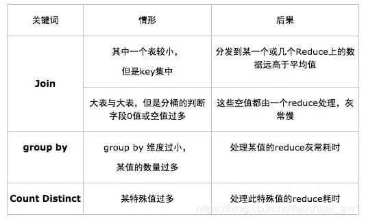
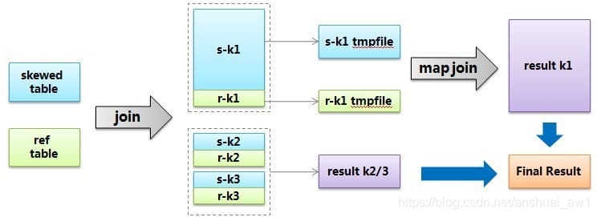

数据倾斜是大数据领域绕不开的拦路虎，当你所需处理的数据量到达了上亿甚至是千亿条的时候，数据倾斜将是横在你面前一道巨大的坎。很可能有几周甚至几月都要头疼于数据倾斜导致的各类诡异的问题。


数据倾斜是指：**mapreduce程序执行时，reduce节点大部分执行完毕，但是有一个或者几个reduce节点运行很慢，导致整个程序的处理时间很长，这是因为某一个key的条数比其他key多很多（有时是百倍或者千倍之多），这条key所在的reduce节点所处理的数据量比其他节点就大很多，从而导致某几个节点迟迟运行不完。**Hive的执行是分阶段的，map处理数据量的差异取决于上一个stage的reduce输出，所以**如何将数据均匀的分配到各个reduce中**，就是解决数据倾斜的根本所在。

以下是一些常见的数据倾斜情形：



# 一、Group by 倾斜

group by造成的倾斜相对来说比较容易解决。hive提供两个参数可以解决：

## 1.1 hive.map.aggr

一个是hive.map.aggr，默认值已经为true，他的意思是做map aggregation，也就是在mapper里面做聚合。这个方法不同于直接写mapreduce的时候可以实现的combiner，但是却实现了类似combiner的效果。事实上各种基于mr的框架如pig，cascading等等用的都是map aggregation（或者叫partial aggregation）而非combiner的策略，也就是在mapper里面直接做聚合操作而不是输出到buffer给combiner做聚合。对于map aggregation，hive还会做检查，如果aggregation的效果不好，那么hive会自动放弃map aggregation。判断效果的依据就是经过一小批数据的处理之后，检查聚合后的数据量是否减小到一定的比例，默认是0.5，由hive.map.aggr.hash.min.reduction这个参数控制。所以如果确认数据里面确实有个别取值倾斜，但是大部分值是比较稀疏的，这个时候可以把比例强制设为1，避免极端情况下map aggr失效。hive.map.aggr还有一些相关参数，比如map aggr的内存占用等，具体可以参考[这篇文章](http://dev.bizo.com/2013/02/map-side-aggregations-in-apache-hive.html)。

## 1.2 hive.groupby.skewindata

另一个参数是hive.groupby.skewindata。这个参数的意思是做reduce操作的时候，拿到的key并不是所有相同值给同一个reduce，而是随机分发，然后reduce做聚合，做完之后再做一轮MR，拿前面聚合过的数据再算结果。所以这个参数其实跟hive.map.aggr做的是类似的事情，只是拿到reduce端来做，而且要额外启动一轮job，所以其实不怎么推荐用，效果不明显。

## 1.3 count distinct 改写

另外需要注意的是count distinct操作往往需要改写SQL，可以按照下面这么做：

```sql
/*改写前*/
select a, count(distinct b) as c from tbl group by a;

/*改写后*/
select a, count(*) as c from (select a, b from tbl group by a, b) group by a;
```

# 二、Join倾斜

## 2.1 skew join

join造成的倾斜，常见情况是不能做map join的两个表(能做map join的话基本上可以避免倾斜)，其中一个是行为表，另一个应该是属性表。比如我们有三个表，一个用户属性表users，一个商品属性表items，还有一个用户对商品的操作行为表日志表logs。假设现在需要将行为表关联用户表：

```sql
select * from logs a join users b on a.user_id = b.user_id;
```

其中logs表里面会有一个特殊用户user_id = 0，代表未登录用户，假如这种用户占了相当的比例，那么个别reduce会收到比其他reduce多得多的数据，因为它要接收所有user_id = 0的记录进行处理，使得其处理效果会非常差，其他reduce都跑完很久了它还在运行。

hive给出的解决方案叫skew join，其原理把这种user_id = 0的特殊值先不在reduce端计算掉，而是先写入hdfs，然后启动一轮map join专门做这个特殊值的计算，期望能提高计算这部分值的处理速度。当然你要告诉hive这个join是个skew join，即：set

> hive.optimize.skewjoin = true;

还有要告诉hive如何判断特殊值，根据hive.skewjoin.key设置的数量hive可以知道，比如默认值是100000，那么超过100000条记录的值就是特殊值。总结起来，skew join的流程可以用下图描述：



## 2.2 特殊值分开处理法

不过，上述方法还要去考虑阈值之类的情况，其实也不够通用。所以针对join倾斜的问题，一般都是通过改写sql解决。对于上面这个问题，我们已经知道user_id = 0是一个特殊key，那么可以把特殊值隔离开来单独做join，这样特殊值肯定会转化成map join，非特殊值就是没有倾斜的普通join了：

```sql
select
	*
from
	(select * from logs where user_id = 0) a
join
	(select * from users where user_id = 0) b
on
	a.user_id = b.user_id
union all
select * from logs a join users b on a.user_id <> 0 and a.user_id = b.user_id;
```

## 2.3 随机数分配法

上面这种个别key倾斜的情况只是一种倾斜情况。最常见的倾斜是因为数据分布本身就具有长尾性质，比如我们将日志表和商品表关联：

```sql
select * from logs a join items b on a.item_id = b.item_id;
```

这个时候，分配到热门商品的reducer就会很慢，因为热门商品的行为日志肯定是最多的，而且我们也很难像上面处理特殊user那样去处理item。这个时候就会用到加随机数的方法，也就是在join的时候增加一个随机数，随机数的取值范围n相当于将item给分散到n个reducer：

```sql
select
	a.*,
	b.*
from
	(select *, cast(rand() * 10 as int) as r_id from logs) a
join
	(select *, r_id from items lateral view explode(range_list(1, 10)) rl as r_id) b
on
	a.item_id = b.item_id
	and a.r_id = b.r_id
```

上面的写法里，对行为表的每条记录生成一个1-10的随机整数，对于item属性表，每个item生成10条记录，随机key分别也是1-10，这样就能保证行为表关联上属性表。其中range_list(1,10)代表用udf实现的一个返回1-10整数序列的方法。这个做法是一个解决join倾斜比较根本性的通用思路，就是如何用随机数将key进行分散。当然，可以根据具体的业务场景做实现上的简化或变化。

## 2.4 业务设计

除了上面两类情况，还有一类情况是因为业务设计导致的问题，也就是说即使行为日志里面join key的数据分布本身并不明显倾斜，但是业务设计导致其倾斜。比如对于商品item_id的编码，除了本身的id序列，还人为的把item的类型也作为编码放在最后两位，这样如果类型1（电子产品）的编码是00，类型2（家居产品）的编码是01，并且类型1是主要商品类，将会造成以00为结尾的商品整体倾斜。这时，如果reduce的数量恰好是100的整数倍，会造成partitioner把00结尾的item_id都hash到同一个reducer，引爆问题。这种特殊情况可以简单的设置合适的reduce值来解决，但是这种坑对于不了解业务的情况下就会比较隐蔽。

# 三、典型的业务场景

## 3.1 空值产生的数据倾斜

场景：如日志中，常会有信息丢失的问题，比如日志中的 user_id，如果取其中的 user_id 和 用户表中的user_id 关联，会碰到数据倾斜的问题。

- 解决方法1： user_id为空的不参与关联

```sql
select
	*
from
	log a
join users b
on
	a.user_id is not null
	and a.user_id = b.user_id
union all
select * from log a where a.user_id is null;
```

- 解决方法2 ：赋与空值分新的key值

```sql
select
	*
from
	log a
left outer join users b
on
	case
		when a.user_id is null
		then concat(‘hive’, rand())
		else a.user_id
	end = b.user_id;
```

结论：方法2比方法1效率更好，不但io少了，而且作业数也少了。解决方法1中 log读取两次，jobs是2。解决方法2 job数是1 。这个优化适合无效 id (比如 -99 , ’’, null 等) 产生的倾斜问题。把空值的 key 变成一个字符串加上随机数，就能把倾斜的数据分到不同的reduce上 ,解决数据倾斜问题。

## 3.2 不同数据类型关联产生数据倾斜

场景：用户表中user_id字段为int，log表中user_id字段既有string类型也有int类型。当按照user_id进行两个表的Join操作时，默认的Hash操作会按int型的id来进行分配，这样会导致所有string类型id的记录都分配到一个Reducer中。

解决方法：把数字类型转换成字符串类型

```sql
select
	*
from
	users a
left outer join logs b
on
	a.usr_id = cast(b.user_id as string)
```

## 3.3 小表不小不大，怎么用 map join 解决倾斜问题

使用 map join 解决小表(记录数少)关联大表的数据倾斜问题，这个方法使用的频率非常高，但如果小表很大，大到map join会出现bug或异常，这时就需要特别的处理。 以下例子:

```sql
select * from log a left outer join users b on a.user_id = b.user_id;
```

users 表有 600w+ 的记录，把 users 分发到所有的 map 上也是个不小的开销，而且 map join 不支持这么大的小表。如果用普通的 join，又会碰到数据倾斜的问题。

```sql
select
	/*+mapjoin(x)*/
	*
from
	log a
left outer join
	(
		select
			/*+mapjoin(c)*/
			d.*
		from
			(select distinct user_id from log) c
		join users d
		on
			c.user_id = d.user_id
	)
	x on a.user_id = b.user_id;
```

假如，log里user_id有上百万个，这就又回到原来map join问题。所幸，每日的会员uv不会太多，有交易的会员不会太多，有点击的会员不会太多，有佣金的会员不会太多等等。所以这个方法能解决很多场景下的数据倾斜问题。

# 四、总结

使map的输出数据更均匀的分布到reduce中去，是我们的最终目标。由于Hash算法的局限性，按key Hash会或多或少的造成数据倾斜。大量经验表明数据倾斜的原因是人为的建表疏忽或业务逻辑可以规避的。在此给出较为通用的步骤：

- 1）采样log表，哪些user_id比较倾斜，得到一个结果表tmp1。由于对计算框架来说，所有的数据过来，他都是不知道数据分布情况的，所以采样是并不可少的。
- 2）数据的分布符合社会学统计规则，贫富不均。倾斜的key不会太多，就像一个社会的富人不多，奇特的人不多一样。所以tmp1记录数会很少。把tmp1和users做map join生成tmp2,把tmp2读到distribute file cache。这是一个map过程。
- 3）map读入users和log，假如记录来自log,则检查user_id是否在tmp2里，如果是，输出到本地文件a,否则生成的key,value对，假如记录来自member,生成的key,value对，进入reduce阶段。
- 4）最终把a文件，把Stage3 reduce阶段输出的文件合并起写到hdfs。

如果确认业务需要这样倾斜的逻辑，考虑以下的优化方案：

- 1）对于join，在判断小表不大于1G的情况下，使用map join
- 2）对于group by或distinct，设定 hive.groupby.skewindata=true
- 3）尽量使用上述的SQL语句调节进行优化