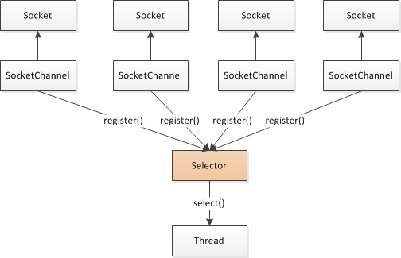

# java aio和nio的区别

https://blog.csdn.net/luzhensmart/category_7950498.html)

AIO 是彻底的异步通信。
NIO 是同步非阻塞通信。
有一个经典的举例。烧开水。
假设有这么一个场景，有一排水壶（客户）在烧水。

AIO的做法是，每个水壶上装一个开关，当水开了以后会提醒对应的线程去处理。
NIO的做法是，叫一个线程不停的循环观察每一个水壶，根据每个水壶当前的状态去处理。
BIO的做法是，叫一个线程停留在一个水壶那，直到这个水壶烧开，才去处理下一个水壶。

------

可以看出AIO是最聪明省力，NIO相对省力，叫一个人就能看所有的壶，BIO最愚蠢，劳动力低下。

**简单的描述一下BIO的服务端通信模型：**采用BIO通信模型的服务端，通常由一个独立的Acceptor线程负责监听客户端的连接，它接收到客户端连接请求之后为每个客户端创建一个新的线程进行链路处理 处理完成后，通过输出流返回应答给客户端，线程销毁。即典型的一请求一应答通宵模型。

刚开始人们为了解决上面，高并发下服务器建立线程过多而枯竭，有人就想出了使用线程池来控制建立线程的数量，不至于服务器挂掉，于是就有了伪异步的io编程

一（1）、伪异步I/O编程

 为了改进上面这种一连接一线程的模型，我们可以使用线程池来管理这些线程，实现1个或多个线程处理N个客户端的模型（但是**底层还是使用的同步阻塞I/O**），通常被称为“伪异步I/O模型“。

 我们知道，如果使用CachedThreadPool线程池（不限制线程数量），其实除了能自动帮我们管理线程（复用），看起来也就像是1:1的客户端：线程数模型，而使用FixedThreadPool我们就有效的控制了线程的最大数量，保证了系统有限的资源的控制，实现了N:M的伪异步I/O模型。

 但是，**正因为限制了线程数量，如果发生大量并发请求，超过最大数量的线程就只能等待，直到线程池中的有空闲的线程可以被复用。**而对Socket的输入流就行读取时，会一直**阻塞**，直到发生：

有数据可读

可用数据以及读取完毕

发生空指针或I/O异常

**所以在读取数据较慢时（比如数据量大、网络传输慢等），大量并发的情况下，其他接入的消息，只能一直等待，这就是最大的弊端。而后面即将介绍的NIO，就能解决这个难题。**

 二、NIO 编程（非阻塞I/O）

**JDK 1.4**中的java.nio.*包中引入新的Java I/O库，其目的是提高速度。实际上，“旧”的I/O包已经使用NIO重新实现过，即使我们**不显式**的使用NIO编程，也能从中受益。速度的提高在文件I/O和网络I/O中都可能会发生，但本文只讨论后者。



（1）缓冲区buffer

  buffer是一个对象，包含了读取和写入的数据，在nio中，所有的数据都是通过缓冲区来处理的。在写入数据时，也是写入到缓冲区中。任何时候访问NIO中的数据，都是通过缓冲区进行操作。

  **缓冲区实际是一个数组结构**，并提供了对数据结构化访问以及维护读写位置等信息。

  8种基本类型都有相应的缓冲区：ByteBuffe、CharBuffer、 ShortBuffer、IntBuffer、LongBuffer、FloatBuffer、DoubleBuffer。他们实现了相同的接口：Buffer。

（2）通道channel

  我们对数据的读取和写入都要通过channel，它就像水管一样，是一个通道。**通道不同于流的地方就是通道是双向的，可以用于读、写和同时读写操作。**

  **底层的操作系统的通道一般都是全双工的，所以全双工的Channel比流能更好的映射底层操作系统的API。**

  **channel主要有2大类：**

​    **selectablechannel 用于用户网络的读写（后面代码会涉及的ServerSocketChannel和SocketChannel都是SelectableChannel的子类。）**

​    **Filechannel 用于文件的操作**

（3）多路复用器 Selector

  Selector是Java  NIO 编程的基础。

  提供选择已经就绪的任务的能力：Selector会不断轮询注册在其上的Channel，如果某个Channel上面发生读或者写事件，这个Channel就处于就绪状态，会被Selector轮询出来，然后通过SelectionKey可以获取就绪Channel的集合，进行后续的I/O操作。

  一个Selector可以同时轮询多个Channel，**因为JDK使用了epoll()代替传统的select实现**，所以没有最大连接句柄1024/2048的限制。所以，只需要一个线程负责Selector的轮询，就可以接入成千上万的客户端。

```
(1)select==>时间复杂度O(n)
它仅仅知道了，有I/O事件发生了，却并不知道是哪那几个流（可能有一个，多个，甚至全部），我们只能无差别轮询所有流，找出能读出数据，或者写入数据的流，对他们进行操作。所以select具有O(n)的无差别轮询复杂度，同时处理的流越多，无差别轮询时间就越长。
(2)poll==>时间复杂度O(n)
poll本质上和select没有区别，它将用户传入的数组拷贝到内核空间，然后查询每个fd对应的设备状态， 但是它没有最大连接数的限制，原因是它是基于链表来存储的.
(3)epoll==>时间复杂度O(1)
epoll可以理解为event poll，不同于忙轮询和无差别轮询，epoll会把哪个流发生了怎样的I/O事件通知我们。所以我们说epoll实际上是事件驱动（每个事件关联上fd）的，此时我们对这些流的操作都是有意义的。（复杂度降低到了O(1)）

select，poll，epoll都是IO多路复用的机制。I/O多路复用就通过一种机制，可以监视多个描述符，一旦某个描述符就绪（一般是读就绪或者写就绪），能够通知程序进行相应的读写操作。但select，poll，epoll本质上都是同步I/O，因为他们都需要在读写事件就绪后自己负责进行读写，也就是说这个读写过程是阻塞的，而异步I/O则无需自己负责进行读写，异步I/O的实现会负责把数据从内核拷贝到用户空间。  

epoll跟select都能提供多路I/O复用的解决方案。在现在的Linux内核里有都能够支持，其中epoll是Linux所特有，而select则应该是POSIX所规定，一般操作系统均有实现
```

（4）NIO服务端

 创建NIO服务端的主要步骤如下：

1.  打开ServerSocketChannel，监听客户端连接
2.  绑定监听端口，设置连接为非阻塞模式
3.  创建Reactor线程，创建多路复用器并启动线程
4.  将ServerSocketChannel注册到Reactor线程中的Selector上，监听ACCEPT事件
5.  Selector轮询准备就绪的key
6.  Selector监听到新的客户端接入，处理新的接入请求，完成TCP三次握手，简历物理链路
7.  设置客户端链路为非阻塞模式
8.  将新接入的客户端连接注册到Reactor线程的Selector上，监听读操作，读取客户端发送的网络消息
9.  异步读取客户端消息到缓冲区
10.  对Buffer编解码，处理半包消息，将解码成功的消息封装成Task
11.  将应答消息编码为Buffer，调用SocketChannel的write将消息异步发送给客户端

  所以不能保证一次能吧需要发送的数据发送完，此时就会出现写半包的问题。我们需要注册写操作，不断轮询Selector将没有发送完的消息发送完毕，然后通过Buffer的hasRemain()方法判断消息是否发送完成。

（5）NIO客户端

三、AIO编程

  NIO 2.0引入了新的异步通道的概念，并提供了异步文件通道和异步套接字通道的实现。

异步的套接字通道时真正的异步非阻塞I/O，对应于UNIX网络编程中的事件驱动I/O（AIO）。他不需要过多的Selector对注册的通道进行轮询即可实现异步读写，从而简化了NIO的编程模型。

API比NIO的使用起来真的简单多了，主要就是监听、读、写等各种CompletionHandler。此处本应有一个WriteHandler的，确实，我们在ReadHandler中，以一个匿名内部类实现了它。

**AIO是真正的异步非阻塞的，所以，在面对超级大量的客户端，更能得心应手**