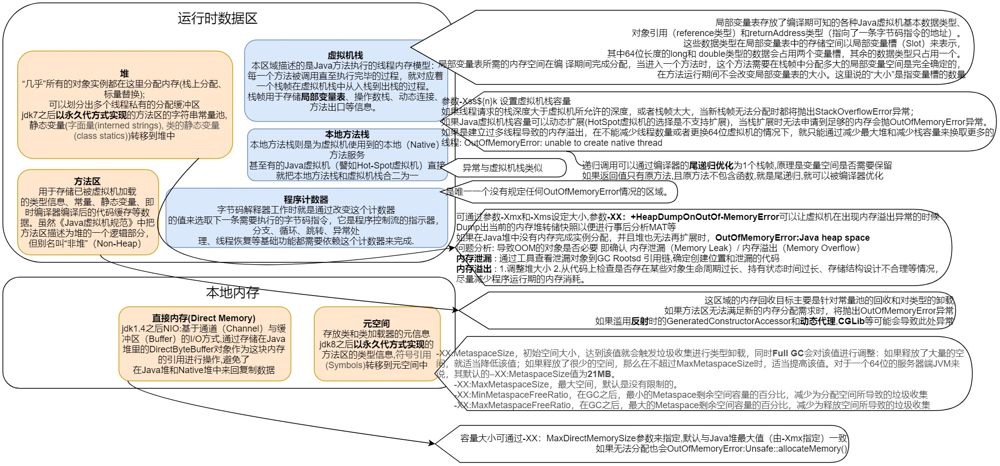
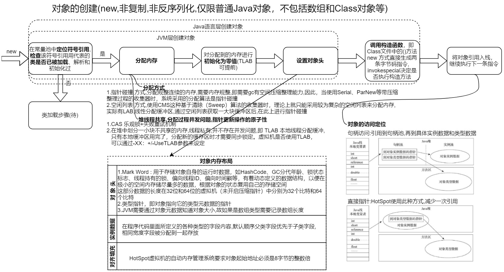

# 深入理解 JVM

## 一 Java的起源 

### 1.C不能跨平台运行

 c 通过编译器翻译成汇编语言,在通过汇编器生成二进制的本地机器码,使CPU能够识别 <- 但**不同的CPU的指令集,汇编语言都有区别**,C语言不能实现跨平台运行，就是因为它编译出来的 输出文件的格式太底层了，只适用于某种cpu，其他cpu不认识

**Java 的平台无关性** 就是 设计模式当中的**适配器设计模式**,编译出的**class(字节码)文件**在**定制的vm**中执行,而不是直接在机器上执行

### 2.JVM的语言无关性

时至今日,涌现Clojure、Groovy、JRuby、Jython、Scala一批运行在java虚拟机上的语言。JVM其实更应该叫做 Class文件虚拟机.

"Write Once，Run Anywhere"虚拟机的思想，被很多其他语言也学会了，比如python和pvm。go语言，.NET等都是同样的思想。

### 3.为什么C/C++没有被替代

这个原因有很多，比如

- java的gc过程所无法避免的**stop the world**过程，这在 某些实时性要求比较高的 系统中，比如 股票交易系统，军事系统，是不可接受的。不过有句话说的很好
  **Java和C++之间有一堵由动态内存分配和垃圾收集技术所围成的'高墙'，墙外的人想进去，墙内的人想出来**
- 对于直接与硬件交互的事情，也只能靠C语言了。毕竟上层再怎么发展，硬件与系统之间永远要存在一个驱动层啊。
- ByteCode运行在虚拟机上，相比于直接编译成 NativeCode 运行在物理机上，速度较慢.

### 4.Java常见的编译器有以下类型

1. 前端编译器：把 *.java 文件转变成 *.class 文件。比如Sun的Javac、Eclipse JDT中的增量式编译器（ECJ）。
2. JIT编译器：字节码(ByteCode)转变成机器码(NaticeCode)。比如HotSpot VM的C1、C2编译器。
3. AOT编译器：直接把*.java文件编译成本地机器代码。 比如GNU Compiler for the Java（GCJ）、Excelsior JET。

## 二 Java 技术体系

## 三 JVM

## 四 new对象和内存分配

## 五 垃圾回收

1. 哪些内存需要回收？ 

   1. 本地方法栈和虚拟机栈 : 栈帧需要多大内存在编译期间就已经基本确定了,且方法执行后栈帧会销毁
   2. 方法区,堆 : 一个接口的不同实现在方法区的元信息大小不确定,堆在执行时会有多少对象实例也不确定

2. 什么时候回收？ 

   1. 对象啥时候是可回收的?
      1. **垃圾如何判定** : 根可达算法(根 : GC Roots) / 引用计数算法(循环引用问题)
         1. 在Java技术体系里面，固定可作为GC Roots的对象包括以下几种： 
            - 在虚拟机栈（栈帧中的本地变量表）中引用的对象，譬如各个线程被调用的方法堆栈中使用到的 参数、局部变量、临时变量等。 
            - 在方法区中类静态属性引用的对象，譬如Java类的引用类型静态变量。
            - 在方法区中常量引用的对象，譬如字符串常量池（String Table）里的引用。
            - 在本地方法栈中JNI（即通常所说的Native方法）引用的对象。
            - Java虚拟机内部的引用，如基本数据类型对应的Class对象，一些常驻的异常对象（比如 NullPointExcepiton、OutOfMemoryError）等，还有系统类加载器。
            - 所有被同步锁（synchronized关键字）持有的对象。
            - 反映Java虚拟机内部情况的JMXBean、JVMTI中注册的回调、本地代码缓存等。
            -  除了这些固定的GC Roots集合以外，根据用户所选用的垃圾收集器以及当前回收的内存区域不 同，还可以有其他对象“临时性”地加入，共同构成完整GC Roots集合。
      2. **引用的种类**和可回收性
         - **强引用** 是指在程序代码之中普遍存在的引用赋值如Object obj=new Object() ,无论任何情况下，只要强引用关系还存在，垃圾收集器就永远不会回 收掉被引用的对象。
         - **软引用**(SoftReference类) 是用来描述一些还有用，但非必须的对象。只被软引用关联着的对象，在系统**将要发生内存溢出异常前**，会把这些对象列进回收范围之中进行第二次回收，如果这次回收还没有足够的内存， 才会抛出内存溢出异常。
         - **弱引用**(WeakReference类)也是用来描述那些非必须对象，但是它的强度比软引用更弱一些，被弱引用关联的对象**只能生存到下一次垃圾收集发生为止**。当垃圾收集器开始工作，无论当前内存是否足够，都会回收掉只 被弱引用关联的对象。
         - **虚引用**(PhantomReference类)也称为“幽灵引用”或者“幻影引用”，它是最弱的一种引用关系。一个对象是否有虚引用的存在，完全不会对其生存时间构成影响，也**无法通过虚引用来取得一个对象实例**。**为一个对象设置虚 引用关联的唯一目的只是为了能在这个对象被收集器回收时收到一个系统通知**。
      3. 类似C/C++的析构方法 **finalize()分析** : 根可达标记了一次的对象,如果finalize()被覆盖,会用jvm一个低优先级线程执行,如果能在第二次根可达标记前恢复引用就不会被回收,但只能用一次且不保证一定会被执行

3. 如何回收？

   1. 方法区回收

      1. 常量回收 <- 引用没了

      2. 类的元数据 <- 同时满足下面三个条件可允许回收 : 

         - 该类所有的实例都已经被回收，也就是Java堆中不存在该类及其任何派生子类的实例。 

         - 加载该类的类加载器已经被回收，这个条件除非是经过精心设计的可替换类加载器的场景，如 OSGi、JSP的重加载等，否则通常是很难达成的。 

         - 该类对应的java.lang.Class对象没有在任何地方被引用，无法在任何地方通过反射访问该类的方法。

           HotSpot虚拟机提供了Xnoclassgc参数进行控制是否要对类型进行回收，

           还可以使用-verbose：class以及-XX：+TraceClass-Loading、-XX： +TraceClassUnLoading查看类加载和卸载信息

           **在大量使用反射、动态代理、CGLib等字节码框架，动态生成JSP以及OSGi这类频繁自定义类加载器的场景中，通常都需要Java虚拟机具备类型卸载的能力，以保证不会对方法区造成过大的内存压力。**

   2. 回收算法

      1. 

