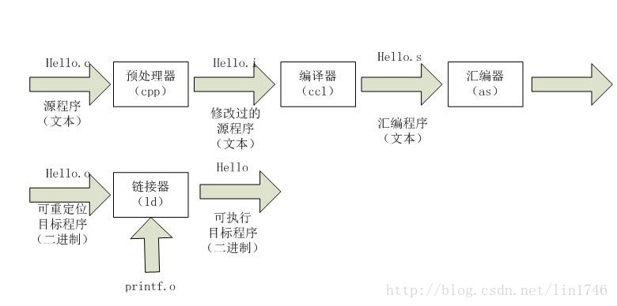
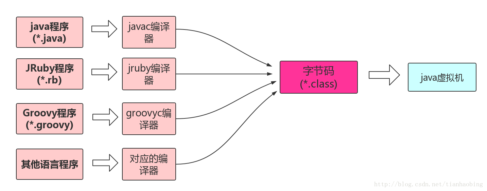
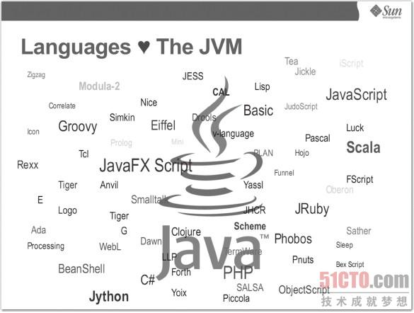
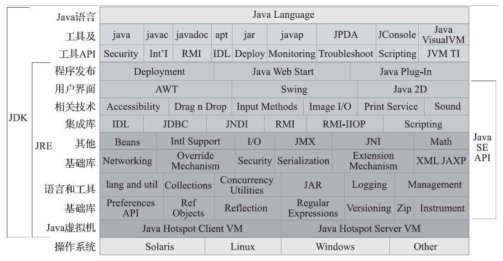

# 深入理解 JVM

## 一 Java的起源 

### 1.C不能跨平台运行

 c 通过编译器翻译成汇编语言,在通过汇编器生成二进制的本地机器码,使CPU能够识别 <- 但**不同的CPU的指令集,汇编语言都有区别**,C语言不能实现跨平台运行，就是因为它编译出来的 输出文件的格式太底层了，只适用于某种cpu，其他cpu不认识

**Java 的平台无关性** 就是 设计模式当中的**适配器设计模式**,编译出的**class(字节码)文件**在**定制的vm**中执行,而不是直接在机器上执行

### 2.JVM的语言无关性

时至今日,涌现Clojure、Groovy、JRuby、Jython、Scala一批运行在java虚拟机上的语言。JVM其实更应该叫做 Class文件虚拟机.

"Write Once，Run Anywhere"虚拟机的思想，被很多其他语言也学会了，比如python和pvm。go语言，.NET等都是同样的思想。

### 3.为什么C/C++没有被替代

这个原因有很多，比如

- java的gc过程所无法避免的**stop the world**过程，这在 某些实时性要求比较高的 系统中，比如 股票交易系统，军事系统，是不可接受的。不过有句话说的很好
  **Java和c++之间有一堵由动态内存分配和垃圾收集技术所围成的'高墙'，墙外的人想进去，墙内的人想出来**
- 对于直接与硬件交互的事情，也只能靠C语言了。毕竟上层再怎么发展，硬件与系统之间永远要存在一个驱动层啊。
- ByteCode运行在虚拟机上，相比于直接编译成 NativeCode 运行在物理机上，速度较慢.

### 4.Java常见的编译器有以下类型

1. 前端编译器：把 *.java 文件转变成 *.class 文件。比如Sun的Javac、Eclipse JDT中的增量式编译器（ECJ）。
2. JIT编译器：字节码(ByteCode)转变成机器码(NaticeCode)。比如HotSpot VM的C1、C2编译器。
3. AOT编译器：直接把*.java文件编译成本地机器代码。 比如GNU Compiler for the Java（GCJ）、Excelsior JET。

## 二 Java 技术体系

## 三 JVM

