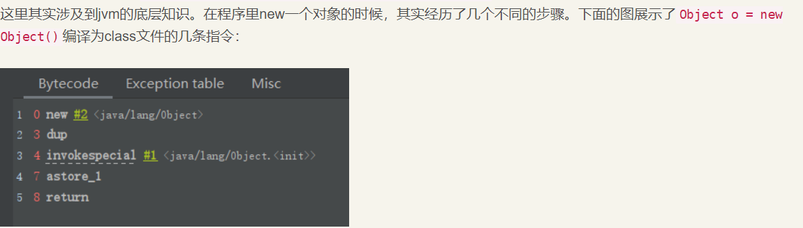
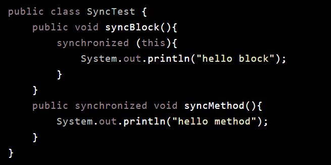
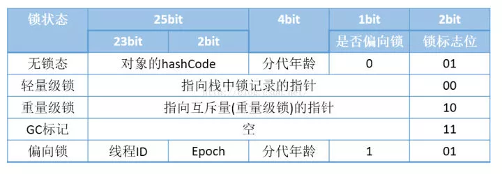
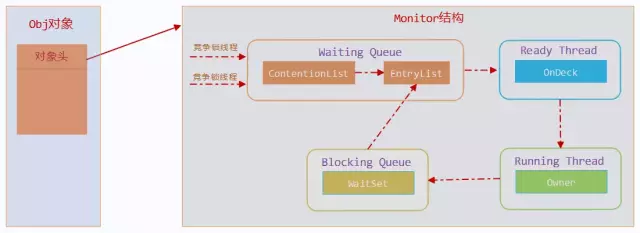
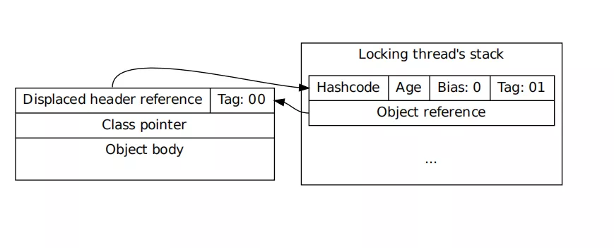
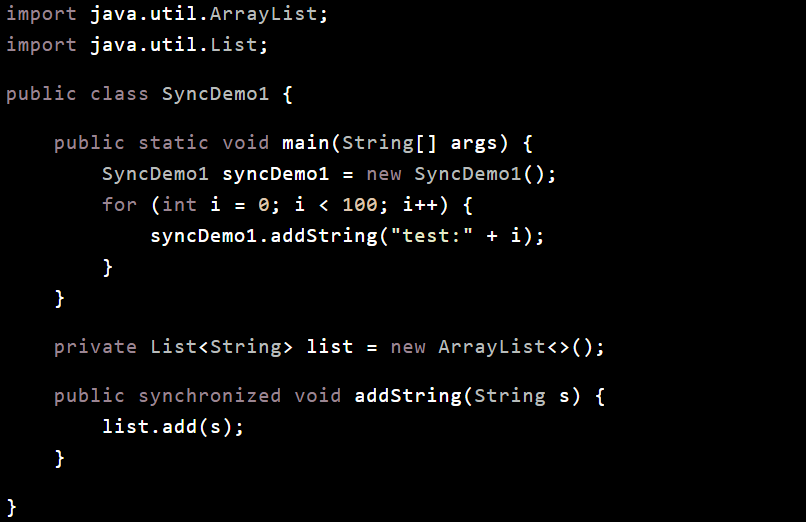
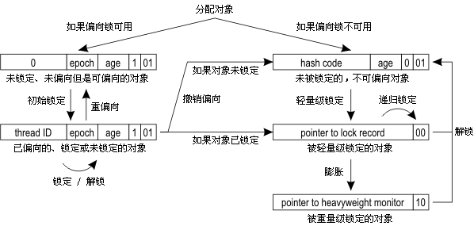
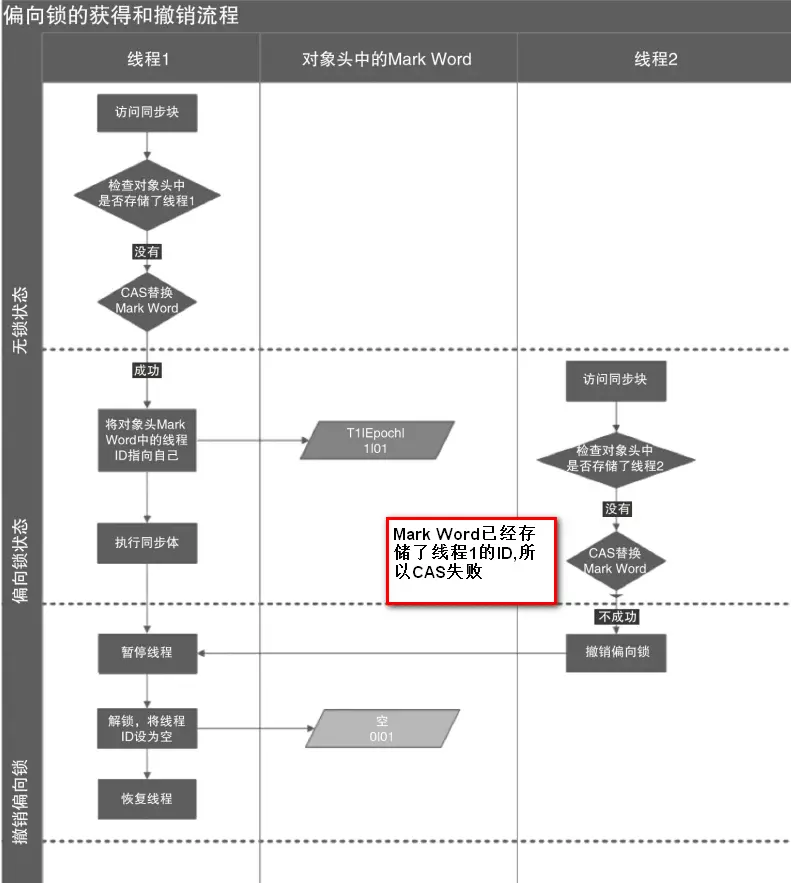
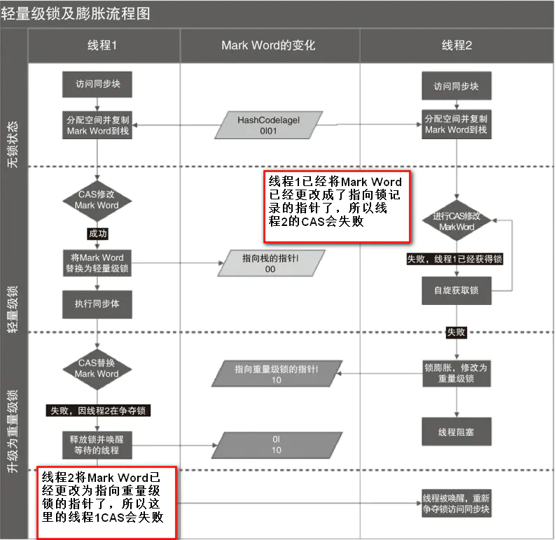

Java 虚拟机中的同步(Synchronization)基于进入和退出管程(Monitor)对象实现， 无论是显式同步(有明确的 monitorenter 和 monitorexit 指令,即同步代码块)还是隐式同步都是如此。同步方法是由方法调用指令读取运行时常量池中方法的 ACC_SYNCHRONIZED 标志来隐式实现的.

底层的操作系统的Mutex Lock来实现的，而操作系统实现线程之间的切换时需要从用户态转换到内核态，这个状态之间的转换需要相对比较长的时间，时间成本相对较高.

```
简单形象描述一下: 打水问题
有个水龙头
1.我去水,我一个人打了第一次,在水龙头上刻了我的名字,表名这个水龙头是我的
2.另外一个人也去打水,发现刻了名字了,就把水龙头搬到自己家里(自己线程栈里)然后原来的水池上留了引用,自己栈里也指向这个水池(锁对象)
3.有更多的人来了,行了,大家都竞争了,来排队打水吧,这种情况下自旋占用cpu的成本很大,所以用最高级别互斥实现,用的linux底层机制,锁指向堆中(共享)的montor对象,里面可以理解为状态机的等待队列

来回改水龙头刻名字的情况都是用CAS来实现的
```

#### CAS操作

这里做一个介绍，CAS为后续锁的章节做一个铺垫O(∩_∩)O~

使用锁时，线程获取锁是一种悲观锁策略，即假设每一次执行临界区代码都会产生冲突，所以当前线程获取到锁的时候同时也会阻塞其他线程获取该锁。而CAS操作（又称为无锁操作）是一种乐观锁策略，它假设所有线程访问共享资源的时候不会出现冲突，既然不会出现冲突自然而然就不会阻塞其他线程的操作。因此，线程就不会出现阻塞停顿的状态。那么，如果出现冲突了怎么办？无锁操作是使用CAS(compare and swap)又叫做比较交换来鉴别线程是否出现冲突，出现冲突就重试当前操作直到没有冲突为止。

**CAS的操作过程** CAS比较交换的过程可以通俗的理解为CAS(V,O,N)，包含三个值分别为：V 内存地址存放的实际值；O 预期的值（旧值）；N 更新的新值。当V和O相同时，也就是说旧值和内存中实际的值相同表明该值没有被其他线程更改过，即该旧值O就是目前来说最新的值了，自然而然可以将新值N赋值给V。反之，V和O不相同，表明该值已经被其他线程改过了则该旧值O不是最新版本的值了，所以不能将新值N赋给V，返回V即可。当多个线程使用CAS操作一个变量是，只有一个线程会成功，并成功更新，其余会失败。失败的线程会重新尝试，当然也可以选择挂起线程 CAS的实现需要硬件指令集的支撑，在JDK1.5后虚拟机才可以使用处理器提供的CMPXCHG指令实现。 CAS的应用场景 在J.U.C包中利用CAS实现类有很多，可以说是支撑起整个concurrency包的实现，在Lock实现中会有CAS改变state变量，在atomic包中的实现类也几乎都是用CAS实现，关于这些具体的实现场景在之后会详细聊聊，现在有个印象就好了（微笑脸）。

**CAS的问题**

1. ABA问题 因为CAS会检查旧值有没有变化，这里存在这样一个有意思的问题。比如一个旧值A变为了成B，然后再变成A，刚好在做CAS时检查发现旧值并没有变化依然为A，但是实际上的确发生了变化。解决方案可以沿袭数据库中常用的乐观锁方式，添加一个版本号可以解决。原来的变化路径A->B->A就变成了1A->2B->3C。java这么优秀的语言，当然在java 1.5后的atomic包中提供了AtomicStampedReference来解决ABA问题，解决思路就是这样的。
2. 自旋时间过长 使用CAS时非阻塞同步，也就是说不会将线程挂起，会自旋（无非就是一个死循环）进行下一次尝试，如果这里自旋时间过长对性能是很大的消耗。如果JVM能支持处理器提供的pause指令，那么在效率上会有一定的提升。
3. 只能保证一个共享变量的原子操作 当对一个共享变量执行操作时CAS能保证其原子性，如果对多个共享变量进行操作,CAS就不能保证其原子性。有一个解决方案是利用对象整合多个共享变量，即一个类中的成员变量就是这几个共享变量。然后将这个对象做CAS操作就可以保证其原子性。atomic中提供了AtomicReference来保证引用对象之间的原子性。

---

#### 如何保证内存可见性

在java虚拟机的内存模型中，有主内存和工作内存的概念，每个线程对应一个工作内存，并共享主内存的数据，下面看看操作普通变量和volatile变量有什么不同： 1、对于普通变量：读操作会优先读取工作内存的数据，如果工作内存中不存在，则从主内存中拷贝一份数据到工作内存中；写操作只会修改工作内存的副本数据，这种情况下，其它线程就无法读取变量的最新值。 2、对于volatile变量，读操作时JMM会把工作内存中对应的值设为无效，要求线程从主内存中读取数据；写操作时JMM会把工作内存中对应的数据刷新到主内存中，这种情况下，其它线程就可以读取变量的最新值。 volatile变量的内存可见性是基于内存屏障(Memory Barrier)实现的，什么是内存屏障？内存屏障，又称内存栅栏，是一个CPU指令。在程序运行时，为了提高执行性能，编译器和处理器会对指令进行重排序，JMM为了保证在不同的编译器和CPU上有相同的结果，通过插入特定类型的内存屏障来禁止特定类型的编译器重排序和处理器重排序，插入一条内存屏障会告诉编译器和CPU：不管什么指令都不能和这条Memory Barrier指令重排序。

### volatile的实现原理

在生成汇编代码时会在volatile修饰的共享变量进行写操作的时候会多出Lock前缀的指令。

Lock前缀的指令会引起处理器缓存写回内存； 一个处理器的缓存回写到内存会导致其他处理器的缓存失效； 当处理器发现本地缓存失效后，就会从内存中重读该变量数据，即可以获取当前最新值。

这样针对volatile变量通过这样的机制就使得每个线程都能获得该变量的最新值。

```
public class Singleton {
	private static /*volatile*/ Singleton INSTANCE;
	private Singleton(){}
	public static Singleton getInstance() {
		if (INSTANCE == null) {
			synchronized (Singleton.class) {
				if (INSTACNE == null) {
					INSTANCE = new Singleton();
				}
			}
		}
		return INSTANCE;
	}
}
```



可以看到，哪怕是简单的一个`Object o = new Object()`，在jvm底层也是分为好几条不同的指令来运行的，其中大致包括这么三个步骤：

1. 申请一块内存，其中成员变量赋默认值
2. 调用类的构造方法，给成员变量赋初始值
3. 将这块内存区域赋值给栈的相应变量，简单理解就是把new出来的这个Object赋值给o

但是如果就这么运行下去，按理来说也是不会有问题的，问题就出在jvm底层在某些时候存在“指令重排”的问题，也就是说，这三个步骤的2，3两步是可能调换的。
如果2，3两步发生指令重排，在高并发的情况下就会出现这样的情况
**线程A在`new Singleton()`的时候指令重排，给成员变量赋默认值后直接将Singleton对象赋值给了INSTANCE，正在准备执行第二步，即调用类的构造方法，给成员变量赋初始值
此时，线程B调用getInstance()方法，判断`INSTANCE == null`，由于此时Object已经赋值给了o，所以INSTANCE不为空，直接使用，然而其实此时INSTANCE才仅是半初始化状态而已，如果线程B拿着这个实例对象，显然是会出现问题的。**

------

### **一、synchronized简介**

Java中提供了两种实现同步的基础语义：synchronized方法和synchronized块， 我们来看个demo：



当SyncTest.java被编译成class文件的时候，synchronized关键字和synchronized方法的字节码略有不同，我们可以用javap -v 命令查看class文件对应的JVM字节码信息，部分信息如下：

```
37937@DESKTOP-L37VQ5V MINGW64 ~/Desktop
$ javac ./SynchronizedDemo.java

37937@DESKTOP-L37VQ5V MINGW64 ~/Desktop
$ javap -c ./SynchronizedDemo.class
Compiled from "SynchronizedDemo.java"
public class SynchronizedDemo {
  public SynchronizedDemo();
    Code:
       0: aload_0
       1: invokespecial #1                  // Method java/lang/Object."<init>":()V
       4: return

  public void syncBlock();
    Code:
       0: aload_0
       1: dup
       2: astore_1
       3: monitorenter
       4: getstatic     #2                  // Field java/lang/System.out:Ljava/io/PrintStream;
       7: ldc           #3                  // String hello block
       9: invokevirtual #4                  // Method java/io/PrintStream.println:(Ljava/lang/String;)V
      12: aload_1
      13: monitorexit
      14: goto          22
      17: astore_2
      18: aload_1
      19: monitorexit
      20: aload_2
      21: athrow
      22: return
    Exception table:
       from    to  target type
           4    14    17   any
          17    20    17   any

  public synchronized void syncMethod();
    Code:
       0: getstatic     #2                  // Field java/lang/System.out:Ljava/io/PrintStream;
       3: ldc           #5                  // String hello method
       5: invokevirtual #4                  // Method java/io/PrintStream.println:(Ljava/lang/String;)V
       8: return
}

```

从上面的中文注释处可以看到，对于synchronized关键字而言，javac在编译时，会生成对应的monitorenter和monitorexit指令分别对应synchronized同步块的进入和退出，有两个monitorexit指令的原因是：为了保证抛异常的情况下也能释放锁，所以javac为同步代码块添加了一个隐式的try-finally，在finally中会调用monitorexit命令释放锁。而对于synchronized方法而言，javac为其生成了一个ACCSYNCHRONIZED关键字，在JVM进行方法调用时，发现调用的方法被ACCSYNCHRONIZED修饰，则会先尝试获得锁。

在JVM底层，对于这两种synchronized语义的实现大致相同，在后文中会选择一种进行详细分析。

因为本文旨在分析synchronized的实现原理，因此对于其使用的一些问题就不赘述了，不了解的朋友可以看看这篇文章。

> https://blog.csdn.net/luoweifu/article/details/46613015

### **二、锁的几种形式**

传统的锁（也就是下文要说的重量级锁）依赖于系统的同步函数，在linux上使用mutex互斥锁，最底层实现依赖于futex，关于futex可以看这些文章，这些同步函数都涉及到用户态和内核态的切换、进程的上下文切换，成本较高。对于加了synchronized关键字但运行时并没有多线程竞争，或两个线程接近于交替执行的情况，使用传统锁机制无疑效率是会比较低的。

> https://github.com/farmerjohngit/myblog/issues/8

在JDK 1.6之前,synchronized只有传统的锁机制，因此给开发者留下了synchronized关键字相比于其他同步机制性能不好的印象。

在JDK 1.6引入了两种新型锁机制：偏向锁和轻量级锁，它们的引入是为了解决在没有多线程竞争或基本没有竞争的场景下因使用传统锁机制带来的性能开销问题。

在看这几种锁机制的实现前，我们先来了解下对象头，它是实现多种锁机制的基础。

### **1.对象头**

因为在Java中任意对象都可以用作锁，因此必定要有一个映射关系，存储该对象以及其对应的锁信息（比如当前哪个线程持有锁，哪些线程在等待）。一种很直观的方法是，用一个全局map，来存储这个映射关系，但这样会有一些问题：需要对map做线程安全保障，不同的synchronized之间会相互影响，性能差；另外当同步对象较多时，该map可能会占用比较多的内存。

所以最好的办法是将这个映射关系存储在对象头中，因为对象头本身也有一些hashcode、GC相关的数据，所以如果能将锁信息与这些信息共存在对象头中就好了。

在JVM中，对象在内存中除了本身的数据外还会有个对象头，对于普通对象而言，其对象头中有两类信息：mark word和类型指针。另外对于数组而言还会有一份记录数组长度的数据。

类型指针是指向该对象所属类对象的指针，mark word用于存储对象的HashCode、GC分代年龄、锁状态等信息。在32位系统上mark word长度为32字节，64位系统上长度为64字节。为了能在有限的空间里存储下更多的数据，其存储格式是不固定的，在32位系统上各状态的格式如下：



可以看到锁信息也是存在于对象的mark word中的。当对象状态为偏向锁（biasable）时，mark word存储的是偏向的线程ID；当状态为轻量级锁（lightweight locked）时，mark word存储的是指向线程栈中Lock Record的指针；当状态为重量级锁（inflated）时，为指向堆中的monitor对象的指针。

### **2.重量级锁**

重量级锁是我们常说的传统意义上的锁，其利用操作系统底层的同步机制去实现Java中的线程同步。

重量级锁的状态下，对象的mark word为指向一个堆中monitor对象的指针。

一个monitor对象包括这么几个关键字段：cxq（下图中的ContentionList），EntryList ，WaitSet，owner。

其中cxq ，EntryList ，WaitSet都是由ObjectWaiter的链表结构，owner指向持有锁的线程。 



当一个线程尝试获得锁时，如果该锁已经被占用，则会将该线程封装成一个ObjectWaiter对象插入到cxq的队列尾部，然后暂停当前线程。当持有锁的线程释放锁前，会将cxq中的所有元素移动到EntryList中去，并唤醒EntryList的队首线程。

如果一个线程在同步块中调用了Object#wait方法，会将该线程对应的ObjectWaiter从EntryList移除并加入到WaitSet中，然后释放锁。当wait的线程被notify之后，会将对应的ObjectWaiter从WaitSet移动到EntryList中。

以上只是对重量级锁流程的一个简述，其中涉及到的很多细节，比如ObjectMonitor对象从哪来？释放锁时是将cxq中的元素移动到EntryList的尾部还是头部？notfiy时，是将ObjectWaiter移动到EntryList的尾部还是头部？

关于具体的细节，会在重量级锁的文章中分析。

### **3.轻量级锁**

JVM的开发者发现在很多情况下，在Java程序运行时，同步块中的代码都是不存在竞争的，不同的线程交替的执行同步块中的代码。这种情况下，用重量级锁是没必要的。因此JVM引入了轻量级锁的概念。

线程在执行同步块之前，JVM会先在当前的线程的栈帧中创建一个Lock Record，其包括一个用于存储对象头中的 mark word（官方称之为Displaced Mark Word）以及一个指向对象的指针。下图右边的部分就是一个Lock Record。



#### 加锁过程：

1.在线程栈中创建一个Lock Record，将其obj（即上图的Object reference）字段指向锁对象。

2.直接通过CAS指令将Lock Record的地址存储在对象头的mark word中，如果对象处于无锁状态则修改成功，代表该线程获得了轻量级锁。如果失败，进入到步骤3。

3.如果是当前线程已经持有该锁了，代表这是一次锁重入。设置Lock Record第一部分（Displaced Mark Word）为null，起到了一个重入计数器的作用。然后结束。

4.走到这一步说明发生了竞争，需要膨胀为重量级锁。

#### 解锁过程：

1.遍历线程栈,找到所有obj字段等于当前锁对象的Lock Record。

2.如果Lock Record的Displaced Mark Word为null，代表这是一次重入，将obj设置为null后continue。

3.如果Lock Record的Displaced Mark Word不为null，则利用CAS指令将对象头的mark word恢复成为Displaced Mark Word。如果成功，则continue，否则膨胀为重量级锁。

### **4.偏向锁**

Java是支持多线程的语言，因此在很多二方包、基础库中为了保证代码在多线程的情况下也能正常运行，也就是我们常说的线程安全，都会加入如synchronized这样的同步语义。但是在应用在实际运行时，很可能只有一个线程会调用相关同步方法。比如下面这个demo：



在这个demo中为了保证对list操纵时线程安全，对addString方法加了synchronized的修饰，但实际使用时却只有一个线程调用到该方法，对于轻量级锁而言，每次调用addString时，加锁解锁都有一个CAS操作；对于重量级锁而言，加锁也会有一个或多个CAS操作（这里的’一个‘、’多个‘数量词只是针对该demo，并不适用于所有场景）。

在JDK1.6中为了提高一个对象在一段很长的时间内都只被一个线程用做锁对象场景下的性能，引入了偏向锁，在第一次获得锁时，会有一个CAS操作，之后该线程再获取锁，只会执行几个简单的命令，而不是开销相对较大的CAS命令。我们来看看偏向锁是如何做的。

#### 对象创建

当JVM启用了偏向锁模式（1.6以上默认开启），当新创建一个对象的时候，如果该对象所属的class没有关闭偏向锁模式（什么时候会关闭一个class的偏向模式下文会说，默认所有class的偏向模式都是是开启的），那新创建对象的mark word将是可偏向状态，此时mark word中的thread id（参见上文偏向状态下的mark word格式）为0，表示未偏向任何线程，也叫做匿名偏向(anonymously biased)。

#### 加锁过程

case 1：当该对象第一次被线程获得锁的时候，发现是匿名偏向状态，则会用CAS指令，将mark word中的thread id由0改成当前线程Id。如果成功，则代表获得了偏向锁，继续执行同步块中的代码。否则，将偏向锁撤销，升级为轻量级锁。

case 2：当被偏向的线程再次进入同步块时，发现锁对象偏向的就是当前线程，在通过一些额外的检查后（细节见后面的文章），会往当前线程的栈中添加一条Displaced Mark Word为空的Lock Record中，然后继续执行同步块的代码，因为操纵的是线程私有的栈，因此不需要用到CAS指令；由此可见偏向锁模式下，当被偏向的线程再次尝试获得锁时，仅仅进行几个简单的操作就可以了，在这种情况下，synchronized关键字带来的性能开销基本可以忽略。

case 3.当其他线程进入同步块时，发现已经有偏向的线程了，则会进入到撤销偏向锁的逻辑里，一般来说，会在safepoint中去查看偏向的线程是否还存活，如果存活且还在同步块中则将锁升级为轻量级锁，原偏向的线程继续拥有锁，当前线程则走入到锁升级的逻辑里；如果偏向的线程已经不存活或者不在同步块中，则将对象头的mark word改为无锁状态（unlocked），之后再升级为轻量级锁。

由此可见，偏向锁升级的时机为：当锁已经发生偏向后，只要有另一个线程尝试获得偏向锁，则该偏向锁就会升级成轻量级锁。当然这个说法不绝对，因为还有批量重偏向这一机制。

#### 解锁过程

当有其他线程尝试获得锁时，是根据遍历偏向线程的lock record来确定该线程是否还在执行同步块中的代码。因此偏向锁的解锁很简单，仅仅将栈中的最近一条lock record的obj字段设置为null。需要注意的是，偏向锁的解锁步骤中并不会修改对象头中的thread id。

下图展示了锁状态的转换流程： 



细节图:






另外，偏向锁默认不是立即就启动的，在程序启动后，通常有几秒的延迟，可以通过命令 -XX:BiasedLockingStartupDelay=0来关闭延迟。

#### 批量重偏向与撤销

从上文偏向锁的加锁解锁过程中可以看出，当只有一个线程反复进入同步块时，偏向锁带来的性能开销基本可以忽略，但是当有其他线程尝试获得锁时，就需要等到safe point时将偏向锁撤销为无锁状态或升级为轻量级/重量级锁。safe point这个词我们在GC中经常会提到，其代表了一个状态，在该状态下所有线程都是暂停的（大概这么个意思），详细可以看这篇文章。总之，偏向锁的撤销是有一定成本的，如果说运行时的场景本身存在多线程竞争的，那偏向锁的存在不仅不能提高性能，而且会导致性能下降。因此，JVM中增加了一种批量重偏向/撤销的机制。

> https://blog.csdn.net/ITer_ZC/article/details/41892567

存在如下两种情况：（见官方论文第4小节）:

> https://www.oracle.com/technetwork/java/biasedlocking-oopsla2006-wp-149958.pdf

1.一个线程创建了大量对象并执行了初始的同步操作，之后在另一个线程中将这些对象作为锁进行之后的操作。这种case下，会导致大量的偏向锁撤销操作。

2.存在明显多线程竞争的场景下使用偏向锁是不合适的，例如生产者/消费者队列。

批量重偏向（bulk rebias）机制是为了解决第一种场景。批量撤销（bulk revoke）则是为了解决第二种场景。

其做法是：以class为单位，为每个class维护一个偏向锁撤销计数器，每一次该class的对象发生偏向撤销操作时，该计数器+1，当这个值达到重偏向阈值（默认20）时，JVM就认为该class的偏向锁有问题，因此会进行批量重偏向。每个class对象会有一个对应的epoch字段，每个处于偏向锁状态对象的mark word中也有该字段，其初始值为创建该对象时，class中的epoch的值。每次发生批量重偏向时，就将该值+1，同时遍历JVM中所有线程的栈，找到该class所有正处于加锁状态的偏向锁，将其epoch字段改为新值。下次获得锁时，发现当前对象的epoch值和class的epoch不相等，那就算当前已经偏向了其他线程，也不会执行撤销操作，而是直接通过CAS操作将其mark word的Thread Id 改成当前线程Id。

当达到重偏向阈值后，假设该class计数器继续增长，当其达到批量撤销的阈值后（默认40），JVM就认为该class的使用场景存在多线程竞争，会标记该class为不可偏向，之后，对于该class的锁，直接走轻量级锁的逻辑。

### **三、总结**

Java中的synchronized有偏向锁、轻量级锁、重量级锁三种形式，分别对应了锁只被一个线程持有、不同线程交替持有锁、多线程竞争锁三种情况。当条件不满足时，锁会按偏向锁->轻量级锁->重量级锁 的顺序升级。JVM种的锁也是能降级的，只不过条件很苛刻，不在我们讨论范围之内。该篇文章主要是对Java的synchronized做个基本介绍，后文会有更详细的分析。