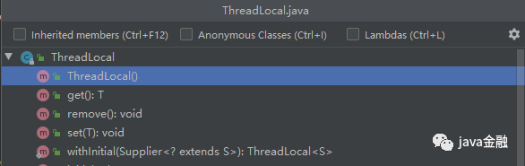
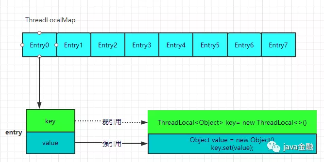
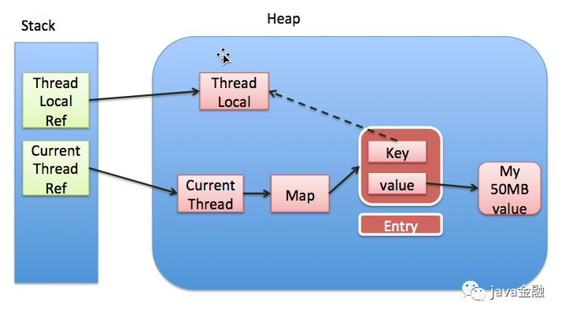
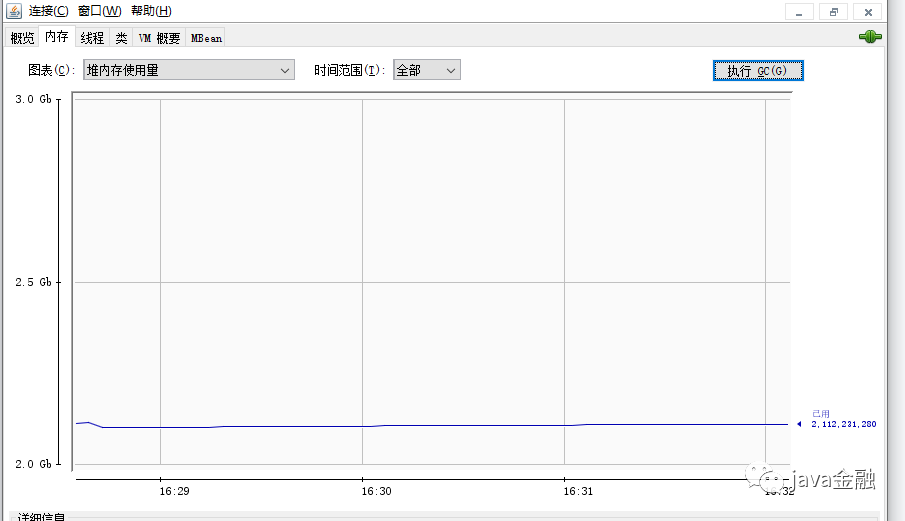

# threadlocal

**什么是ThreadLocal**

`ThreadLocal`类顾名思义可以理解为线程本地变量。也就是说如果定义了一个`ThreadLocal`， 每个线程往这个`ThreadLocal`中读写是线程隔离，互相之间不会影响的。它提供了一种将可变数据通过每个线程有自己的独立副本从而实现线程封闭的机制。**Thread中的ThreadLocalMap实现**

### 种类

1. ThreadLocal : 用于使非线程安全的工具编程线程安全,`ThreadLocalMap`采用容量都是2的幂,按位运算hash,之后冲突的话用**「线性探测」**的方式
2. FastThreadLocal : netty包中的实现,加上一个魔数`0x61c88647`的,这个魔数的选取与斐波那契散列有关,使得更均匀
3. InheritableThreadLocal : 遗传线程本地变量,new可以,但是线程池不会动态更新,浅拷贝后来thread是隔离的
4. transmittable-thread-local : 原理是ttl也会把需要传递的threadlocal缓存起来，然后在包装类的run方法内重放，设置到子线程。这个缓存的逻辑封装在TransmittableThreadLocal类中

### 实际应用

实际开发中我们真正使用`ThreadLocal`的场景还是比较少的，大多数使用都是在框架里面。最常见的使用场景的话就是用它来解决数据库连接、`Session`管理等保证每一个线程中使用的数据库连接是同一个。还有一个用的比较多的场景就是用来解决`SimpleDateFormat`解决线程不安全的问题，不过现在`java8`提供了`DateTimeFormatter`它是线程安全的，感兴趣的同学可以去看看。还可以利用它进行优雅的传递参数，传递参数的时候，如果父线程生成的变量或者参数直接通过`ThreadLocal`传递到子线程参数就会丢失，这个后面会介绍一个其他的`ThreadLocal`来专门解决这个问题的。

### ThreadLocal api介绍

ThreadLocal的API还是比较少的就几个api我们看下这几个`api`的使用，使用起来也超级简单

```
    private static ThreadLocal<String> threadLocal = ThreadLocal.withInitial(()->"java金融");
    public static void main(String[] args) {
        System.out.println("获取初始值："+threadLocal.get());
        threadLocal.set("关注：【java金融】");
        System.out.println("获取修改后的值："+threadLocal.get());
        threadLocal.remove();
    }
```

输出结果：

```
获取初始值：java金融
获取修改后的值：关注：【java金融】
```

是不是炒鸡简单，就几行代码就把所有`api`都覆盖了。下面我们就来简单看看这几个`api`的源码吧。

#### 成员变量

```
        /**初始容量，必须为2的幂
         * The initial capacity -- MUST be a power of two.
         */
        private static final int INITIAL_CAPACITY = 16;

        /** Entry表，大小必须为2的幂
         * The table, resized as necessary.
         * table.length MUST always be a power of two.
         */
        private Entry[] table;

        /**
         * The number of entries in the table.
         */
        private int size = 0;

        /**
         * The next size value at which to resize.
         */
        private int threshold; // Default to 0
```

这里会有一个面试经常问到的问题:为什么`entry`数组的大小，以及初始容量都必须是`2`的幂？对于 `firstKey.threadLocalHashCode & (INITIAL_CAPACITY - 1);` 以及很多源码里面都是使用 hashCode &（ -1） 来代替hashCode% 。这种写法好处如下：

- 使用位运算替代取模，提升计算效率。
- 为了使不同 `hash` 值发生碰撞的概率更小，尽可能促使元素在哈希表中均匀地散列。

#### set方法

```
public void set(T value) {
    Thread t = Thread.currentThread();
    ThreadLocalMap map = getMap(t);
    if (map != null)
        map.set(this, value);
    else
        createMap(t, value);
}
```

`set`方法还是比较简单的，我们可以重点看下这个方法里面的ThreadLocalMap，它既然是个map（注意不要与`java.util.map`混为一谈，这里指的是概念上的`map`），肯定是有自己的key和value组成，我们根据源码可以看出它的`key`是其实可以把它简单看成是`ThreadLocal`，但是实际上ThreadLocal中存放的是`ThreadLocal`的弱引用，而它的`value`的话是我们实际`set`的值

```
static class Entry extends WeakReference<ThreadLocal<?>> {
    /** The value associated with this ThreadLocal. */
    Object value; // 实际存放的值

    Entry(ThreadLocal<?> k, Object v) {
        super(k);
        value = v;
    }
}
```

`Entry`就是是`ThreadLocalMap`里定义的节点，它继承了`WeakReference`类，定义了一个类型为`Object`的`value`，用于存放塞到`ThreadLocal`里的值。我们再来看下这个`ThreadLocalMap`是位于哪里的？我们看到`ThreadLocalMap` 是位于`Thread`里面的一个变量，而我们的值又是放在`ThreadLocalMap`，这样的话我们就实现了每个线程间的隔离。下面两张图的基本就把`ThreadLocal`的结构给介绍清楚了。接下来我们再看下`ThreadLocalMap`里面的数据结构，我们知道`HaseMap`解决`hash`冲突是由链表和红黑树（`jdk1.8`）来解决的，但是这个我们看到`ThreadLocalMap`只有一个数组，它是怎么来解决`hash`冲突呢？`ThreadLocalMap`采用**「线性探测」**的方式，什么是线性探测呢？就是根**「据初始`key`的hashcode值确定元素在`table`数组中的位置，如果发现这个位置上已经有其他`key`值的元素被占用，则利用固定的算法寻找一定步长的下个位置，依次判断，直至找到能够存放的位置」**。`ThreadLocalMap`解决`Hash`冲突的方式就是简单的步长加`1`或减`1`，寻找下一个相邻的位置。

```
 /**
  * Increment i modulo len.
  */
 private static int nextIndex(int i, int len) {
     return ((i + 1 < len) ? i + 1 : 0);
 }

 /**
  * Decrement i modulo len.
  */
 private static int prevIndex(int i, int len) {
     return ((i - 1 >= 0) ? i - 1 : len - 1);
 }
```

这种方式的话如果一个线程里面有大量的`ThreadLocal`就会产生性能问题，因为每次都需要对这个`table`进行遍历，清空无效的值。所以我们在使用的时候尽可能的使用少的`ThreadLocal`，不要在线程里面创建大量的`ThreadLocal`，如果需要设置不同的参数类型我们可以通过`ThreadLocal`来存放一个`Object`的`Map`这样的话，可以大大减少创建`ThreadLocal`的数量。伪代码如下：

```
public final class HttpContext {
    private HttpContext() {
    }
    private static final ThreadLocal<Map<String, Object>> CONTEXT = ThreadLocal.withInitial(() -> new ConcurrentHashMap(64));
    public static <T> void add(String key, T value) {
        if(StringUtils.isEmpty(key) || Objects.isNull(value)) {
            throw new IllegalArgumentException("key or value is null");
        }
        CONTEXT.get().put(key, value);
    }
    public static <T> T get(String key) {
        return (T) get().get(key);
    }
    public static Map<String, Object> get() {
        return CONTEXT.get();
    }
    public static void remove() {
        CONTEXT.remove();
    }
}
```

这样的话我们如果需要传递不同的参数，可以直接使用一个`ThreadLocal`就可以代替多个`ThreadLocal`了。如果觉得不想这么玩，我就是要创建多个`ThreadLocal`，我的需求就是这样，而且性能还得要好，这个能不能实现列？可以使用`netty`的`FastThreadLocal`可以解决这个问题，不过要配合使`FastThreadLocalThread`或者它子类的线程线程效率才会更高，更多关于它的使用可以自行查阅资料哦。

下面我们先来看下它的这个哈希函数

```
// 生成hash code间隙为这个魔数，可以让生成出来的值或者说ThreadLocal的ID较为均匀地分布在2的幂大小的数组中。
private static final int HASH_INCREMENT = 0x61c88647;

/**
 * Returns the next hash code.
 */
private static int nextHashCode() {
    return nextHashCode.getAndAdd(HASH_INCREMENT);
}
```

可以看出，它是在上一个被构造出的`ThreadLocal`的`ID/threadLocalHashCode`的基础上加上一个魔数`0x61c88647`的。这个魔数的选取与斐波那契散列有关，`0x61c88647`对应的十进制为`1640531527`.当我们使用`0x61c88647`这个魔数累加对每个`ThreadLocal`分配各自的`ID`也就是`threadLocalHashCode`再与`2`的幂（数组的长度）取模，得到的结果分布很均匀。我们可以来也演示下通过这个魔数

```
public class MagicHashCode {
    private static final int HASH_INCREMENT = 0x61c88647;

    public static void main(String[] args) {
        hashCode(16); //初始化16
        hashCode(32); //后续2倍扩容
        hashCode(64);
    }

    private static void hashCode(Integer length) {
        int hashCode = 0;
        for (int i = 0; i < length; i++) {
            hashCode = i * HASH_INCREMENT + HASH_INCREMENT;//每次递增HASH_INCREMENT
            System.out.print(hashCode & (length - 1));
            System.out.print(" ");
        }
        System.out.println();
    }
}
```

运行结果：

```
7 14 5 12 3 10 1 8 15 6 13 4 11 2 9 0 
7 14 21 28 3 10 17 24 31 6 13 20 27 2 9 16 23 30 5 12 19 26 1 8 15 22 29 4 11 18 25 0 
7 14 21 28 35 42 49 56 63 6 13 20 27 34 41 48 55 62 5 12 19 26 33 40 47 54 61 4 11 18 25 32 39 46 53 60 3 10 17 24 31 38 45 52 59 2 9 16 23 30 37 44 51 58 1 8 15 22 29 36 43 50 57 0 
```

不得不佩服下这个作者，通过使用了斐波那契散列法，来保证哈希表的离散度，让结果很均匀。可见**「代码要写的好，数学还是少不了」**啊。其他的源码就不分析了，大家感兴趣可以自行去查看下。

### ThreadLocal的内存泄露

关于`ThreadLocal`是否会引起内存泄漏也是一个比较有争议性的问题。首先我们需要知道什么是内存泄露？

> ❝
>
> 在Java中，内存泄漏就是存在一些被分配的对象，这些对象有下面两个特点，首先，这些对象是可达的，即在有向图中，存在通路可以与其相连；其次，这些对象是无用的，即程序以后不会再使用这些对象。如果对象满足这两个条件，这些对象就可以判定为Java中的内存泄漏，这些对象不会被GC所回收，然而它却占用内存。
>
> ❞

`ThreadLocal`的内存泄露情况：

- 线程的生命周期很长，当`ThreadLocal`没有被外部强引用的时候就会被`GC`回收（给`ThreadLocal`置空了）：`ThreadLocalMap`会出现一个`key`为`null`的`Entry`，但这个`Entry`的`value`将永远没办法被访问到（后续在也无法操作`set、get`等方法了）。如果当这个线程一直没有结束，那这个`key`为`null`的`Entry`因为也存在强引用（`Entry.value`），而`Entry`被当前线程的`ThreadLocalMap`强引用（`Entry[] table`），导致这个`Entry.value`永远无法被`GC`，造成内存泄漏。下面我们来演示下这个场景

```
public static void main(String[] args) throws InterruptedException {
    ThreadLocal<Long []> threadLocal = new ThreadLocal<>();
    for (int i = 0; i < 50; i++) {
        run(threadLocal);
    }
    Thread.sleep(50000);
    // 去除强引用
    threadLocal = null;
    System.gc();
    System.runFinalization();
    System.gc();
}

private static void run(ThreadLocal<Long []> threadLocal) {
    new Thread(() -> {
        threadLocal.set(new Long[1024 * 1024 *10]);
        try {
            Thread.sleep(1000000000);
        } catch (InterruptedException e) {
            e.printStackTrace();
        }
    }).start();
}
```

通过`jdk`自带的工具`jconsole.exe`会发现即使执行了`gc` 内存也不会减少，因为key还被线程强引用着。效果图如下:

- 针对于这种情况`ThreadLocalMap`在设计中，已经考虑到这种情况的发生，你只要调用`了set()、get()、remove()`方法都会调用`cleanSomeSlots()、expungeStaleEntry()`方法去清除`key`为`null`的`value`。这是一种被动的清理方式，但是如果`ThreadLocal`的`set()，get()，remove()`方法没有被调用，就会导致`value`的内存泄漏。它的文档推荐我们使用`static`修饰的`ThreadLocal`，导致`ThreadLocal`的生命周期和持有它的类一样长，由于`ThreadLocal`有强引用在，意味着这个`ThreadLocal`不会被`GC`。在这种情况下，我们如果不手动删除，`Entry`的`key`永远不为`null`，弱引用也就失去了意义。所以我们在使用的时候尽可能养成一个好的习惯，使用完成后手动调用下`remove`方法。其实实际生产环境中我们手动`remove`大多数情况并不是为了避免这种`key`为`null`的情况，更多的时候，是为了保证业务以及程序的正确性。比如我们下单请求后通过`ThreadLocal`构建了订单的上下文请求信息，然后通过线程池异步去更新用户积分，这时候如果更新完成，没有进行`remove`操作，即使下一次新的订单会覆盖原来的值但是也是有可能会导致业务问题。如果不想手动清理是否还有其他方式解决下列？`FastThreadLocal` 可以去了解下，它提供了自动回收机制。
- 在线程池的场景，程序不停止，线程一直在复用的话，基本不会销毁，其实本质就跟上面例子是一样的。如果线程不复用，用完就销毁了就不会存在泄露的情况。因为线程结束的时候会`jvm`主动调用`exit`方法清理。

```
/**
  * This method is called by the system to give a Thread
  * a chance to clean up before it actually exits.
  */
 private void exit() {
     if (group != null) {
         group.threadTerminated(this);
         group = null;
     }
     /* Aggressively null out all reference fields: see bug 4006245 */
     target = null;
     /* Speed the release of some of these resources */
     threadLocals = null;
     inheritableThreadLocals = null;
     inheritedAccessControlContext = null;
     blocker = null;
     uncaughtExceptionHandler = null;
 }
```

### InheritableThreadLocal

文章开头有提到过父子之间线程的变量传递丢失的情况。但是`InheritableThreadLocal`提供了一种父子线程之间的数据共享机制。可以解决这个问题。

```
 static ThreadLocal<String> threadLocal = new ThreadLocal<>();
    static InheritableThreadLocal<String> inheritableThreadLocal = new InheritableThreadLocal<>();

    public static void main(String[] args) throws InterruptedException {
        threadLocal.set("threadLocal主线程的值");
        Thread.sleep(100);
        new Thread(() -> System.out.println("子线程获取threadLocal的主线程值：" + threadLocal.get())).start();
        Thread.sleep(100);
        inheritableThreadLocal.set("inheritableThreadLocal主线程的值");
        new Thread(() -> System.out.println("子线程获取inheritableThreadLocal的主线程值：" + inheritableThreadLocal.get())).start();

    }
```

输出结果

```
线程获取threadLocal的主线程值：null
子线程获取inheritableThreadLocal的主线程值：inheritableThreadLocal主线程的值
```

但是`InheritableThreadLocal`和线程池使用的时候就会存在问题，因为子线程只有在线程对象创建的时候才会把父线程`inheritableThreadLocals`中的数据复制到自己的`inheritableThreadLocals`中。这样就实现了父线程和子线程的上下文传递。但是线程池的话，线程会复用，所以会存在问题。可以参考下阿里巴巴的`transmittable-thread-local`哦。

**ttl也会把需要传递的threadlocal缓存起来，然后在包装类的run方法内重放，设置到子线程。这个缓存的逻辑封装在TransmittableThreadLocal类中**

```
private static ThreadLocal<Map<String,String>> holder = new InheritableThreadLocal<Map<String,String>>(){
  @Override
  protected Map<String,String> initialValue() {
  	return new HashMap<>();
  }
};
 
@Data
public static class WrapedRunnable implements Runnable{
    private Map<String,String> attachment;
    private Runnable runnable;
    public WrapedRunnable(Runnable runnable) {
        this.runnable=runnable;
        this.attachment = new HashMap<>(holder.get());
    }
    @Override
    public void run() {
        holder.set(this.attachment);
        runnable.run();
    }
}

@Test
public void testMandatoryTTL(){
    Executor executor = Executors.newFixedThreadPool(1);
    executor.execute(()->{
        System.out.println("init");
    });
    HashMap<String,String> attachment = new HashMap<>();
    attachment.put("123","456");
    holder.set(attachment);
    //普通方式
    executor.execute(()->{
        System.out.println(holder.get().containsKey("123"));
    });
    //处理后的方式
    executor.execute(new WrapedRunnable(()->{
        System.out.println(holder.get().containsKey("123"));
    }));
}
```


### 总结

大概介绍了`ThreadLocal`的常见用法，以及大致实现原理，以及关于`ThreadLocal`的内存泄露问题，以及关于使用它需要注意的事项，以及如何解决父子线程之间的传递。介绍了`ThreadLocal、InheritableThreadLocal、FastThreadLocal、transmittable-thread-local`各种使用场景，以及需要注意的事项。本文重点介绍了`ThreadLocal`，如果把这个弄清楚了，其他几种ThreadLocal就更好理解了。